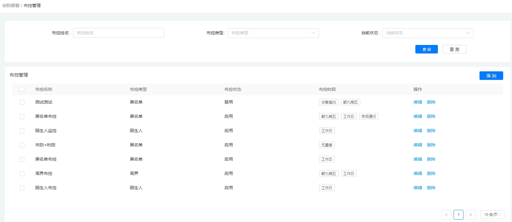
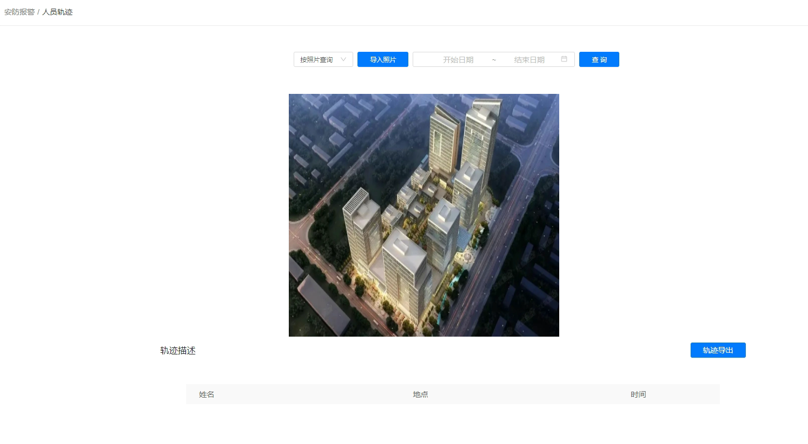
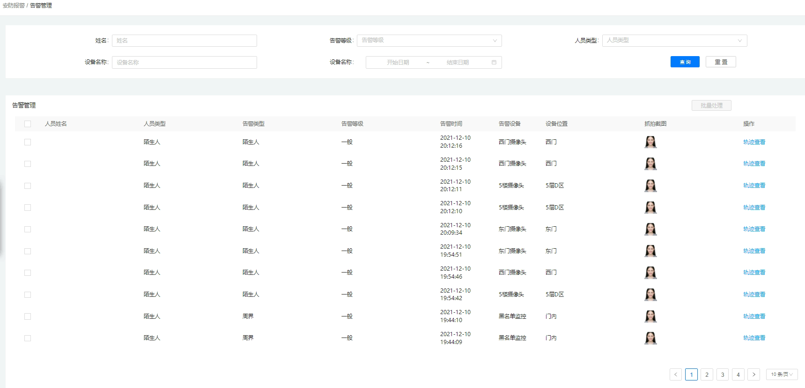
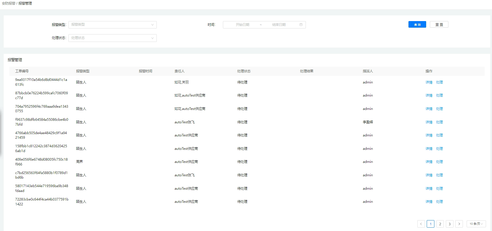

## 4.4安防报警

### 4.4.1全景监控

在此功能模块下，管理者调动摄像头实时监控各区域的实时动态情况，通过单屏或者多屏展示，也可以查看监控拍到的历史信息。

### 4.4.2布控管理

可根据园区的监控管理需求，添加各个不同的布控时段和各个区域的布控设备之间的组合，拟定不同的布控类型；管理者通过查询，也可对不同的布控进行编辑或删除操作。

### 4.4.3人员轨迹

管理员可以按照姓名或者图片等条件查找人员轨迹，系统会输出相应人员的轨迹描述，管理员也可导出具体的轨迹描述信息。

### 4.4.4告警管理

在告警管理模块下，管理员可以按条件查询告警信息，对告警信息进行对应的处理，也可以点击查看轨迹信息，可以看到导致发生告警人员的轨迹信息。

### 4.4.5报警管理

管理员可以按报警类型，处理状态等条件去查询具体的报警记录信息，点击查看详情，或者点击处理报警信息。

### 4.4.6黑名单管理

黑名单管理模块为园区管理者提供管理黑名单人员信息的功能。在黑名单管理模块中的人员不被允许进入园区并同时被剥夺园区内的一切使用权限。管理者可通过新增黑名单用户来将一个人员添加至黑名单，当有黑名单人员试图进入园区时，会根据标识其身份的信息主动检测到该人员并及时报警，避免危害园区公共安全。除了新增黑名单人员外，管理者还可以进行人员信息的编辑、将人员解除黑名单、查询黑名单人员等操作。

