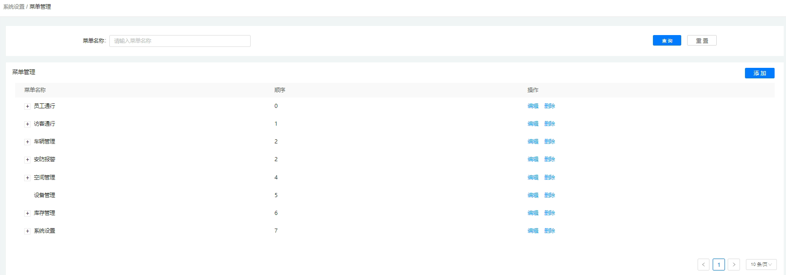
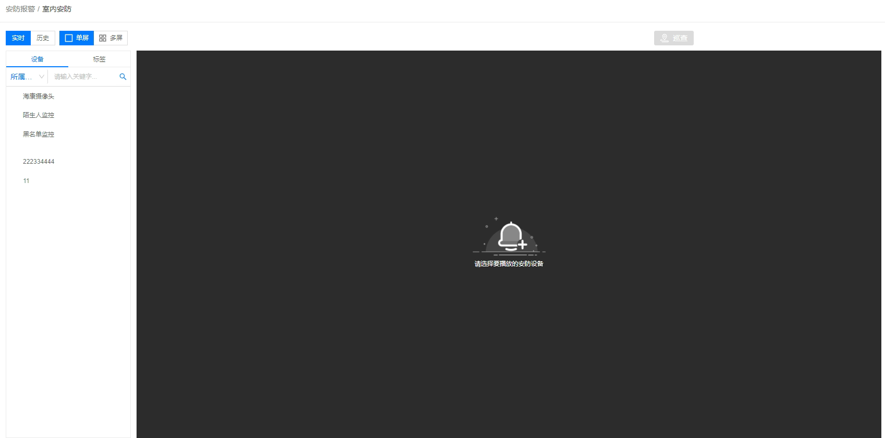
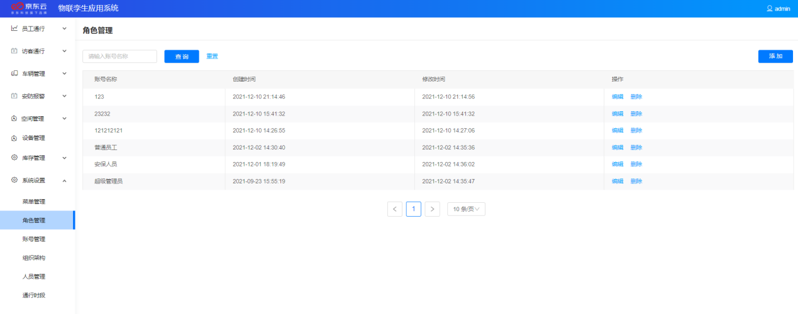
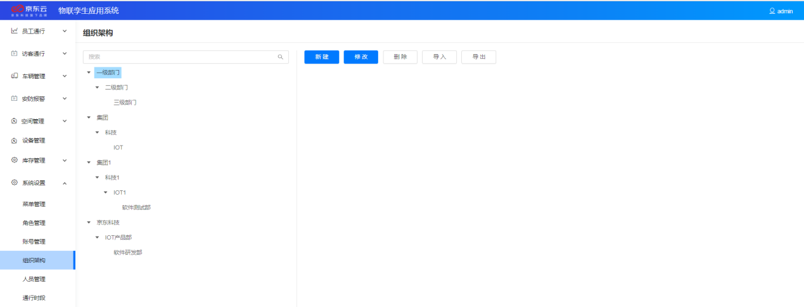
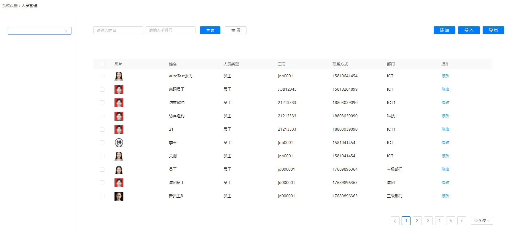
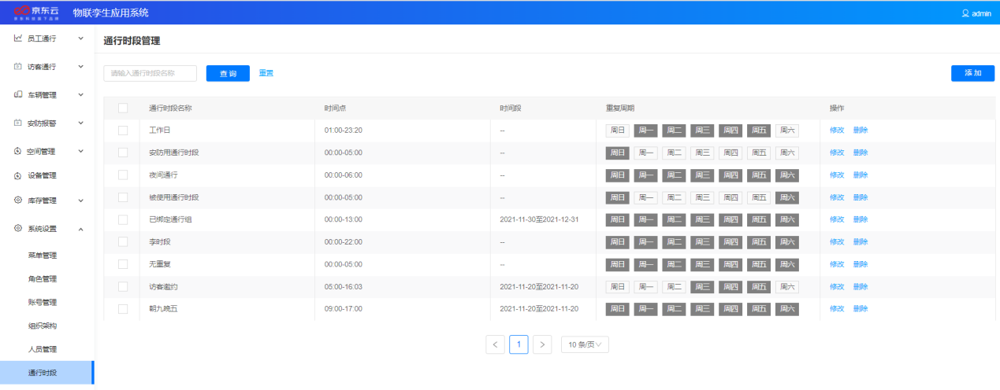

## 4.7系统管理

### 4.7.1菜单管理

菜单管理模块支持账号名称查询，管理员在这里可以添加新的功能模块，也可以对已有的功能模块编辑修改或者删除，实现系统功能模块的创建、修改、删除与层级管理。

### 4.7.2角色管理

角色管理模块会根据园区管理的实际需要，为使用监管平台的用户设置不同的角色，如：超级管理员、保安人员、普通员工等。不同角色的用户具有不同的操作权限，满足管理上重点信息隔离，职能划分清晰的需求。

**查询**** &amp; ****编辑**** &amp; ****删除** ：在角色管理模块可以查看到所有的角色信息，包括：创建时间、账号名称、修改时间等，也可以对每个角色进行编辑或者删除操作。

**创建角色** ：若已有的角色不能满足实际需要，则超级管理员(具有最高权限)可以根据需求创建新的角色并为新创建的角色命名和分配在监管平台的操作权限。

### 4.7.3组织架构

组织架构模块是将公司内多架构、多层级的组织与人员的对应关系进行统一展示与管理，包括：不同组织的架构以及同一组织不同层级的架构，支持搜索、新建、修改、删除、导入、导出等功能。

**创建组织** ：拥有组织架构模块操作权限的用户可以通过创建组织架构节点和编辑组织架构名称的方式来构建所在组织的树形结构，若组织结构被创建成功则其可在人员管理模块被人员信息所关联。

### 4.7.4人员管理

人员管理模块是为园区管理者提供集中管理园区固定人员的功能，人员如：园区内企业员工、物业人员等。园区管理者可以在人员管理模块导入或添加员工的信息，并随时进行维护。

**查看人员信息** ：管理员可以在人员管理模块查看所有已添加过的内部人员信息，信息包括：照片、姓名、人员类型、工号、联系方式、部门等，具体展示的信息可以根据实际的业务需要进行调整修改。

### 4.7.5通行时段

管理员可以根据园区通行时间的管理需要以及监控设备的布控时段，添加不同的通行时段，为不同类型的员工分配不同的通行时段权限。

**添加**** &amp; ****修改**** &amp; ****删除** ：管理员可以添加新的通行时段，也能对已有的通行时段进行修改删除操作。

