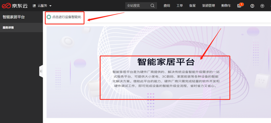
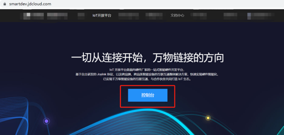
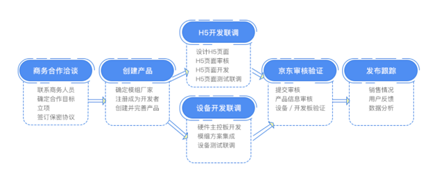

# 产品使用说明

## 入口

- 登录[京东云官网](https://www.jdcloud.com)
- 选择“产品>物联网>行业应用>智能家居平台”
- 在的产品介绍页面，点击“立即使用”，即可进入智能家居平台的控制台
- 进入到控制台后，“点击进行设备智能化”、或者图片即可进入到智能家居平台首页

## 智能家居平台
进入智能家居平台后，点击下方“控制台“入口即可开始设备智能化。Tips:点击下方页面所示”文档中心“，您可以查看所有详细的文档。

## 设备智能化流程说明

### Step1：商务合作洽谈
接入前请先联系商务人员，确定合作目标等。

### Step2：创建产品
注册成为平台开发者，个人开发者和企业开发者均可创建产品，但只有企业开发者才可以发布产品，若想发布产品，请先升级成为企业开发者。
根据流程创建产品并完善信息。

### Step3：开发联调
根据开发文档进行开发联调，包括H5开发联调和设备端开发联调；H5设计需参考《H5页面设计规范》。
平台推荐开发者使用H5可视化拖拽工具，快速高效低成本进行H5设计和开发。

### Step4：京东审核验证
线上提交审核之后，还需线下寄送设备/开发板到京东（若设备需要寄回，平台将会采用到付形式寄出）。
京东验证项包括
1. 外包装、详情页、说明书、sku。
2. 安全项、功能、用户体验。

### Step5：发布跟踪
京东验收通过后，产品发布，正式上线并销售。上线后，平台会将产品贴上“京鱼智能”的标签，该标签代表该产品可通过小京鱼App、京鱼座音箱控制，可用于产品的包装、说明书、商品详情页面等地方。
