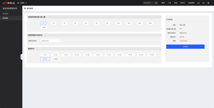
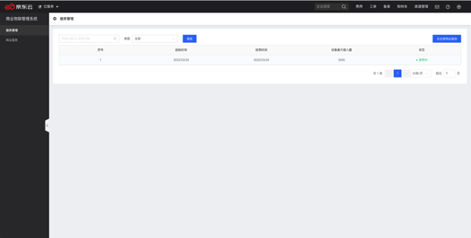

# 产品使用流程

## 第一步：账号实名认证
请确保您的京东云账号已经通过[实名认证](https://docs.jdcloud.com/cn/real-name-verification/introduction)。

## 第二步：购买服务
在“产品-->物联网-->行业应用-->商业物联管理系统”控制台的“[购买服务](https://moiot-console.jdcloud.com/server/buy)”，您可以购买设备服务。

1、首先选择最大设备接入规格。

2、选择服务开始时间。

3、全部填写完成后，点击立即购买，进入购买订单确认页，订单确认无误后点击立即支付。

## 第三步：服务管理
在“产品-->物联网-->行业应用-->商业物联管理系统”控制台的“[服务管理](https://moiot-console.jdcloud.com/server/list)”，您可以进行已购服务进行管理。

1、您可以查看已购的设备数、服务起始时间和结束时间。

2、“点击使用此服务”，您可以进入到商业物联管理系统，按照[开发指南](../DeveloperGuide/DeviceAccessService.md)进行使用。

