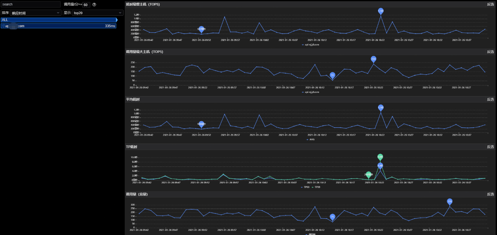
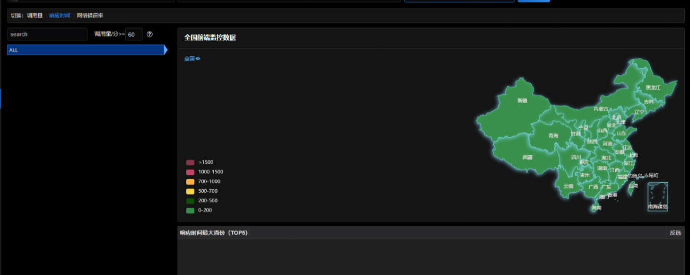
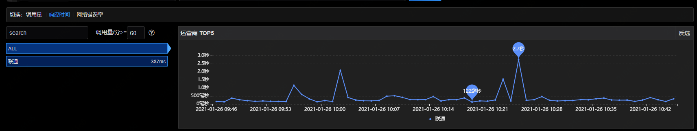
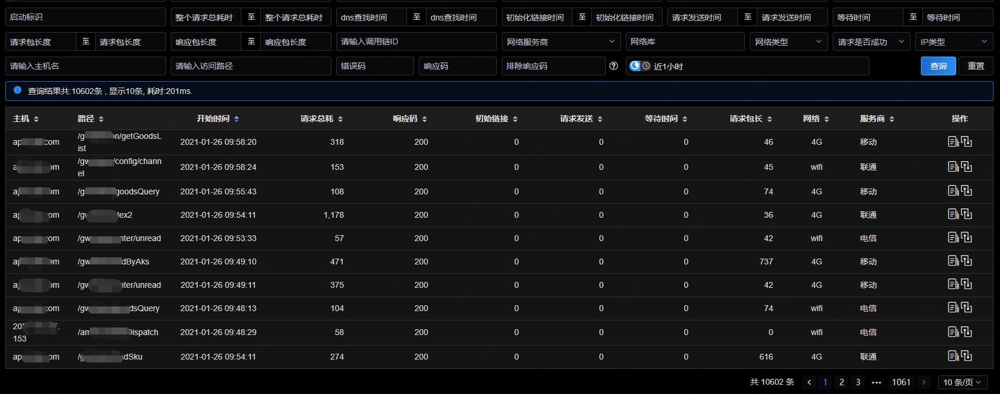
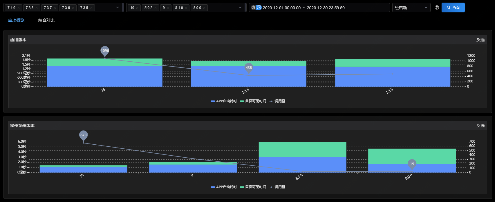
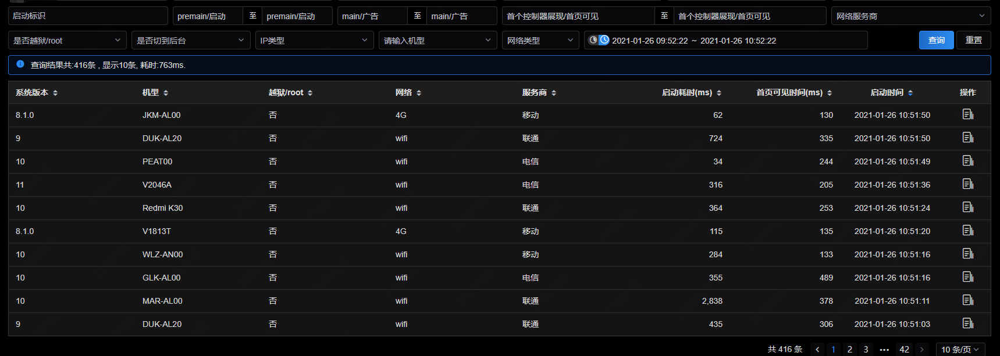

# 产品功能操作说明

## 应用概览

应用概览主要从应用个数、卡顿用户数、崩溃用户数、网络请求、webview、启动次数几个维度对整体的数据进行呈现，以宏观的角度展示整体的监控数据。

## 应用首页

应用首页中将应用所有重要的性能指标以卡片和图表的形式进行展示，可以根据不同的筛选条件来查看该应用不同版本以及不同时间下的数据。

## 网络请求

主要包括网络监控、地域监控、运营商监控和日志查询。

### 网络监控

通过此功能可以查看访问主域名下各个子链接的总响应时间以及通过各项指标的时间趋势图，可以通过时间筛选，来查看不同时间段，不同粒度的数据展示。

### 地域监控

通过此功能可以查看网络调用在不同地区各项指标的分布情况，以及每个省份所对应的市级数据分布运营商监控。

### 运营商监控

通过运营商监控可以看到网络调用在不同运营商各项指标的分布情况，以及每个运营商在不同地域的指标分布情况。

### 日志查询

日志查询展示了应用的详细调用日志，通过不同的筛选条件查看指定的内容，除此以外，还可以通过每条记录的操作按钮，去查看详细的链路信息。

## 应用启动

主要包括启动监控和日志查询。

### 启动监控

启动监控功能可以看到应用在启动时，不同应用版本、操作系统版本、机型等设备属性对性能的影响。为了方便用户进行比较，系统会对重要设备属性进行组件分析。

### 日志查询

在日志查询中可以查看到具体的应用启动日志，从筛选参数中可以看到，启动日志的维度，不仅包括了基本的系统版本、机型、网络、服务商等，而且还包括了当前系统是否越狱/root、IP类型等，除此以外，还可以按照首页加载时间来进行过滤筛选。

## WebView

此功能包括webview监控和日志查询两部分。

### Webview监控

通过应用版本及小版本在指定时间范围内，对页面调用响应时间进行排序，而且还可以通过耗时最慢页面（TOP5）、调用量最大页面（TOP5）、页面完全加载时间、调用量、Dom Ready时间、DOM解析耗时、白屏时间、错误率/错误数、慢请求列表等细分图进行展示。

### 日志查询

可以对指定慢请求url进行日志查询，通过详细数据排查页面加载慢的原因，从而更好进行优化。

## 原生页面

此功能包括页面监控和日志查询两部分。

### 页面监控

通过应用版本及小版本在指定时间范围内，对页面调用响应时间进行排序，而且还可以通过耗时最慢页面（TOP5）、调用量最大页面（TOP5）、耗时、调用量、慢请求列表等细分图进行展示。

### 日志查询

通过版本号、操作系统等维度信息，对原生页面的访问日志进行查询。

## 系统崩溃

此功能包括崩溃分析、崩溃概览、崩溃详情。

### 崩溃分析

在崩溃分析中通过崩溃代码行、崩溃模块、关键堆栈、应用版本、发生次数、影响用户、崩溃时间等多个维度展示了崩溃的基本信息。

### 崩溃概览

崩溃概览功能从崩溃趋势、崩溃排行榜两个板块对应用的崩溃情况进行分析。

### 崩溃详情

崩溃详情是对崩溃分析和崩溃概览的延伸，此功能对崩溃信息进行了详细的阐述。

## 系统卡顿

此功能包括了卡顿分析和卡顿概览两部分。

### 卡顿分析

基于指定的应用，以应用版本、是否越狱、设备ID、用户ID等维度为查询条件，筛选出对应的卡顿信息，根据发生次数和影响用户数，来判断当前异常对用户的影响范围。

### 卡顿概览

基于应用，从一个整体的角度来对系统卡顿进行汇总展示。

## 错误监控

此功能包括了错误分析和日志分析两部分。

### 错误分析

错误分析将从时间维度和错误码的维度对各种错误日志类型进行分析，具体的错误日志类型的配置，您可以在应用概览中，对您接入的应用进行编辑。

### 日志查询

通过版本号、操作系统等维度信息，对错误监控的日志进行查询。

## 自定义监控

用户可以调用APM提供的SDK中的API进行自定义埋点，完全由自己定义需要统计的维度信息。

### 自定义监控分析

基于应用，以版本、时间为筛选条件进行查询，查询结果可以通过概览及组件对比的方式进行展示。

### 自定义监控日志

可对用户上报的故障信息形成日志，可以展现出详细的日志信息，以便进行故障分析。

## 日志捞回

可对用户上报的故障信息形成日志，可以展现出详细的日志信息，以便进行故障分析。

## 监控日志

此功能包括了CPU日志和内存日志两部分。

### CPU日志

主要对应用中各模块在调用时，CPU使用情况数据的收集及展示。

### 内存日志

主要对应用中各模块在调用时，内存使用情况数据的收集及展示。

## 告警配置

系统支持网络监控、webview监控、启动监控、原生页面、崩溃监控、错误监控、自定义监控模块的告警，您可以根据自己的需求进行相关配置。

## 用户轨迹

用户轨迹主要是结合服务端监控，前端h5页面监控，对用户行为进行全链路轨迹跟踪，并以时间轴、拓扑图的形式进行展现。