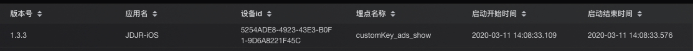

# 性能监控-iOS-接入文档

## 1. 系统环境

要求系统环境iOS9.0及以上版本。

## 2. 接入指南

性能监控，网络监测和崩溃收集。

## 3. 代码集成
### 3.1 Pod集成
### 3.1.1 Podfile配置
`source 'http://gitlab.mpaas.jdcloud.com/umapadmin/jdtmpaassdkspecrepo.git'`  
`pod 'JDTAPM', '1.0.0'`   
`pod 'JDTGateway', '1.0.0'`  

### 3.1.2 Podspec配置
在使用APM的模块中配置Podspec：

`# APM依赖`    
`s.dependency 'JDTAPM'`  
`s.dependency 'JDTGateway'`  
`s.dependency 'RealReachability'`  
`s.libraries = 'c++', 'z'#z表示libz.tdb,后缀不需要,lib开头的省略lib`  

### 3.2 主工程集成

1. 将`JDTAPM.framework`拖入到项目中。

2. 在 Link Binary With Libraries 中添加依赖库 `libz.tdb` `libc++.tbd` `WebKit.framework`。

3. 依赖第三方库: `RealReachability`。


## 4. 基础功能

### 4.1 网关初始化

初始化离线化SDK前，先要初始化网关SDK，请参考[网关SDK接入文档](../../Mobile-Gateway/SDK/ios.md)。

### 4.2 APM初始化

```
// 引入头文件
#import <JDTAPM/JDTAPM.h>

// 初始化代码
// 全部功能打开
int64_t optionSwitch = JDTAPM_OPTION_ALL；
JDTAPMConfig *config = [[JDTAPMConfig alloc] init];
config.optionSwitch = option;
// 设备唯一ID
config.deviceID = DEVICEID;
// SDK在SGM后台申请,私有化部署后，将提供SGM后台
config.appkey = 在SGM后台申请应用的appkey; 
config.appSecret = 在SGM后台申请应用的appSecret;
config.path = @"数据上报主机URL";

config.userIDBlock = ^NSString *{
    // 用户ID
    return userID;
};

BOOL initSuccess = [JDTAPM jdt_setupConfiguration:config];
if (!initSuccess) {
    // 没有初始化成功
}
```

### 4.3 忽略某些网络请求

```
// block返回true的，都被忽略
[JDTAPM jdt_setIgnoreNetworkUrlBlock:^BOOL(NSURL *requestUrl) {

 if ([requestUrl.absoluteString containsString:@"要监控的网络请求URL"]) {
 return NO;
 }
 
 return YES;
}];
```

### 4.4 自定义App启动阶段耗时打点
接入SDK后默认会采集一条标准的启动时长，从用户点击图标到进入首个可见页面的总时长。


```
// 记录 自定义性能监控 开始时间  customKey为事件标识key
[JDTAPM jdt_recordPerformanceCustomStart:customKey];
// 记录 自定义性能监控 开始时间
[JDTAPM jdt_recordPerformanceCustomEnd:customKey];
```

标准的启动日志中会追加一条此自定义采集启动时间



## 5.隐私政策合规

为了保证您的App顺利通过检测，结合当前监管关注重点，我们制作了京东SDK初始化合规方案。熟悉监管要求，掌握合规操作流程，拒绝App被下架。

### 合规三步走

#### 1.您需要确保App有《隐私政策》，并且在用户首次启动App时就弹出《隐私政策》取得用户同意。

#### 2.您务必告知用户您选择京东APMSDK服务，请在《隐私政策》中增加如下参考条款：

“我们的产品集成京东APMSDK，京东APMSDK采集设备标识符(IMEI/Mac/device ID/IDFA/OPENUDID/GUID、SIM 卡 IMSI 信息)，用于唯一标识设备，以便为提供离线化服务的唯一标识；

#### 3.您务必严格遵守如下初始化步骤，确保用户同意《隐私政策》之后，再初始化京东APMSDK。

【1】在application: didFinishLaunchingWithOptions:函数中加入逻辑判断，用户没有同意《隐私政策》之前，先不调用APMSDK初始化。

【2】确保App首次冷启动时，在用户阅读您的《隐私政策》并取得用户授权之后，才调用正式初始化函数，初始化网关SDK和APMSDK。反之，如果用户不同意《隐私政策》授权，则不能调用初始化函数。

【3】一旦App获取到《隐私政策》的用户授权，后续的App冷启动，开发者应该保证在application: didFinishLaunchingWithOptions:函数中调用预初始化函数(授权后初始化函数必须调用，不能遗漏)。