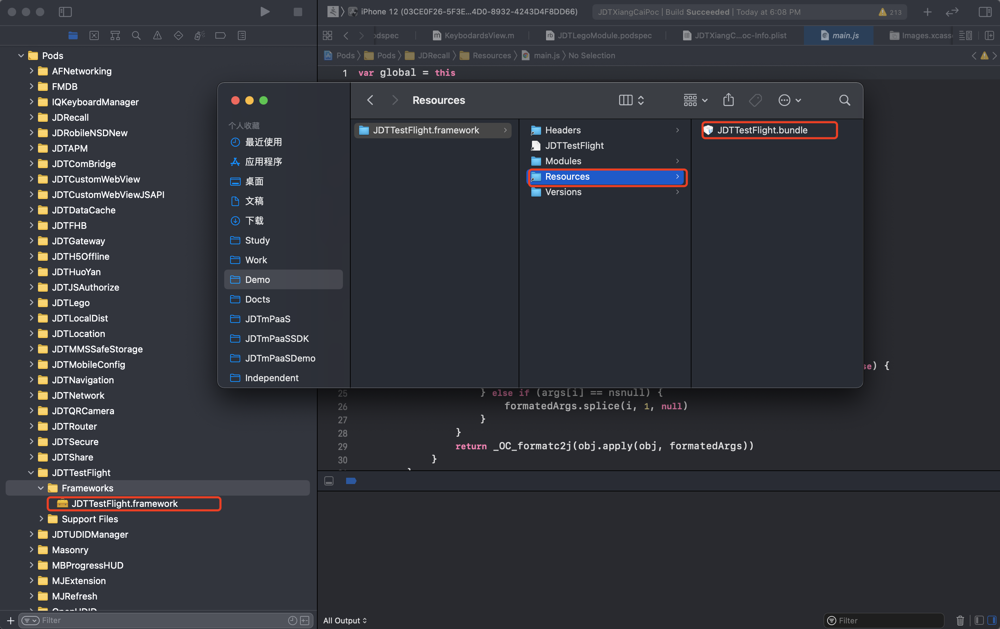

# 应用发布-iOS-接入文档

## 1.系统环境

要求系统环境iOS8.0及以上版本。

## 2.接入指南

应用灰度发布，应用升级等。

## 3.集成流程

### 3.1 Pod集成
### 3.1.1 Podfile配置
`source 'https://gitlab.mpaas.jdcloud.com/umapadmin/jdtmpaassdkspecrepo.git'`  

`pod 'JDTTestFlight', '1.0.0'`   
`pod 'JDTGateway', '1.0.0'`  
`pod 'JDTUDIDManager', '1.0.0'` 

### 3.1.2 Podspec配置
在使用应用发布SDK的模块中配置Podspec：

`# 应用发布依赖SDK`  
`s.dependency 'JDTTestFlight'`   
`s.dependency 'JDTGateway'`   
`s.dependency 'JDTUDIDManager'` 

`# 应用发布依赖第三方`  
`s.dependency 'AFNetworking', '~> 3.2.1'`  
`s.dependency 'RealReachability'`    
`s.dependency 'Masonry'`   
`s.dependency 'SDWebImage'`   

### 3.1.3 主工程配置
将`JDTTestFlight.framework`中`JDTTestFlight.bundle`拖入到项目中。



### 3.2 主工程集成

1. 将 `JDTTestFlight.framework`，`JDTGateway.framework` 和 `JDTUDIDManager.framework`拖入到项目中。

2. 通过CocoaPods添加第三方依赖`pod AFNetworking', '~> 3.2.1'`，`pod 'RealReachability'`，`pod 'Masonry'`和`pod 'SDWebImage'`  

3. 将`JDTTestFlight.framework`中`JDTTestFlight.bundle`拖入到项目中。  

## 4. 基础功能

### 4.1 网关初始化
初始化离线化SDK前，先要初始化网关SDK，请参考[网关SDK接入文档](../../Mobile-Gateway/SDK/ios.md)。

### 4.2 TestFlightSDK初始化
```ObjectiveC
JDTTestFlightConfig *config = [[JDTTestFlightConfig alloc] init];
    // 必填参数
    config.appCode = @"9f80f0df8b6793ab4693238f5868075a";
    config.userId = self.userIdTextField.text; // 账户体系唯一标识
    config.deviceId = @"1223323232";
    
    // 灰度投放
    config.testFlightRequestUrl = @"/upgrade/api/marketRelease/getReleaseData";
    // 数据上报接口地址
    config.testFlightReportUrl = @"/upgrade/api/BiService/collectingData";
    
    [JDDTestFlight jdt_startWithConfig:config];
    [JDDTestFlight jdt_setJDDTestFightUIDelegate:self];
```

### 4.3 代理方法

```ObjectiveC
/// 展示UI页面，如果testFlightModel为空则不需要更新
/// @param testFlightModel TF信息
- (void)jdt_showTestFligthUIWithInfo:(JDDTestFlightModel*)testFlightModel hasNewVersion:(BOOL)hasNewVersion {
    if (!hasNewVersion) {
        NSLog(@"已经是最新版本");
        return;
    }
    if ([JDDTestFlightApi canShowTestFligthUIWithModel:testFlightModel]) {
        [JDDTestFlightApi showDefaultUIWithModel:testFlightModel];
    }
}
```

## 5.隐私政策合规

为了保证您的App顺利通过检测，结合当前监管关注重点，我们制作了京东SDK初始化合规方案。熟悉监管要求，掌握合规操作流程，拒绝App被下架。

### 合规三步走

##### 1.您需要确保App有《隐私政策》，并且在用户首次启动App时就弹出《隐私政策》取得用户同意。

##### 2.您务必告知用户您选择京东TestFlightSDK服务，请在《隐私政策》中增加如下参考条款：

“我们的产品集成京东TestFlightSDK，京东网关SDK采集设备标识符(IMEI/Mac/android ID/IDFA/OPENUDID/GUID、SIM 卡 IMSI 信息)，用于唯一标识设备，以便为提供应用发布服务的唯一标识；

##### 3.您务必严格遵守如下初始化步骤，确保用户同意《隐私政策》之后，再初始化京东TestFlightSDK。
