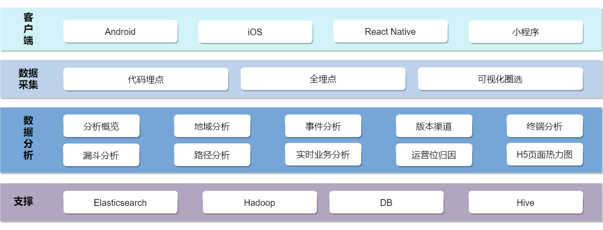

# 基础架构

分布式服务火眼移动行为分析系统从逻辑上分为客户端SDK、移动端数据接收服务、数据转发、管理控制台、内部API服务几个部分。

- 客户端SDK：通过客户端sdk对页面或元素进行可视化配置、埋点
- 移动端数据接收服务：接收服务负责接收行为分析数据，将接收到的行为数据写到消息队列Kafka中；
- 数据转发服务：负责将Kafka中的数据转发到专门的数据存储中心；
- 控制台服务：提供参数配置、行为数据分析的展示等功能。
- 内部API服务：控制台配置接口，提供内部API

## 产品架构

产品架构如下图：

