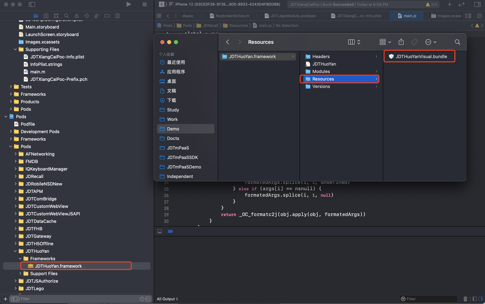
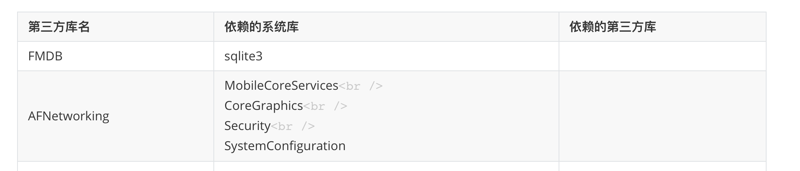

# 行为分析-iOS-接入文档 1.2.7
## 1. 系统环境
要求iOS9.0及以上版本

## 2. 接入指南
1.申请网关    
请到网关平台申请相应火眼网关应用，以获得网关应用名称和网关密钥。  

2.申请火眼应用      
在集成火眼SDK前需要我们先去【火眼控制台】去申请应用，以便获得AppSecret。
## 3. 集成流程
### 3.1 Pod集成
### 3.1.1 Podfile配置

`source 'https://gitlab.mpaas.jdcloud.com/umapadmin/jdtmpaassdkspecrepo.git'`  

`pod 'JDTHuoYan', 1.0.0'`   

`pod 'JDTGateway',  '1.0.0'` 

### 3.1.2 Podspec配置
在使用火眼SDK的模块中配置Podspec：

`# 火眼依赖SDK`  
`s.dependency 'JDTHuoYan'`   
`s.dependency 'JDTGateway'` 

`# 火眼依赖第三方`
`s.dependency 'FMDB/SQLCipher', '2.6.2'`

`# 火眼依赖系统库`  
`s.frameworks 'CoreFoundation','CoreTelephony','CoreLocation','UIKit','Security','WebKit'` 
    
### 3.1.3 主工程配置
将`JDTHuoYan.framework`中`JDTHuoYan.bundle`拖入到项目中。  


### 3.2 主工程配置

1.手动集成火眼SDK。  

2.选择工程目录-》Build Settings 》 Other Link Flags 中加入-ObjC参数。  

4.依赖库：sqlite3、MobileCoreServices、CoreGraphics、Security、SystemConfiguration。   

5.将`JDTHuoYan.framework`中`JDTHuoYan.bundle`拖入到项目中。  


## 4. 基本功能
### 4.1 初始化配置  
application:didFinishLaunchingWithOptions 中初始化SDK。 
``` ObjectiveC
[JDTHuoYanConfig getInstance].url = @"https://www.example.com"; 
[JDTHuoYanConfig getInstance].debugEnable = YES;[JDTHuoYanConfig getInstance].appChannel = @"App Store"; 
[JDTHuoYanConfig getInstance].autoTrack = YES; 
[JDTHuoYanConfig getInstance].userId = @"user1";
[JDTHuoYanConfig getInstance].extraParams = @{@"extra1":@"value1"};

// 启动
[JDTHuoYan jdt_startTrack:@"填火眼平台应用别名" token:@"填火眼平台App-Sign"]; 
```

### 4.2 API
1.JDTHuoYanConfig 类是配置统计相关，以下是相关的配置

```
// 应用的统计版本号
@property (nonatomic, retain, readonly) NSString* sdkVersion;

// 渠道名，默认为"App Store"
@property (nonatomic, retain) NSString* appChannel;

// 显示日志
@property (nonatomic, assign) BOOL debugEnable;

// 是否启动自动采集
@property (nonatomic, assign) BOOL autoTrack;

// 用户id
@property (nonatomic, copy) NSString * userId;

// 渠道名，默认为"appstore"
@property (nonatomic, retain) NSString* host;
```
2.事件统计  
```
/**
* 事件埋点
* @param eventId 事件ID
* @param paramJson 时间参数，json格式字符串，可以为null
*/
+ (void)jdt_onEvent:(NSString  * _Nonnull)eventId  paramJson:(NSDictionary *)paramJson;
```
3.PV统计  
```
/**
* 页面PV埋点，在viewController 的viewWillAppear中调用，必须与 onPageEnd成对调用
* @param viewController 埋点页面
* @param pageName 页面名称
*/
+ (void)jdt_onPageBegin:(UIViewController  * _Nonnull)viewController pageName:(NSString *)pageName;
/**
* 页面PV埋点，在Activity 的viewWillDisappear中调用，必须与 onPageBegin成对调用
* @param viewController 埋点页面
* @param pageName 页面名称
*/
+ (void)jdt_onPageEnd:(UIViewController  * _Nonnull)viewController pageName:(NSString *)pageName;
```
4.可视化埋点  
```
// 主window初始化完成后就可以调用以下代码打开可视化埋点
+ (void)jdt_startVisualEditModel;
```
5.数据查看  
在app中操作，查看log日志可以看到数据自动采集上报情况。也可以通过fiddler或者charles抓包方式查看数据上报情
```
[JDTHuoYanConfig getInstance].debugEnable = YES;
```
## 5. 高级功能
无

## 6.隐私政策合规

为了保证您的App顺利通过检测，结合当前监管关注重点，我们制作了京东SDK初始化合规方案。熟悉监管要求，掌握合规操作流程，拒绝App被下架。

### 合规三步走

##### 1.您需要确保App有《隐私政策》，并且在用户首次启动App时就弹出《隐私政策》取得用户同意。

##### 2.您务必告知用户您选择京东火眼服务，请在《隐私政策》中增加如下参考条款：

“我们的产品集成京东火眼，京东火眼采集设备标识符(IMEI/Mac/device ID/IDFA/OPENUDID/GUID、SIM 卡 IMSI 信息)，用于唯一标识设备，以便为提供离线化服务的唯一标识；

##### 3.您务必严格遵守如下初始化步骤，确保用户同意《隐私政策》之后，再初始化京东火眼。

【1】在application: didFinishLaunchingWithOptions:函数中加入逻辑判断，用户没有同意《隐私政策》之前，先不调用火眼初始化。

【2】确保App首次冷启动时，在用户阅读您的《隐私政策》并取得用户授权之后，才调用正式初始化函数，初始化网关SDK和火眼。反之，如果用户不同意《隐私政策》授权，则不能调用初始化函数。

【3】一旦App获取到《隐私政策》的用户授权，后续的App冷启动，开发者应该保证在application: didFinishLaunchingWithOptions:函数中调用预初始化函数(授权后初始化函数必须调用，不能遗漏)。
