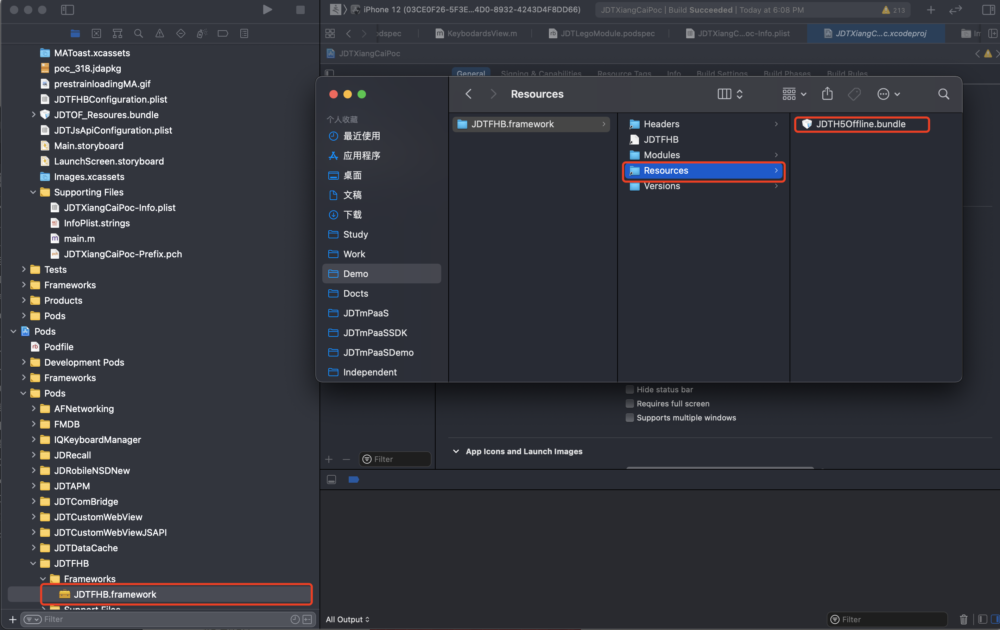
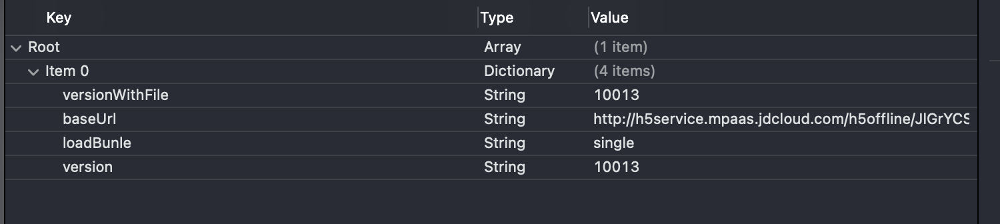

# H5离线化-iOS-接入文档 
##  1. 系统环境
要求系统环境iOS9.0及以上版本。

## 2. 接入指南

H5离线加载，实现web页面快速加载。

## 3. 集成流程
### 3.1 Pod集成
### 3.1.1 Podfile配置

`source 'http://gitlab.mpaas.jdcloud.com/umapadmin/jdtmpaassdkspecrepo.git'`  
`pod 'JDTH5Offline', '1.0.0'`   
`pod 'JDTGateway', :'1.0.0'`  

### 3.1.2 Podspec配置
在使用H5离线化SDK的模块中配置Podspec：

`# H5离线化依赖SDK`  
`s.dependency 'JDTH5Offline'`   
`s.dependency 'JDTGateway'` 

`# H5离线化依赖第三方`  
`s.dependency 'AFNetworking', '~> 3.2.1'`  
`s.dependency 'RealReachability'`  
`s.dependency 'ZipArchive'`  

`# H5离线化依赖系统库`  
`s.frameworks = 'WebKit'`  

### 3.1.3 主工程配置

将`JDTH5Offline.framework`中`JDTH5Offline.bundle`拖入到项目中。


### 3.2 主工程集成

1. 将 `JDTH5Offline.frameworks`文件拖进项目，同时将文件里的Resources文件拖入工程。

2. 增加所需的系统库Webkit。

3. 增加所需的第三方库，可通过cocoapods集成。

```
  pod 'ZipArchive'
  pod 'RealReachability'
```

如果没有cocoapods，亦可自己去github下载相应的库；然后将下载库文件拖入项目即可完成集成。

## 4. 基础功能

### 4.1 网关初始化

初始化离线化SDK前，先要初始化网关SDK，请参考[网关SDK接入文档](../../../MPaaS/Mobile-Gateway/SDK/ios.md)。

### 4.2 离线化SDK初始化

```objective-c
#import <OpenUDID/OpenUDID.h>
#import <JDTH5Offline/JDTH5Offline.h>
#import <sys/utsname.h>
    
JDTOFConfig *config = [[JDTOFConfig alloc] init];
config.forceUseLatestResource = NO;
config.enableUpdateStyle = YES;
// 控制台创建应用生成appkey
config.appkey = @"appkey";
// SDK请求路径
config.path = @"/h5offline/api/";
// pin
config.pin = @"pin";
config.loadBunleResorces = ^{
    [self loadLocalBundle];
};
config.recodTrackData = ^(NSString* bid, NSDictionary* params) {
     NSLog(@"test block is completed");
};
// 启动SDK    
[JDTH5Offline jdt_startModel:config resultsBlock:^(NSDictionary * _Nonnull results, NSError * _Nonnull error) {
        if (results) {
            NSLog(@"%@",results);
        }else{
            [self presentAlertWithMessage:@"请求失败"];
        }
    }];
```
加载本地离线包
```objective-c
- (void)loadLocalBundle {
    NSString* bundlePath = nil;
    for (NSBundle* bundle in [NSBundle allBundles]) {
        bundlePath = [bundle pathForResource:@"JDFinanceBillForTab" ofType:@"bundle"];
        if (bundlePath) {
            break;
        }
    }
    
    NSString* thePath = [[NSBundle bundleWithPath:bundlePath] pathForResource:@"JDDOF_Config" ofType:@"plist"];
    if (!thePath) {
        return;
    }
    
    NSMutableArray *loadBunleList = [NSMutableArray arrayWithContentsOfFile:thePath];
    [JDTH5Offline jdt_loadBunleResorces:loadBunleList bundlePath:bundlePath resultBlock:^(NSDictionary * item, NSError * error) {
        if (error) {
            NSLog(@"JDTH5Offline loadBunleResorces error=%@", error);
        }
    }];
}
```

## 5. 高级功能

### 5.1 内置包功能

制作内置包（bundle）

首先制作bundle，可新建一个JDTOF_Resoures命名的文件夹，修改后缀为.bundle,并将zip及配置表放入bundle中，将bundle导入项目即可完成。

内置包分为zip包和配置文件，如下图所示


内置zip包需从控制台下载加密的zip，并将配置信息填入JDTOF_Config.plist文件中，配置文件信息如下：



version，versionWithFile这两个字段保持一致，对应控制台版本标识，baseurl对应控制台baseurl，loadBundle是zip包的命名。

## 6.隐私政策合规

为了保证您的App顺利通过检测，结合当前监管关注重点，我们制作了京东SDK初始化合规方案。熟悉监管要求，掌握合规操作流程，拒绝App被下架。

### 合规三步走

##### 1.您需要确保App有《隐私政策》，并且在用户首次启动App时就弹出《隐私政策》取得用户同意。

##### 2.您务必告知用户您选择京东H5OfflineSDK服务，请在《隐私政策》中增加如下参考条款：

“我们的产品集成京东H5OfflineSDK，京东H5OfflineSDK采集设备标识符(IMEI/Mac/device ID/IDFA/OPENUDID/GUID、SIM 卡 IMSI 信息)，用于唯一标识设备，以便为提供离线化服务的唯一标识；

##### 3.您务必严格遵守如下初始化步骤，确保用户同意《隐私政策》之后，再初始化京东H5OfflineSDK。

【1】在application: didFinishLaunchingWithOptions:函数中加入逻辑判断，用户没有同意《隐私政策》之前，先不调用H5Offline初始化。

【2】确保App首次冷启动时，在用户阅读您的《隐私政策》并取得用户授权之后，才调用正式初始化函数，初始化网关SDK和H5OfflineSDK。反之，如果用户不同意《隐私政策》授权，则不能调用初始化函数。

【3】一旦App获取到《隐私政策》的用户授权，后续的App冷启动，开发者应该保证在application: didFinishLaunchingWithOptions:函数中调用预初始化函数(授权后初始化函数必须调用，不能遗漏)。
