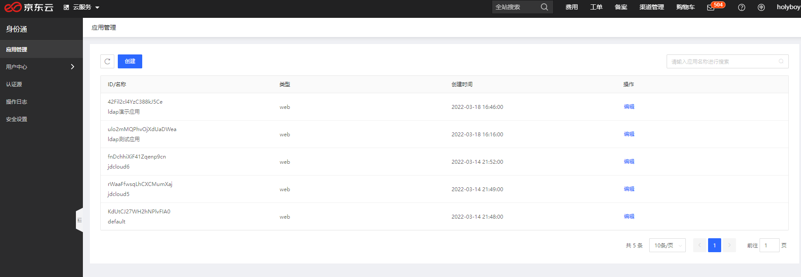
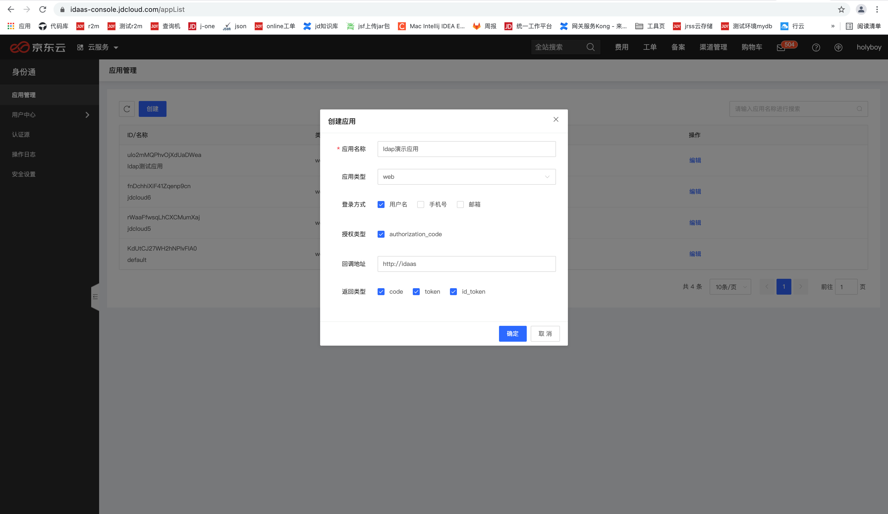
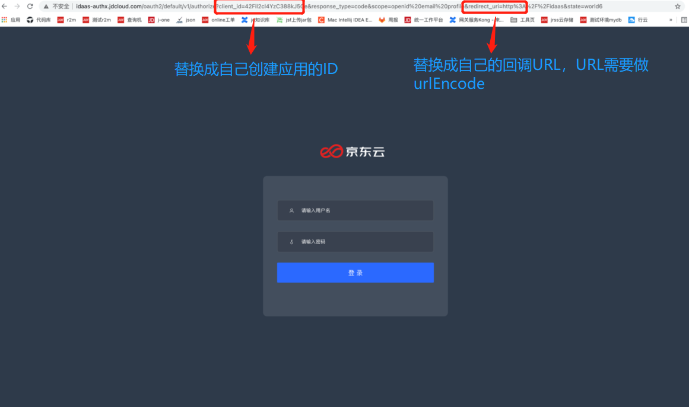
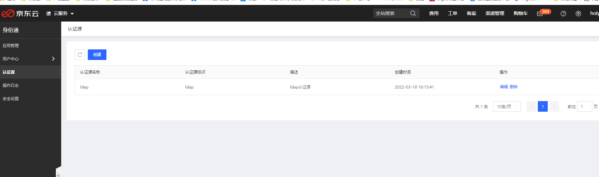
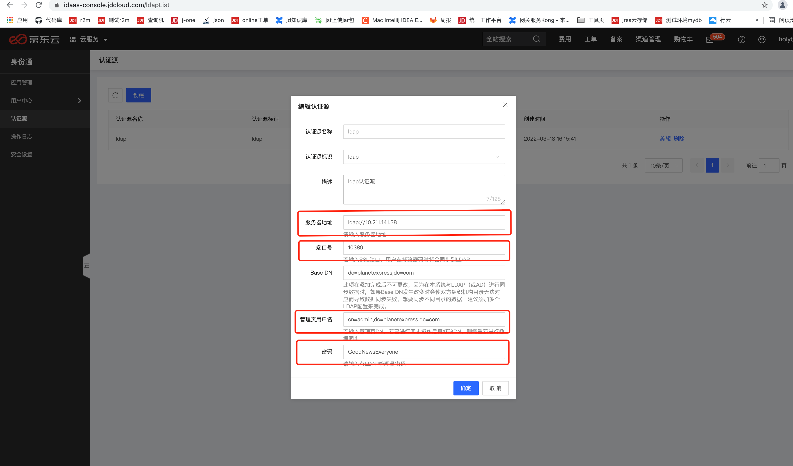
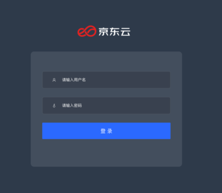

# 添加应用并授权

身份通支持OAuth2.0类型的应用。OAuth2.0支持[授权码模式](https://tools.ietf.org/html/rfc6749#page-24)（Authorization Code Grant）和[隐式模式](https://tools.ietf.org/html/rfc6749#page-31)（Implicit Grant），点击应用管理，进入应用管理页面。在此处，您可以管理您所有已经创建的应用。

## 创建应用

点击创建应用，填写您要创建的应用名称、类型、登入方式、授权类型、回调地址和返回类型，点击“确认”按钮，应用即创建成功。

创建完应用即可进入idaas 登录界面

## 配置认证源

点击左侧菜单中的认证源，在此处，您可以为添加认证源，支持用户号密码认证LDAP认证。

点击“添加”按钮，进入添加认证源页面，录入认证源名称，选择认证源标识，自动默认用户名密码认证；添加LDAP认证源，填写服务器地址、端口号、Base DN、管理员DN与密码，点击’’确认’’按钮，即可完成LDAP认证源的添加。

## 登入

访问链接进入登录界面，如果是用户名和密码认证，输入用户名和密码，完成登录认证；如果选择LDAP认证，输入LDAP认证源对应的用户名和密码，完成登录认证。

