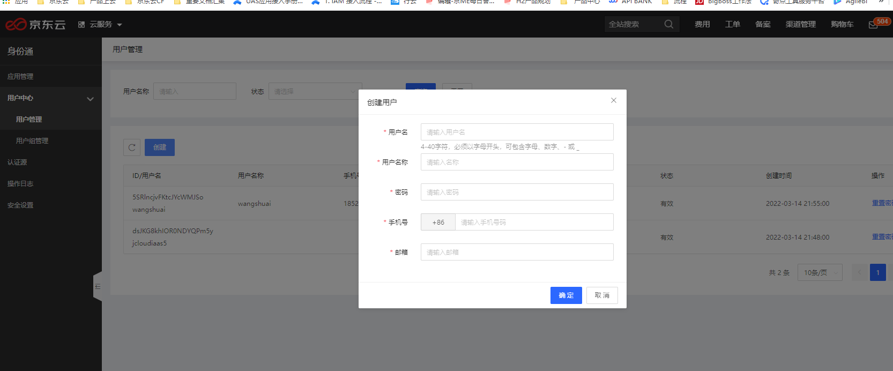
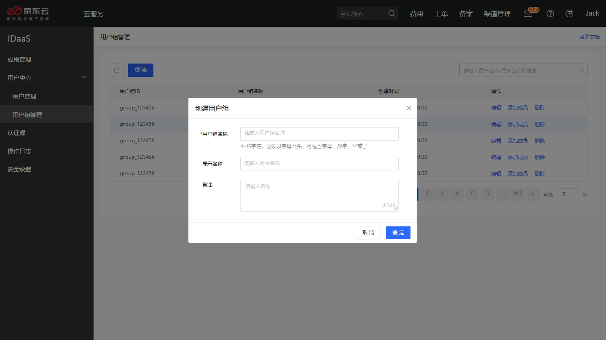
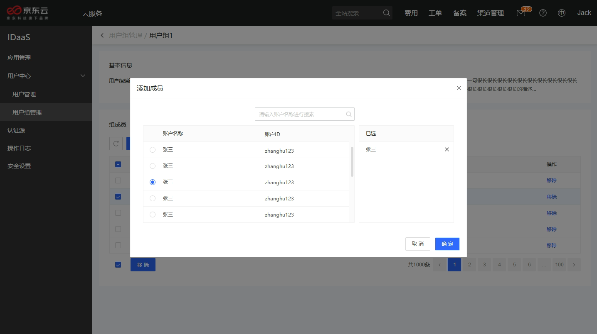
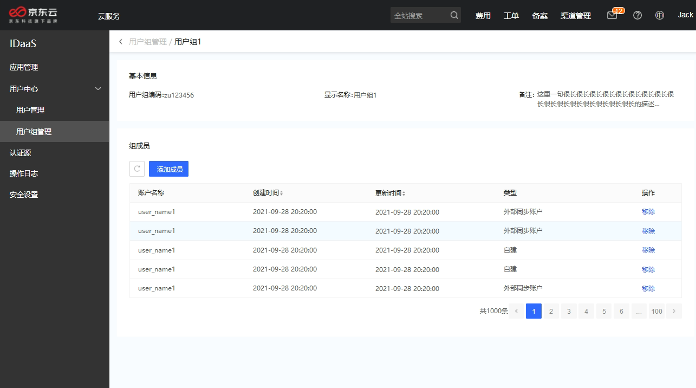
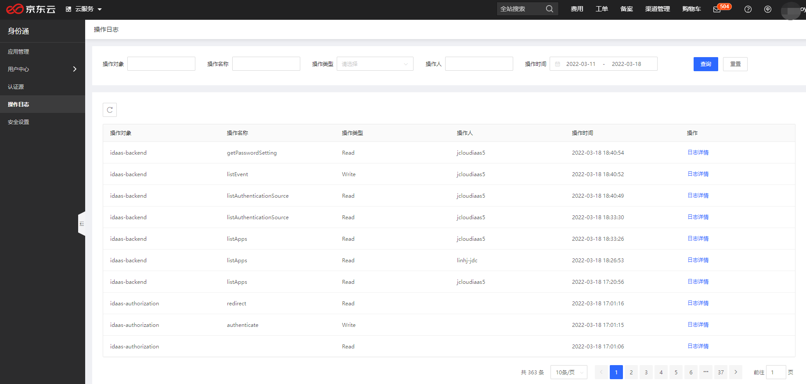
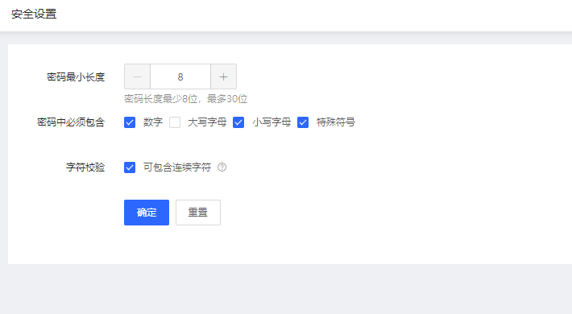

# 管理用户

管理员可以对身份通用户、用户组或组织架构进行管理。

## 用户

用户是一个身份通账号，该账号独立于京东云账号。创建用户时，手机号与邮箱号为必填项。

## 用户组

管理员可以创建任意多个组，用户和组之间的关系为多对多，即用户可以不属于任何组，也可以属于多个组。向一个用户组授权应用后，组内的每一个用户都将继承该授权。
创建用户组时，用户组名称为必填项，用户组名必须以字母开头，可包含字母、数字、“ - ”或“ _ ”。同时，可以设置用户组的显示名称与备注，显示名称格式不受限制。

管理员可以点击对应用户组的添加成员按钮，为该用户组批量的添加新成员，该操作支持输入用户名进行快捷检索。

管理员也可以点击编辑用户组，进入用户组详情页。在此处，您可以从用户组中添加或移除不需要的成员。

## 操作日志

IDaaS操作审计日志，记录用户对各操作对象的操作记录，记录信息有操作对象，操作名称，操作类型和操作人及操作时间。

对用户登录密码的安全性设置，可支持最小长度，密码包含字符定义及字符校验的定义，用户保证用户登录安全。

