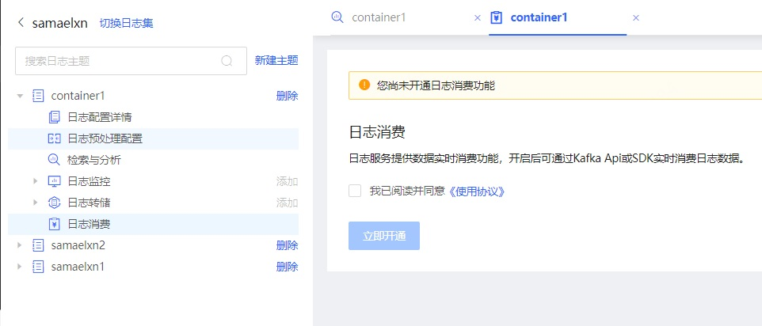
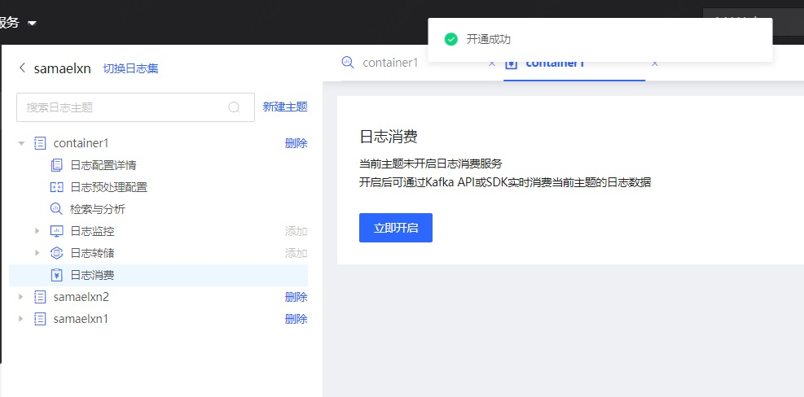
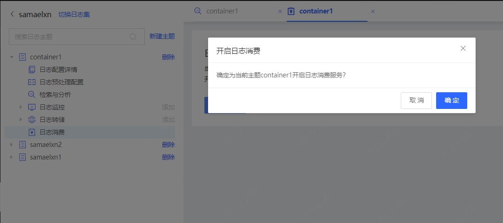
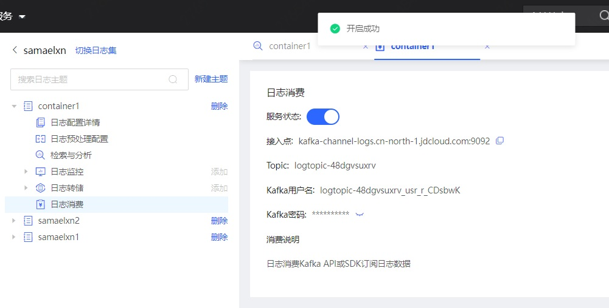

## 日志消费

### 1. 概述

企业的运维中，有时需要将某些日志数据进行进一步的开发使用，可以使用日志的实时消费功能，将日志转发至Kafka中，通过Kafka API实时订阅和消费日志数据，适用于流计算、实时计算等场景。

### 2. 操作步骤

**开通日志消费功能**

默认情况下，日志集的日志消费功能是关闭状态的，当前日志集下的日志主题需要使用日志消费时，首选需要先开通日志消费功能。

在当前日志集下任意日志主题中，点击左侧的日志消费菜单，右侧显示尚未开通的提示，请确保已阅读并同意《使用协议》，勾选后点击立即开通按钮，即可开通成功。

**开启日志消费服务**

如果当前日志集已开通日志消费功能，此时在某个日志主题下点击左侧的日志消费菜单，右侧显示当前主题尚未开启日志消费服务。

点击立即开启，系统会为当前日志主题创建一个topic用于实时转发日志数据，您可以在开通成功的提示信息中查看接入点、Topic、Kafka用户名、Kafka密码，使用Kafka API订阅并消费日志数据。

**关闭日志消费服务**

如果不想再继续订阅消费，可以在日志消费页面中，点击服务状态的开关项，关闭当前日志主题的日志消费服务，关闭后，新的日志不会再推送至Kafka中。
