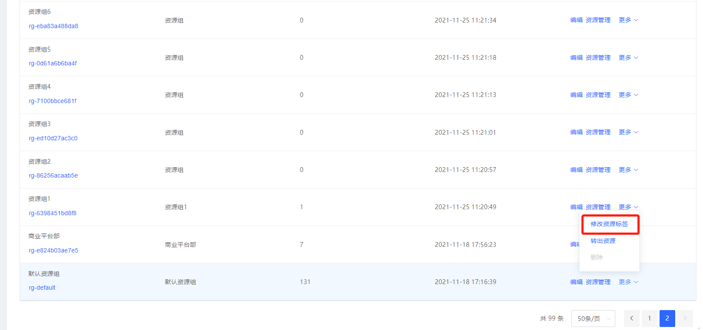
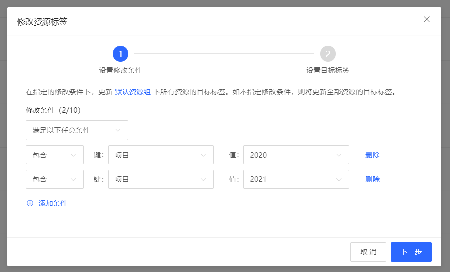
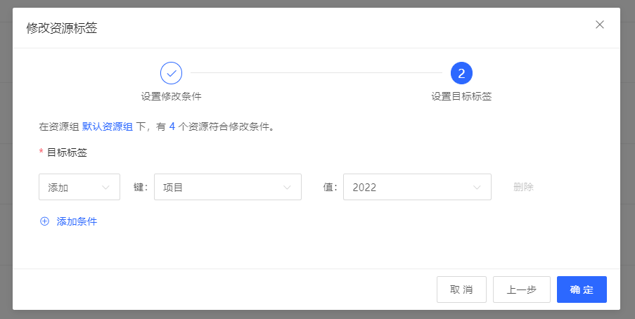
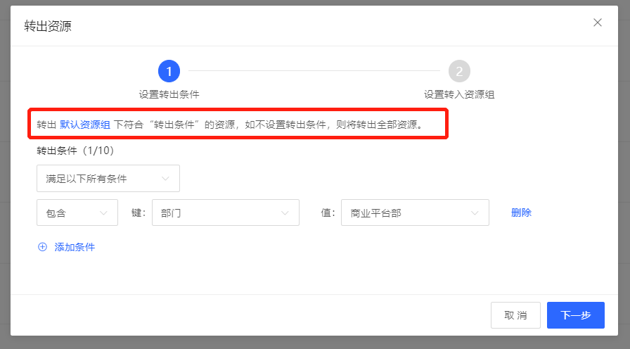
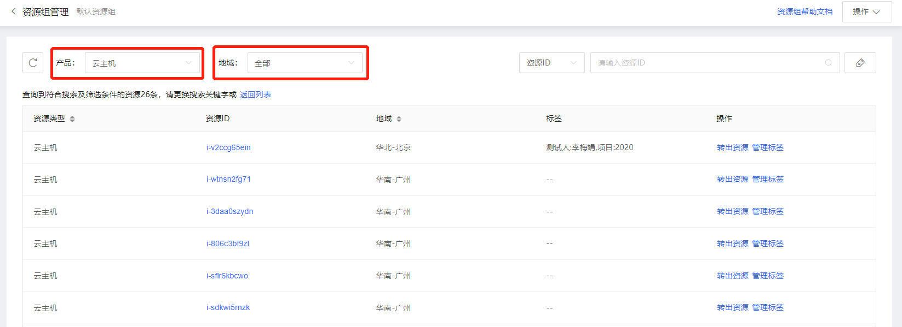
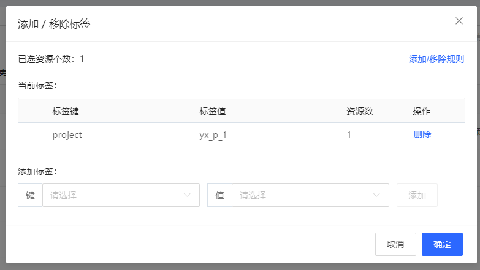

## **资源管理**

本页内容为基于资源组的资源批量管理。
### 1. 批量修改资源标签

资源组的应用场景之一是可以批量管理组内资源的标签。

在资源组列表页，点击操作列的“修改资源标签”，弹出批量修改资源标签的弹窗。

示例场景：将默认资源组内，打了标签“项目：2020”或“项目：2021”的资源标签批量修改为新标签“项目：2022”

第一步，设置修改条件为满足以下任意条件，包含项目：2020或项目：2021

第二步，选择要批量添加的新标签键值，或要批量删除的标签键值，点击确定，即可对上一步的选中资源，批量添加一组标签，或批量删除某个已有标签。

### 2. 批量转出资源

可以将某个资源组内的资源批量转出到其他资源组；也可以通过指定条件，将原资源组内的部分资源转出至其他资源组。

例如，将默认资源组内带有部门：商业平台部的资源全部转出至新资源组。

### 3. 单个资源转出

在资源组列表，点击某个资源组，进入该资源组内的资源列表，支持指定产品线、指定地域查看资源，资源列表限制资源类型、资源ID、地域、标签信息，支持将单个资源转出，也支持编辑单个资源的标签。

### 4. 修改单个资源的标签

