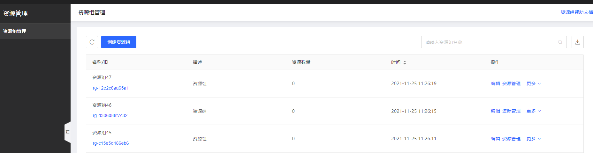
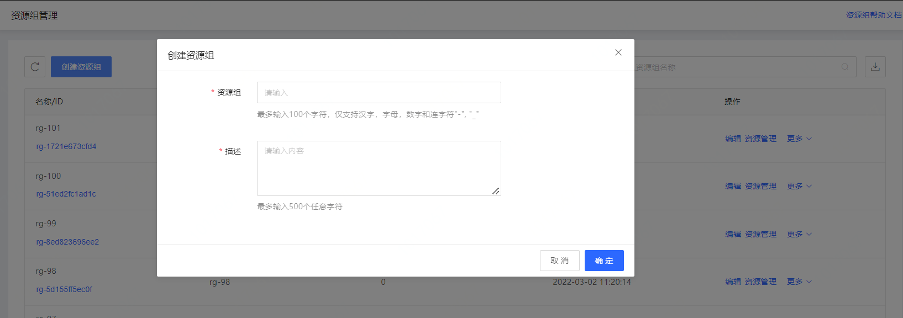
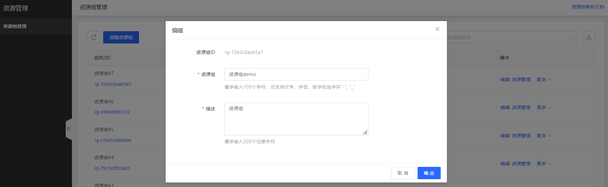
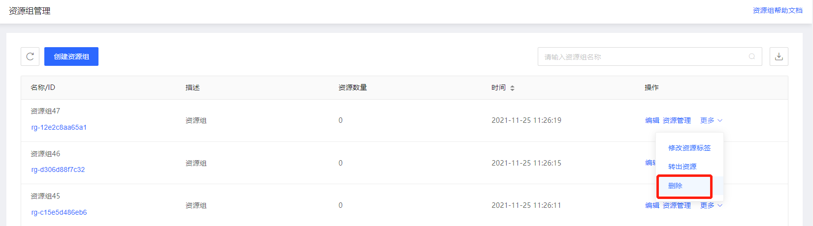

## **资源组管理**

您可以根据本页面内容进行资源组的创建和管理，前提是您登录的身份为京东云主账号或拥有资源组管理权限（JDCloudResourceGroupAdmin）的 IAM 子用户/角色。

### 1. 资源组列表

您可以通过控制台菜单导航，找到管理 - 资源组管理，点击后进入资源组管理控制台。
资源组列表页展示当前账号下所有资源组信息，包含资源组名称/ID、资源组描述、资源组内的资源数量、资源组创建时间等。当您未创建任何自定义资源组时，您的账号下会有一条默认资源组，您账号下的所有资源（已支持资源组的云产品）都将归属于默认资源组。默认资源组的资源支持转出至自定义资源组。

### 2. 创建资源组

点击列表左上角的创建资源组，在弹窗内输入资源组名称和描述，即可创建自定义资源组。

最多输入100个字符，仅支持汉字，字母，数字和连字符"-", "_"

### 3. 编辑资源组

在资源组列表页，点击对应的资源组后的“编辑”，可支持编辑资源组名称和描述信息。

### 4. 删除资源组 ### 

在资源组列表页，点击对应的资源组后的“更多”-“删除”，可支持删除资源组。

删除资源组时，需要先将该资源组下的资源转出至其他资源组。

默认资源组不允许删除。

