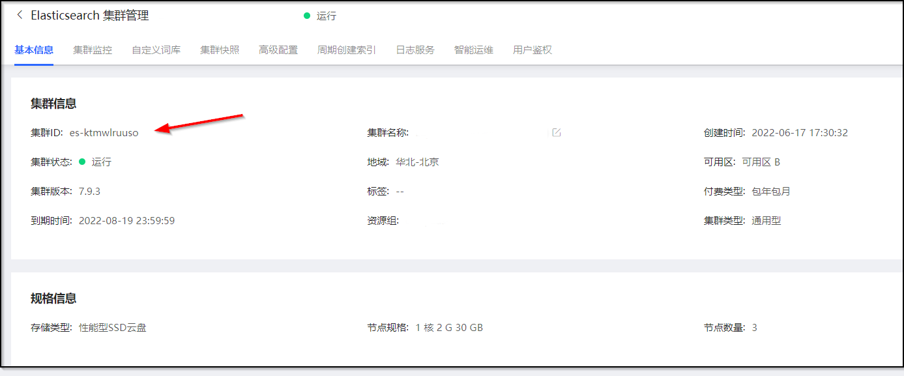
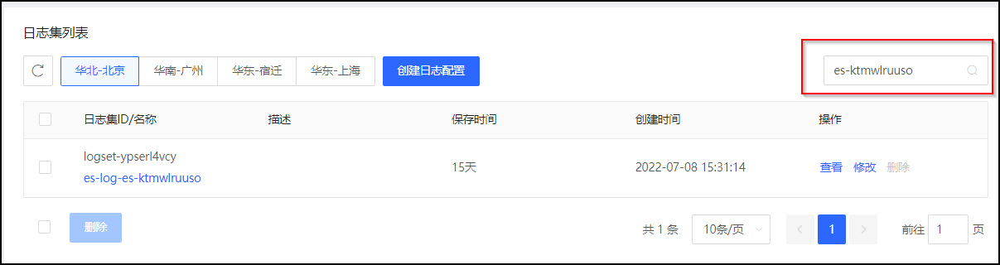
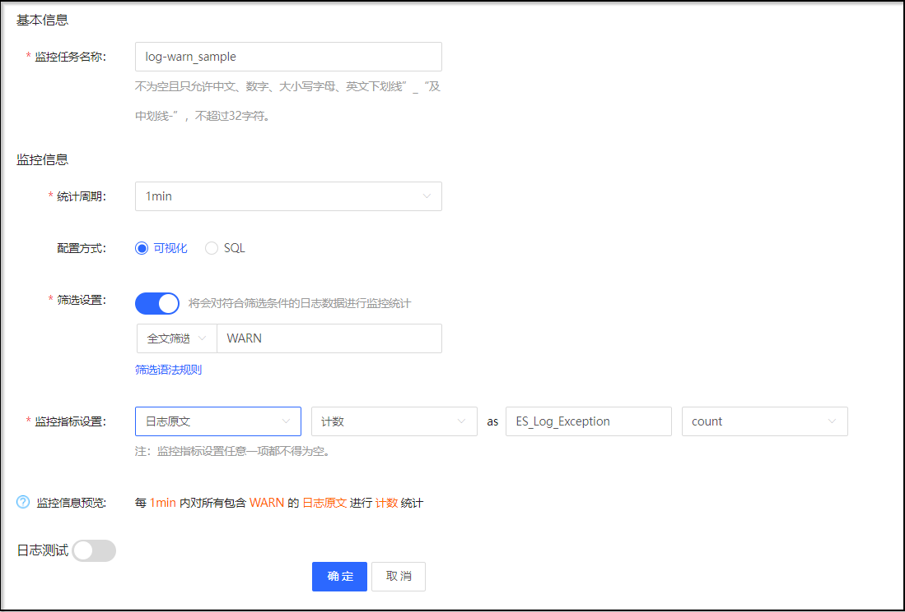
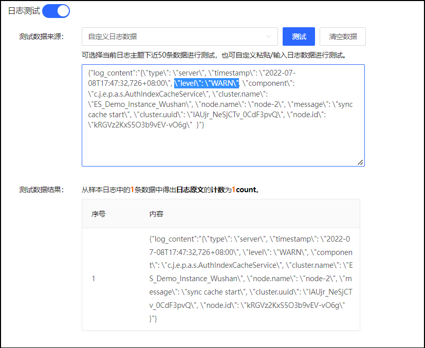
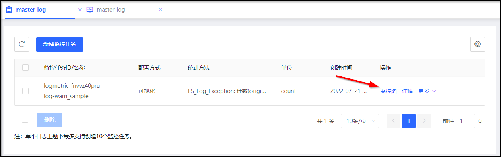
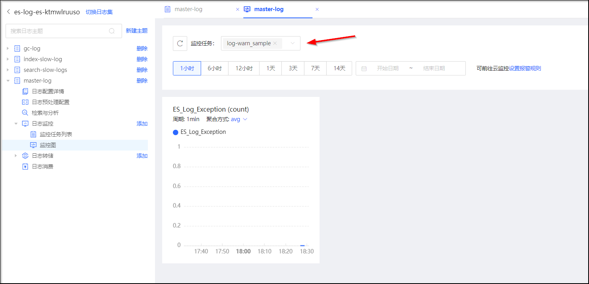
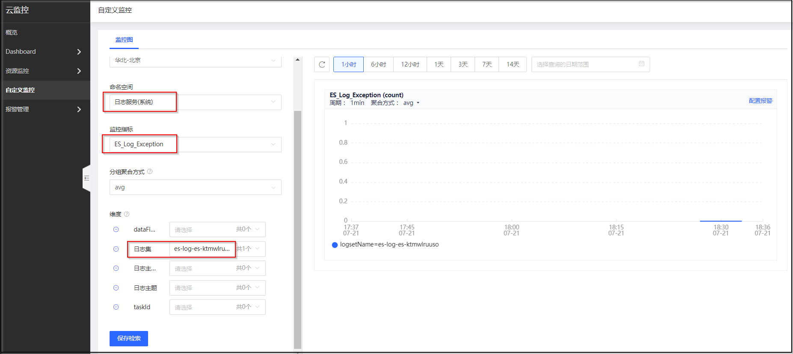

# Elasticsearch 自定义日志监控

您可以通过京东云的日志服务、云监控提供的自定义监控服务，配置 Elasticsearch 的自定义日志监控，配置完成后，您可以在日志服务或云监控的控制台查看自定义监控图，也可以通过云监控的 OpenAPI 查询自定义日志监控的数据。
在下面的例子中，我们将配置 Elasticsearch 的自定义日志监控，监控 **Elasticsearch 主日志中的 WARN 级别日志次数** ，以及通过查看自定义监控图或者调用 OpenAPI 的方式查询该自定义日志监控指标的数据。

## 开通ES集群的日志服务
1. 登陆 [京东云 Elasticsearch 控制台](https://es-console.jdcloud.com/clusters)，在集群列表页中，点击集群名称进入集群详情页面。
2. 在集群详情页面，记录下集群 ID （例如本例子中，集群 ID 为 es-ktmwlruuso ）



3. 参考 [ Elasticsearch 日志服务](../Operation-Guide/eslog.md) 开通 Elasticsearch 日志服务。

## 配置日志监控
1. 登陆 [京东云日志服务控制台](https://logs-console.jdcloud.com/)，或通过在京东云控制台选择【云服务-监控与运维-日志服务】切换至日志服务控制台。
2. 选择目标集群所在的区域后，在日志集列表搜索框中，输入上面记录的 **集群 ID** 搜索目标集群的 Elasticsearch 日志集。



3. 点击 日志集名称 进入对应的日志集。选择日志主题 **master-log**，展开进入 【master-log - 日志监控 - 监控任务列表】。


4. 点击 **新建监控任务**，在新建监控任务页面中，配置监控任务参数：
- 配置监控任务名称。
- 配置统计周期：1min
- 配置方式：可视化
- 筛选设置：全文筛选、“WARN”
- 监控指标设置：日志原文、计数、#metric名称#、count

> **#metric名称#**：在调用云监控接口获取监控数据时会使用到，建议对所有集群配置同一个 metric 名称。例如：ES_Log_Exception。



- 日志测试（可选）：可直接使用当前日志主题下的日志进行测试，也可以自定义粘贴日志数据进行测试。例如自定义粘贴一条或多条日志，对应修改日志中的值（\"level\": \"WARN\"）测试监控任务配置。



5. 点击确认，完成监控任务创建。


## 查看监控图
### 在日志服务控制台查看监控图
- 可以在日志服务控制台，在对应 Elasticsearch 日志集的 【master-log - 日志监控 - 监控任务列表】 中，选择目标监控任务右侧的【操作-监控图】，查看对应日志监控任务的监控图。



- 也可以在日志服务控制台，在对应 Elasticsearch 日志集的【master-log - 日志监控 - 监控图】 中，选择对应的监控任务（可多选），查看对应日志监控任务的监控图。



### 在云监控控制台查看监控图
自定义监控图查看、添加报警规则等详细步骤可参考：
- [查看监控图](../../../../documentation/Management/Monitoring/Operation-Guide/custom-monitoring/chart-view.md)
- [添加报警规则](../../../../documentation/Management/Monitoring/Operation-Guide/custom-monitoring/create-alarmrule-custom.md)
</br>

1. 登陆 [京东云云监控控制台](https://cms-console.jdcloud.com/)，也可通过在京东云控制台选择【云服务-监控与运维-云监控】切换至云监控控制台。
2. 在左侧菜单栏中选择 **自定义监控**。
3. 选择监控图配置后，可以查看前面日志监控配置的监控图。
- 检索方式：新增检索方式；
- 地域：选择目标 Elasticsearch 集群所在的区域；
- 命名空间：输入 logs 并点击搜索，在下拉列表中选择 **日志服务（系统）**；
- 监控指标：输入您在日志监控配置中输入的#metric名称#，例如：ES_Log_Exception；
- 维度：选择日志集、日志主题（可选）、taskId（可选））



## 调用云监控接口获取监控数据
您可以通过调用 [云监控 describeCustomMetricData 接口](https://docs.jdcloud.com/cn/monitoring/api/describecustommetricdata?content=API)获取配置的日志监控指标的数据，其中：
- namespaceUID：logs-metric
- QueryOption -> metric：输入前面配置的 #metric名称#，例如：ES_Log_Exception；

可参考如下样例
```
{
    "regionId":"cn-north-1",
    "namespaceUID":"logs-metric",
    "query":{
        "metric":"ES_Log_Exception",
        "aggrType":"avg",
        "downSampleType":"avg",
        "dimensions":[
            {
                "key":"logsetName",
                "values":["es-log-es-ktmwlruuso"],
                "groupBy":true
            },
            {
                "key":"logtopicId",
                "values":["logtopic-8bzou695dj"],
                "groupBy":true
            }
         ]
    },
    "startTime":"2022-07-08T18:13:27+0800",
    "endTime":"2022-07-08T19:13:27+0800",
    "apiVersion":"v2"
}
```
