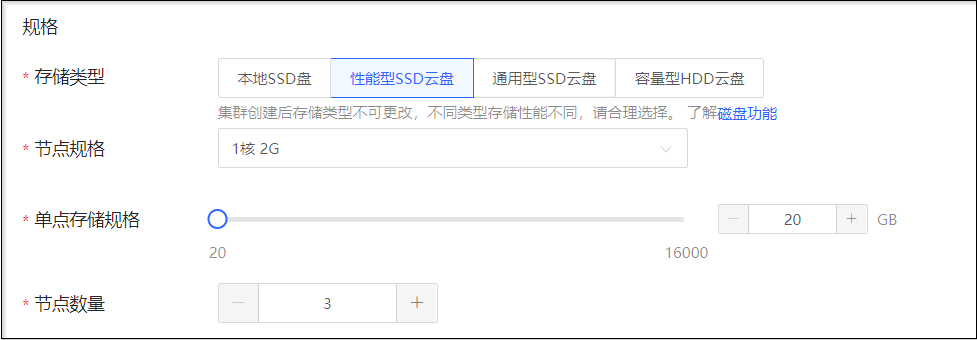
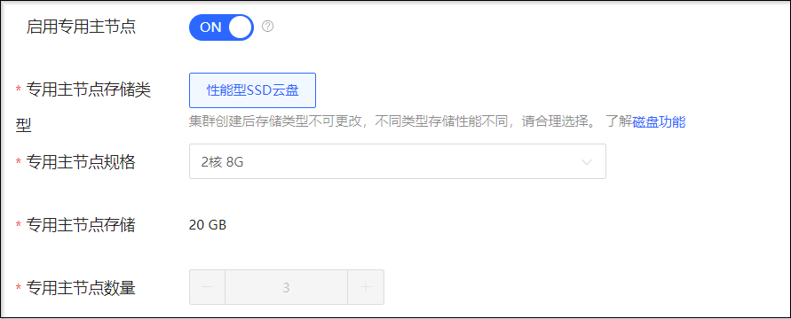
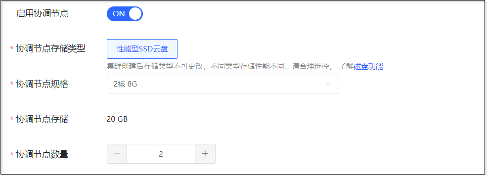
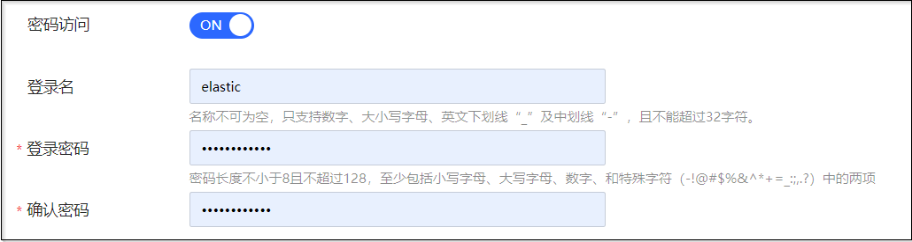
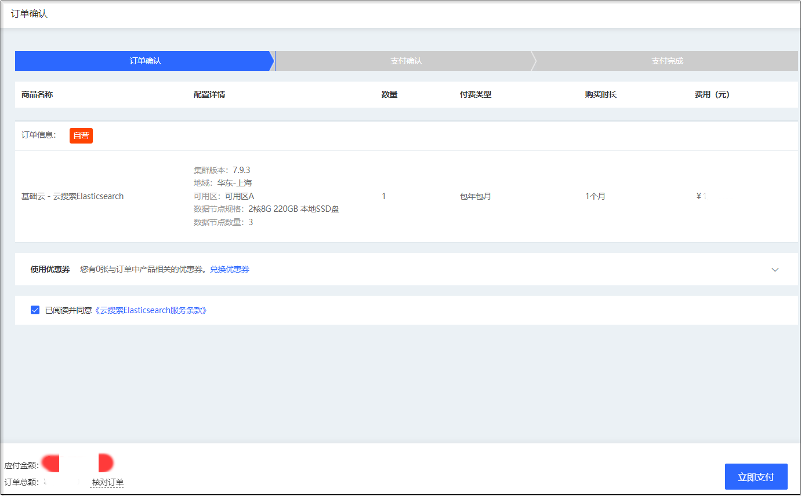

# 创建集群

集群是京东云搜索Elasticsearch提供服务的基本单元，也是您使用和管理Elasticsearch服务的主要对象。您可以在云搜索Elasticsearch控制台新建集群，关于实例的计费说明请参见“[价格总览](../Pricing/Price-Overview.md)”、“[计费规则](../Pricing/Billing-Rules.md)”。

## 前提条件

- 已注册京东云账号，并完成实名认证。如果还没有账号请 [注册](https://accounts.jdcloud.com/p/regPage?source=jdcloud&ReturnUrl=https%3a%2f%2fuc.jdcloud.com%2fpassport%2fcomplete%3freturnUrl%3dhttps%3a%2f%2fwww.jdcloud.com)，或 [实名认证](https://uc.jdcloud.com/account/certify)。
- 如计费类型选择按配置计费，请确认您的账户余额（包括代金券）能满足您的使用。

## 操作步骤

### 一、登陆控制台
1. 访问 [云搜索Elasticsearch 控制台](https://es-console.jdcloud.com/clusters)，或者访问 [京东云控制台](https://console.jdcloud.com/) 选择【云服务】-【互联网中间件】-【云搜索Elasticsearch】进入实例列表页 。

2. 在实例列表页面单击**创建**，进入“创建集群”页面。

### 二、选择集群配置

1. 选择计费模式：
- **计费类型**：支持包年包月和按配置计费。按配置的计费方式比较灵活，可以即开即停，按实际使用时长计费。包年包月的计费方式相对于按配置计费会提供更大的折扣，适用于长期使用者。详细请参见 [计费规则](../Pricing/Billing-Rules.md)。

2. 选择地域/部署方式/可用区：
- **地域**：目前支持“华北-北京”、“华南-广州”、“华东-上海”。
- **部署方式**：支持单可用区和多可用区部署。单可用区部署支持跨机架容灾，多可用区部署支持跨机房容灾，但网络会有一定延迟，可根据业务要求选择。选择多可用区部署时，集群的数据节点会均匀的分布到您选择的多个多用区中，所部署的数据节点支持可用区感知功能，可使数据的副本分布到多个可用区中，保证单个可用区仅有一份副本，当单个可用区出现故障时，剩余可用区仍然可以不间断的提供服务。可参考 [集群多可用区部署](../Getting-Started/MultiAZ-ES.md)。
- **可用区**：可用区是使用独立电源和网络资源的物理区域。通过内部网络互联，再以物理方式进行隔离，提高了应用程序的可用性。

3. 选择Elasticsearch版本和设置集群名称：
- **版本**：当前支持5.6.9、6.5.4、6.7.0、6.8.13、7.5.2、7.9.3。
- **集群名称**：自定义的集群名称，名称不可为空，只支持数字、大小写字母、英文下划线“_”及中划线“-”，以字母开头且不能超过32字符。

4. 选择数据节点规格参数：
- **存储类型**：支持本地SSD盘、性能型SSD云盘、通用型SSD云盘、容量型HDD云盘。
- **节点规格**：支持多种计算规格，可以根据具体业务情况选择。详细规格可参考 [产品规格](../Introduction/Specifications.md)。
- **单点存储规格**：每个节点配置的磁盘容量，整个集群的存储量 = 单个节点存储 * 节点个数。单点存储规格范围20-16000GB，步长为10GB，可输入整数。
- **节点数量**：单可用区部署时可选范围为3-40，双可用区部署时可选范围为6-40，三可用区部署时可选范围为9-45。支持工单方式提升节点配额。

5. 选择专有主节点或协调节点参数（可选）：当集群具有一定规模时，可以配置 [专用主节点](../Operation-Guide/Instance/Nodes/Dedicated-master-node.md) 或 [协调节点](../Operation-Guide/Instance/Nodes/Coordinating-node.md) ，进一步保障集群稳定性。当未选择专用主节点或协调节点时，数据节点充当专用主节点或协调节点的角色。

**专有主节点配置**
- **启用专有主节点**：专用主节点的使用可以提高集群稳定性，建议开启专用主节点，开启后可选择节点规格和数量。
- **专用主节点存储类型**：支持性能型SSD云盘。
- **专用主节点规格**：支持多种计算规格，专用主节点规格不要求同数据节点规格一致，可以根据具体业务情况选择。详细规格可参考 [产品规格](../Introduction/Specifications.md)。
- **专用主节点存储**：默认为20GB，不可修改。
- **专用主节点数量**：默认为3，不可修改，奇数个能保证高可用并预防脑裂风险。

**协调节点配置**
- **启用协调节点**：协调节点就像负载均衡器一样，用来响应客户请求，均衡每个节点的负载。协调节点的加入可以释放数据节点承担的均衡节点负载的任务，使大型集群受益。开启后可选择节点规格和数量。
- **协调节点存储类型**：支持性能型SSD云盘。
- **协调节点规格**：支持多种计算规格，可以根据具体业务情况选择。详细规格可参考 [产品规格](../Introduction/Specifications.md)。
- **协调节点存储**：默认为20GB，不可修改。
- **协调节点数量**：单可用区部署时可选范围为2-20，双可用区部署时可选范围为4-30，三可用区部署时可选范围为6-30。

6. 选择私有网络及子网：ES集群将部署在 VPC 内，只有在同一个VPC下才能访问ES集群，因此为保证内网顺利访问，建议选择已有云上业务的区域位置所在 VPC。多可用区部署模式下，也是选择同一个 VPC。同一个 VPC 内，不同可用区子网之间是互通的。
- **私有网络**： 显示当前VPC列表，默认选择最新创建的VPC。单击列表后“新建私有网络”跳转至私有网络（VPC）页面。
- **子网**： 显示当前子网列表，默认选择最新创建的子网。单击列表后“新建子网”跳转至私有网络-子网页面。

7. 设置自动创建快照参数：
- **自动创建快照**： 默认关闭，可开启，开启后可选择每天备份时间。

8. 设置用户鉴权参数：
- **密码访问**： 默认关闭，可开启，可开启用户鉴权功能并设置用户数据鉴权的管理员账号和密码。用户鉴权功能可参考 [用户鉴权](../Operation-Guide/Auth/Auth_introduction.md)。
- **登录名**：用户数据鉴权的管理员账号。
- **登录密码**：用户数据鉴权的管理员账号密码。

9. 选择资源组：选择集群实例所属的资源组，如未选择，该集群实例将分配至默认资源组。

10. 选择购买时长和自动续费：计费方式选择包年包月时需选择购买时长和是否自动续费，包年包月的集群有使用期限，到期后会影响服务使用，建议包年包月购买的集群设置为自动续费。

.

11. 选择完全部参数后，单击 **创建** 按钮，进入订单确认页。

### 三、订单确认及支付
1. 在订单确认页，确认订单参数和应付金额无误后，请勾选 **已阅读并同意《云搜索Elasticsearch服务条款》** ，单击 **立即支付** 并支付。

.

### 四、创建完成
1. 预付费集群支付完成，后付费集群开通成功后，可以跳转到[云搜索Elasticsearch 控制台](https://es-console.jdcloud.com/clusters) 查看刚创建的集群。创建的集群将展现在集群列表中，状态为“创建中”，耐心等待几分钟，创建成功后集群状态会变为“运行”。

