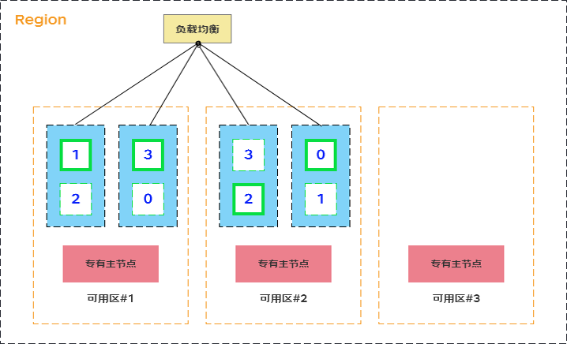
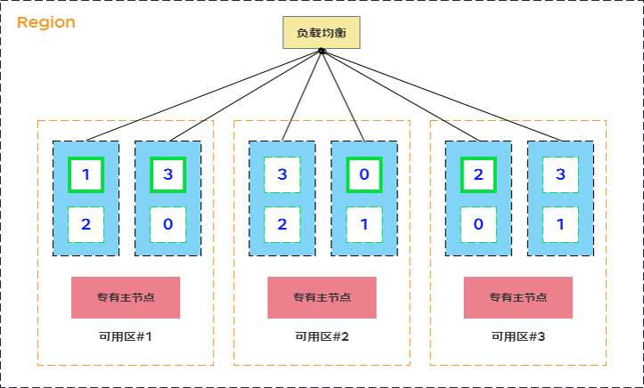

# 集群多可用区部署

集群多可用区部署可以提升集群的容灾能力，Elasticsearch集群可以选择双可用区（跨2个可用区）或三可用区（跨3个可用区）部署，集群的数据节点会均匀的分布到您选择的多个多用区中，所部署的数据节点支持可用区感知功能。在索引配置了副本的情况下，数据的副本会分布到多个可用区中，保证单个可用区仅有一份副本，当单个可用区出现故障时，剩余可用区仍然可以不间断的提供服务，显著增强了集群的可用性。

多可用区部署可显著增强了集群的可用性和数据的可靠性，但网络会有一定延迟，可根据业务要求选择使用。

- [多可用区容灾部署操作](MultiAZ-ES#user-content-1)
- [集群多可用区容灾原理](MultiAZ-ES#user-content-2)

## 场景
多可用区部署支持单可用区、双可用区、三可用区三种部署方式，各部署方式的使用场景建议如下：
- 单可用区：普通部署模式，适用于非关键任务型的工作（默认）。
- 双可用区（跨2个可用区）：跨可用区容灾部署模式，适用于生产型的工作。
- 三可用区（跨3个可用区）：高可用部署模式，适用于具有更高可用性要求的生产型的工作。

<div id="user-content-1"></div>

## 多可用区容灾部署操作
在购买京东云Elasticsearch实例时，您可以选择单可用区或者多可用区。当选择多可用区时，你可以选择两个或者三个可用区，系统将在您选择的可用区中部署Elasticsearch实例。


<div id="user-content-2"></div>

## 集群多可用区容灾原理



### 专有主节点
为了提高集群的可靠性，您在使用多可用区容灾功能时必须要创建三个专有主节点，且分布在三个不同的可用区中。这个部署方式，可以保证当一个可用区不可用时，集群依然有超过半数的法定主节点选举个数，可以保证集群的正常选主。
- 在三可用区部署时，我们会在每个可用区部署一个专有主节点；
- 在双可用区部署时，除了您选择的两个可用区外，我们会自动地为您选择一个新的可用区部署专有主节点。

### 数据节点
为了保证多可用区容灾的功能生效，你所选择的集群数据节点个数必须为可用区个数的整数倍，这些数据节点会均匀的部署在您选择的可用区上。

**索引副本**
1. 双可用区部署时，为保证集群高可用和数据高可靠，当其中一个可用区不可用时，剩下的可用区需要继续提供服务，因此索引的副本个数至少为1。由于集群为索引默认配置的副本个数为1个，因此如果您对读性能没有特殊要求，可以直接使用默认值。
2. 三可用区部署时，为保证集群高可用和数据高可靠，当其中一个可用区或两个可用区不可用时，剩下的可用区需要继续提供服务，因此索引的副本个数至少为2。由于集群为索引默认配置的副本个数为1个、因此需要配置索引模板调整默认的副本数。详细信息请参见：[索引模板](https://www.elastic.co/guide/en/elasticsearch/reference/master/index-templates.html)。例如使用索引模板设置副本个数为2个、示例代码如下。

   ```
   PUT _template/template_1
   {
     "template": "*",
     "settings": {
       "number_of_replicas": 2
     }
   }
   ```

### 协调节点
为了保证多可用区容灾的功能生效，你所选择的协调节点个数必须为可用区个数的整数倍，这些协调节点会均匀的部署在您选择的可用区上。

## 配置说明

为使集群含有可用区感知的能力，保证每个可用区都有一份完整的数据副本，需要对集群做一些特殊配置。详细信息请参见：[Shard Allocation Awareness](https://www.elastic.co/guide/en/elasticsearch/reference/master/modules-cluster.html#shard-allocation-awareness)

例如当集群跨2个可用区部署时、集群配置相关的参数说明如下：

|                                                           |                                                              |           |
| --------------------------------------------------------- | ------------------------------------------------------------ | --------- |
| cluster.routing.allocation.awareness.attributes           | 用于告知ES使用哪些节点属性设置分片的分配策略。跨可用区实例通过在节点的启动参数中加入Enode.attr.zone_id、来标识节点的可用区(例如某个节点部署在az01可用区、则在该节点的启动参数中加入`-Enode.attr.zone_id=az01)`，因此该参数值固定为zone_id。<br />注意：不要通过ES API修改此参数值、否则会引起异常 | zone_id   |
| cluster.routing.allocation.awareness.force.zone_id.values | 用于告知ES在跨可用区部署时强制均分shard。假设索引中包含了3个主分片、1个副本、并且部署在az01和az02两个可用区。按照分片分配策略、系统会在az01分配3个分片、在az02分配3个分片。如果指定了cluster.routing.allocation.awareness.force.zone_id.values参数为az01,az02、当az02不可用时、该可用区的3个分片不会自动迁移到az01。 | az01,az02 |


