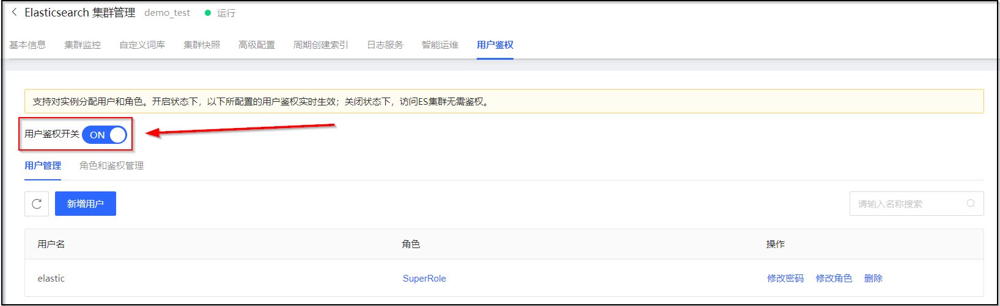
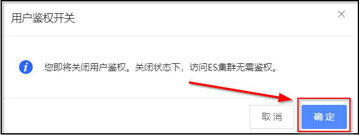

# 关闭用户鉴权
## 前置条件
1. 集群已经开启用户鉴权。

## 操作步骤
1. 访问 [云搜索Elasticsearch控制台](https://es-console.jdcloud.com/clusters)，进入集群管理页面。或访问 [京东云控制台](https://console.jdcloud.com/)，点击顶部导航栏 互联网中间件-云搜索Elasticsearch，进入集群管理页。
2. 单击 **目标集群名称** 链接，进入集群详情页。
3. 选择 **用户鉴权** 标签页，单击 **用户鉴权开关** 右侧的开关按钮。

4. 在弹出的对话框中，单击 **确定**，开启用户鉴权。

