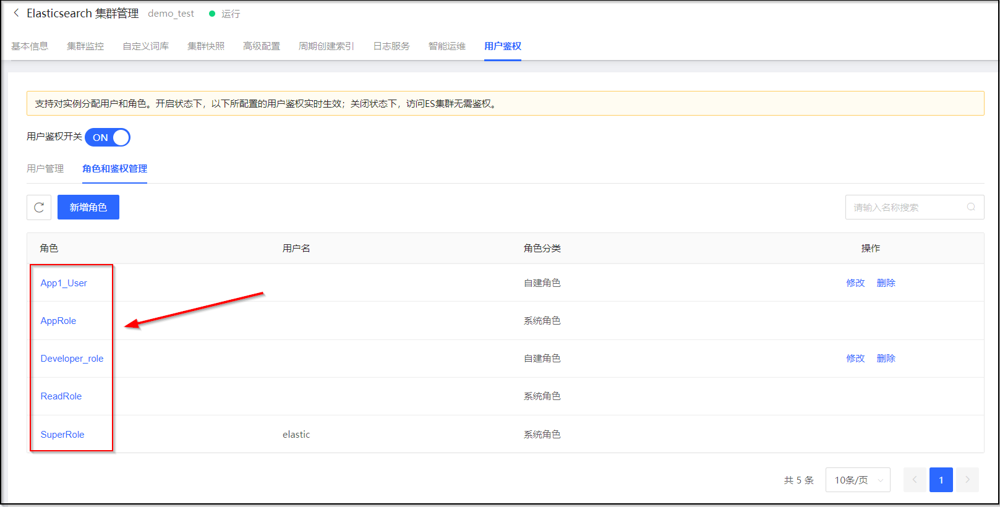
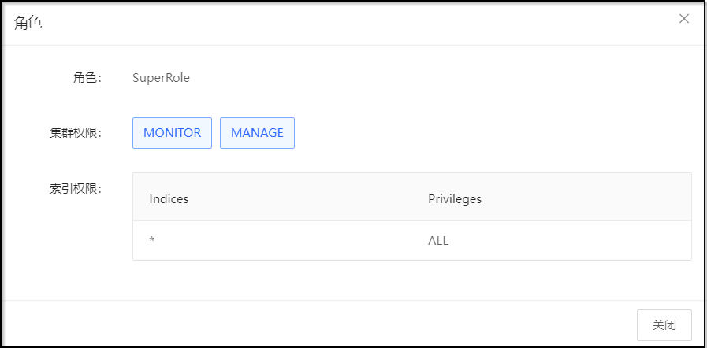
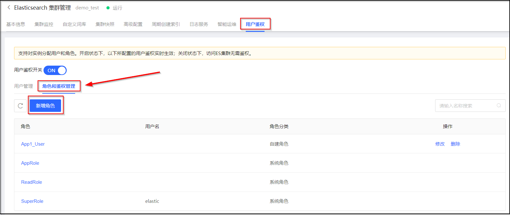
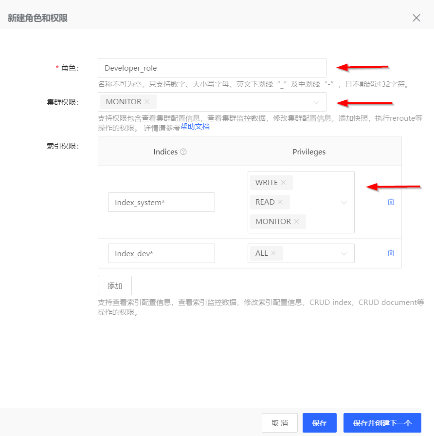
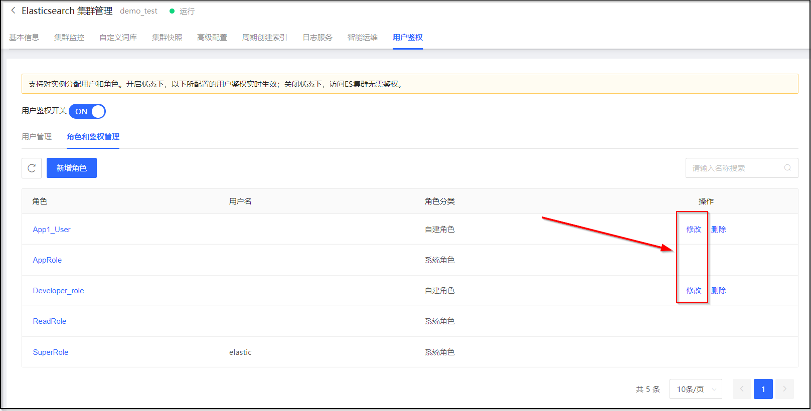
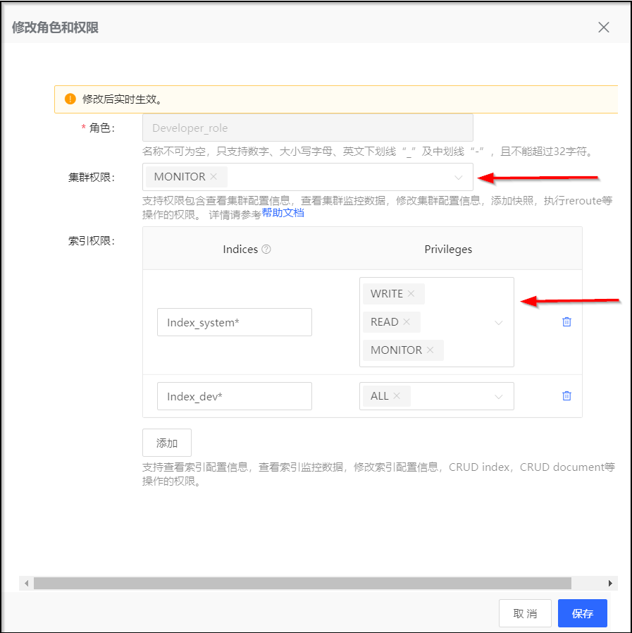
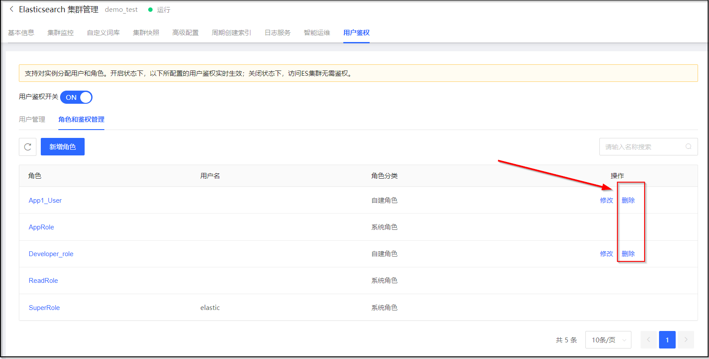
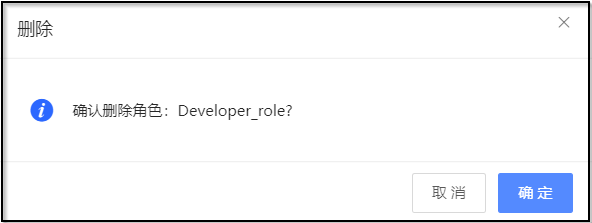

# 角色管理

## 系统角色
京东云Elasticsearch为每个集群创建时为每个集群预置了3个系统角色，系统角色不可修改或删除。系统角色的信息如下：

| 角色名称  | 角色分类  | 集群权限  | 索引权限  |
| :------------ | :------------ | :------------ | :------------ |
| SuperRole  | 系统角色  | MANAGE，MONITOR  | ALL |
| AppRole  | 系统角色  | MONITOR  | MONITOR，READ，CREATE_INDEX，WRITE，DELETE |
| ReadRole  | 系统角色  | MONITOR  | MONITOR，READ |

## 查看角色配置
1. 访问 [云搜索Elasticsearch控制台](https://es-console.jdcloud.com/clusters)，进入集群管理页面。或访问 [京东云控制台](https://console.jdcloud.com/)，点击顶部导航栏 互联网中间件-云搜索Elasticsearch，进入集群管理页。
2. 单击 **目标集群名称**链接，进入集群详情页。
3. 选择 **用户鉴权** 标签页，在 **角色和鉴权管理** 区域中，单击 **角色名称** 链接，查看角色配置。

## 创建自定义角色
### 前置条件
1. 集群已经开启用户鉴权。

### 操作步骤
1. 访问 [云搜索Elasticsearch控制台](https://es-console.jdcloud.com/clusters)，进入集群管理页面。或访问 [京东云控制台](https://console.jdcloud.com/)，点击顶部导航栏 互联网中间件-云搜索Elasticsearch，进入集群管理页。
2. 单击 **目标集群名称**链接，进入集群详情页。
3. 选择 **用户鉴权** 标签页，在 **角色和鉴权管理** 区域中，单击 **新增角色** 按钮。

4. 在 **新建角色和权限** 对话框中，输入角色名称，选择集群权限和索引权限后，单击 **保存** 按钮保存角色，或单击 **保存并创建下一个** 按钮继续创建角色。

## 修改自定义角色
### 前置条件
1. 集群已经开启用户鉴权。
2. 已创建自定义角色。

### 操作步骤
1. 访问 [云搜索Elasticsearch控制台](https://es-console.jdcloud.com/clusters)，进入集群管理页面。或访问 [京东云控制台](https://console.jdcloud.com/)，点击顶部导航栏 互联网中间件-云搜索Elasticsearch，进入集群管理页。
2. 单击 **目标集群名称**链接，进入集群详情页。
3. 选择 **用户鉴权** 标签页，在 **角色和鉴权管理** 区域中，单击要修改的自定义角色的 **操作-修改** 按钮。

4. 在 **修改角色和权限** 对话框中，选择集群权限和索引权限后，单击 **保存** 按钮保存修改。

## 删除自定义角色

> 说明：系统角色不能删除，只允许删除自定义角色。

### 前置条件
1. 集群已经开启用户鉴权。
2. 已创建自定义角色。

### 操作步骤
1. 访问 [云搜索Elasticsearch控制台](https://es-console.jdcloud.com/clusters)，进入集群管理页面。或访问 [京东云控制台](https://console.jdcloud.com/)，点击顶部导航栏 互联网中间件-云搜索Elasticsearch，进入集群管理页。
2. 单击 **目标集群名称**链接，进入集群详情页。
3. 选择 **用户鉴权** 标签页，在 **角色和鉴权管理** 区域中，单击要删除的自定义角色的 **操作-删除** 按钮。

4. 在 **删除** 对话框中，，单击 **确定** 按钮。

