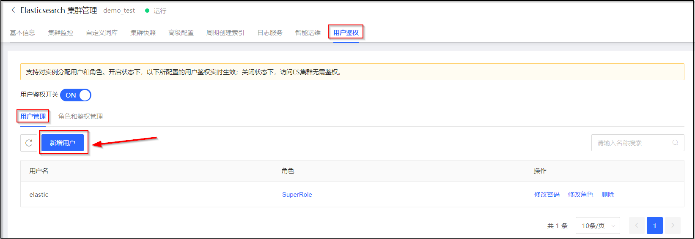
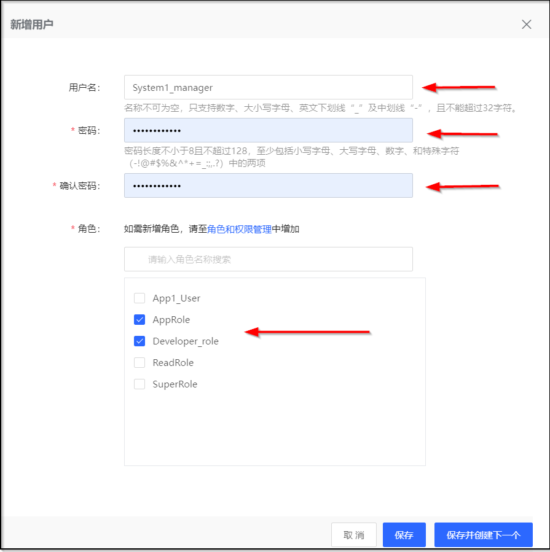
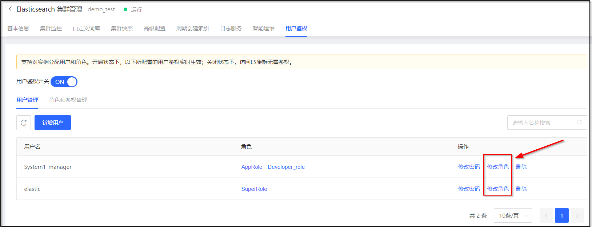
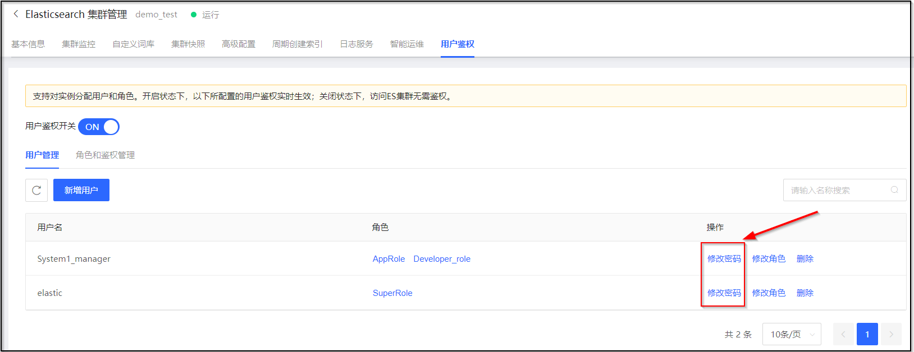
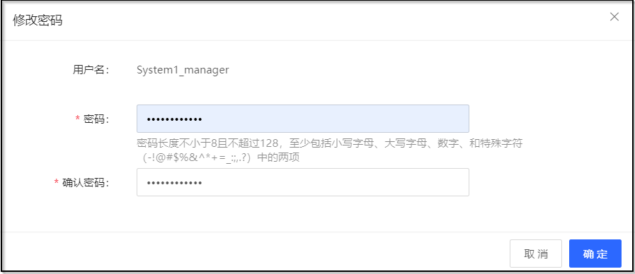

# 用户管理

## 创建用户
1. 访问 [云搜索Elasticsearch控制台](https://es-console.jdcloud.com/clusters)，进入集群管理页面。或访问 [京东云控制台](https://console.jdcloud.com/)，点击顶部导航栏 互联网中间件-云搜索Elasticsearch，进入集群管理页。
2. 单击 **目标集群名称**链接，进入集群详情页。
3. 选择 **用户鉴权** 标签页，在 **用户管理** 区域中，单击 **新增用户** 按钮。

4. 在 **新建用户** 对话框中，输入用户名和密码，选择配置给该用户的角色（可多选）后，单击 **保存** 按钮保存用户，或单击 **保存并创建下一个** 按钮继续创建用户。

## 修改用户
### 前置条件
1. 已经创建了用户。

### 操作步骤
1. 访问 [云搜索Elasticsearch控制台](https://es-console.jdcloud.com/clusters)，进入集群管理页面。或访问 [京东云控制台](https://console.jdcloud.com/)，点击顶部导航栏 互联网中间件-云搜索Elasticsearch，进入集群管理页。
2. 单击 **目标集群名称**链接，进入集群详情页。
3. 选择 **用户鉴权** 标签页，在 **用户管理** 区域中，单击要修改的用户的 **操作-修改角色** 按钮。

4. 在 **修改角色** 对话框中，修改配置给该用户的角色（可多选）后，单击 **确定** 按钮保存修改。

## 删除用户
### 前置条件
1. 已经创建了用户。

### 操作步骤
1. 访问 [云搜索Elasticsearch控制台](https://es-console.jdcloud.com/clusters)，进入集群管理页面。或访问 [京东云控制台](https://console.jdcloud.com/)，点击顶部导航栏 互联网中间件-云搜索Elasticsearch，进入集群管理页。
2. 单击 **目标集群名称**链接，进入集群详情页。
3. 选择 **用户鉴权** 标签页，在 **用户管理** 区域中，单击要删除的用户 **操作-删除** 按钮。

4. 在 **删除** 对话框中，，单击 **确定** 按钮。
> 说明：删除前，请确认该用户已不再使用当前实例信息，以免影响用户使用造成损失。

## 修改用户密码
### 前置条件
1. 已经创建了用户。

### 操作步骤
1. 访问 [云搜索Elasticsearch控制台](https://es-console.jdcloud.com/clusters)，进入集群管理页面。或访问 [京东云控制台](https://console.jdcloud.com/)，点击顶部导航栏 互联网中间件-云搜索Elasticsearch，进入集群管理页。
2. 单击 **目标集群名称**链接，进入集群详情页。
3. 选择 **用户鉴权** 标签页，在 **用户管理** 区域中，单击要修改的用户的 **操作-修改密码** 按钮。

4. 在 **修改密码** 对话框中，输入新密码后，单击 **确定** 按钮保存密码。

