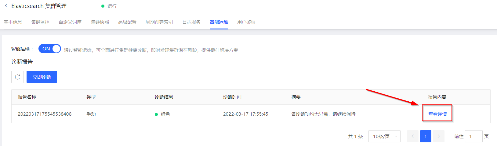
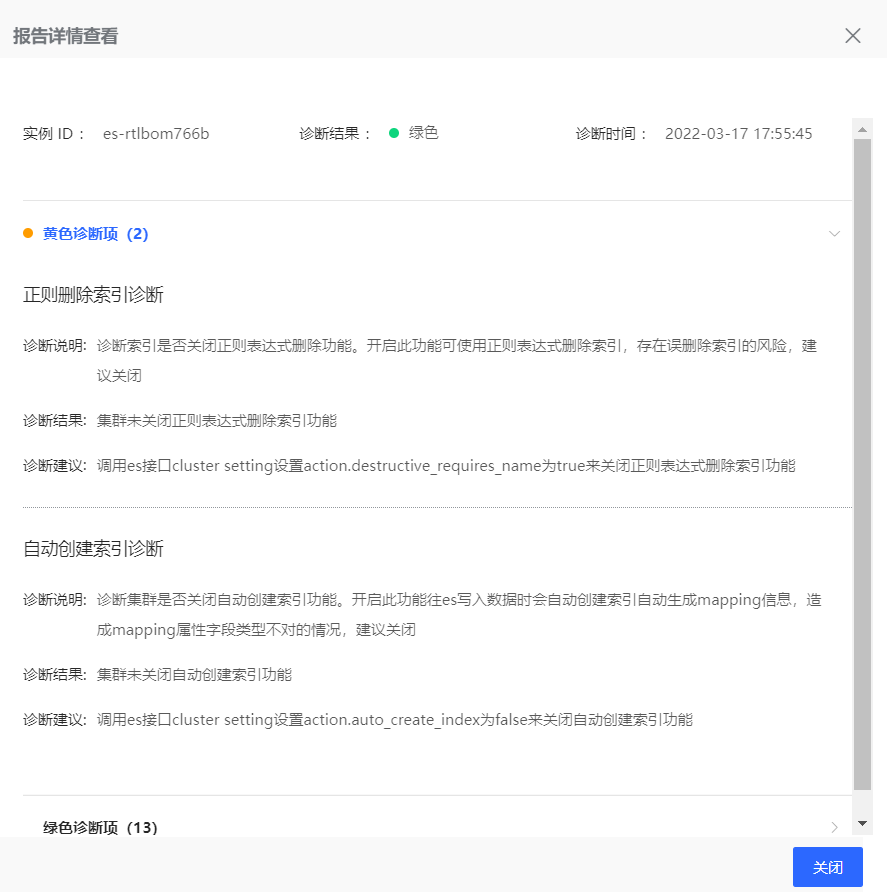

#查看健康诊断报告

## 前提条件
- 已开启 **智能运维** 服务，详情请参见 [开启智能运维服务](../HealthCheck/Health_check_on.md)
- 至少已完成一次手工或自动集群健康诊断，并生成报告，详情请参见 [诊断集群健康状况](../HealthCheck/Health_check_start.md)

## 操作步骤
1. 访问[云搜索Elasticsearch控制台](https://es-console.jdcloud.com/clusters)，进入集群管理页面。或访问 [京东云控制台](https://console.jdcloud.com/)，点击顶部导航栏 互联网中间件-云搜索Elasticsearch，进入集群管理页。
2. 单击 **目标集群名称**链接 进入集群详情页。
3. 选择 **智能运维** 标签页。
4. 单击诊断报告列表页【报告内容-**查看详情**】，进入诊断报告详情。

