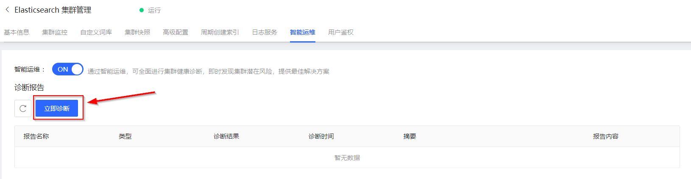

# 诊断集群健康状况
## 前提条件
- 已开启 **智能运维** 服务，详情请参见 [开启智能运维服务](../HealthCheck/Health_check_on.md)
## 手动诊断
1. 访问[云搜索Elasticsearch控制台](https://es-console.jdcloud.com/clusters)，进入集群管理页面。或访问 [京东云控制台](https://console.jdcloud.com/)，点击顶部导航栏 互联网中间件-云搜索Elasticsearch，进入集群管理页。
2. 单击 **目标集群名称**链接 进入集群详情页。
3. 选择 **智能运维** 标签页。
4. 点击 **立即诊断**按钮，在弹出的信息框中选择 **确定** ，开启手工诊断。

5. 系统手工诊断完成后，您可以在诊断报告列表中查看本次或历史诊断报告。

## 自动诊断
> 说明：智能运维系统会在每天凌晨主动触发一次健康诊断并生成诊断报告，您可以在诊断报告列表中查看本次或历史诊断报告。
