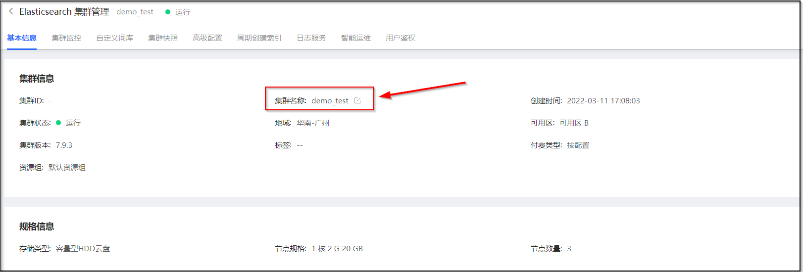
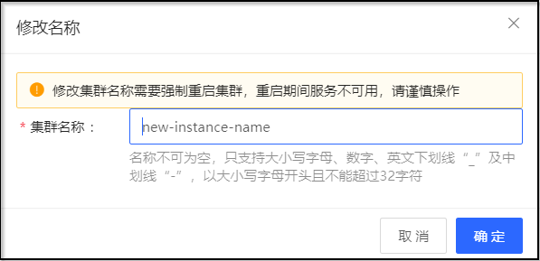

# 修改实例名称

您可根据需要修改您实例名称。

## 限制和说明

> - 名称不可为空，只支持大小写字母、数字、英文下划线“_”及中划线“-”，以大小写字母开头且不能超过32字符。
> - 修改集群名称需要强制重启集群，重启期间服务不可用，请谨慎操作

## 操作步骤
1. 访问 [云搜索Elasticsearch控制台](https://es-console.jdcloud.com/clusters)，进入集群管理页面。或访问 [京东云控制台](https://console.jdcloud.com/)，点击顶部导航栏 互联网中间件-云搜索Elasticsearch，进入集群管理页。
2. 点击 **目标集群名称** 链接，进入集群详情页。
3. 点击**基本信息-集群信息-集群名称**右侧的修改按钮。

4. 在弹出的**修改名称**弹窗中，按需输入新实例名称，点击**确定**提交修改。

