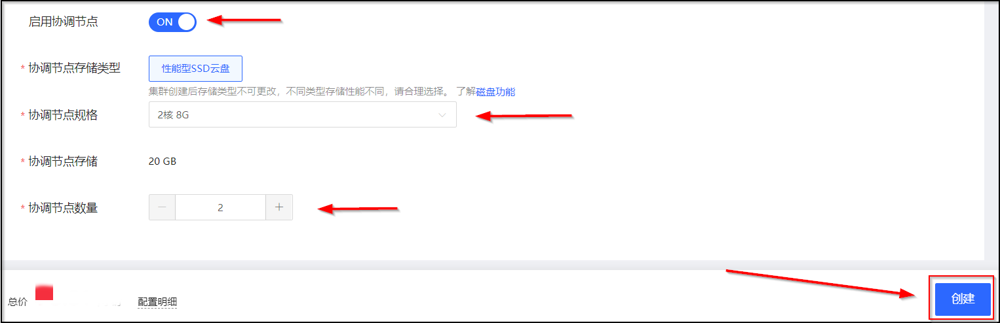
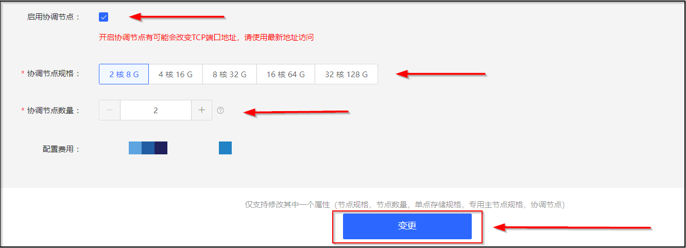

# 协调节点

协调节点就像负载均衡器一样，用来响应客户请求，均衡每个节点的负载。协调节点的加入可以释放数据节点承担的均衡节点负载的任务，并分担数据节点的CPU开销，从而提高处理性能和服务稳定性。如果您的业务是CPU密集型的业务，例如需要进行较多的聚合查询之类的操作，建议购买协调节点。
京东云搜索Elasticsearch支持设置协调节点来提高处理性能和集的稳定性，您可以通过下列方式设置协调节点，购买或者升配后，系统将按照对应规格的价格进行计费。各规格的价格详情，请参见 [产品定价](../../../Pricing/Price-Overview.md)
- [创建集群](Coordinating-node#user-content-1)
- [变更配置](Coordinating-node#user-content-2)

## 协调节点参数
| 参数 | 说明 |
| :-- | :-- |
| 协调节点 | 默认未开启，可更改。 |
| 规格 | 2核8G、4核16G、8核32G、16核64G、32核128G |
| 协调节点数量 | 单可用区：默认为2个，可更改,可选范围2-40个。双可用区：默认为4个，可更改,可选范围4-40个。三可用区：默认为6个，可更改,可选范围6-45个。|
| 协调节点存储类型 | 性能型SSD云盘 |
| 协调节点存储空间 | 20GB，暂不可更改 |

> 说明：购买的节点数量需要是可用区的整数倍。

## 创建集群时启用协调节点

1. 访问 [云搜索Elasticsearch控制台](https://es-console.jdcloud.com/clusters)，进入集群管理页面。或访问 [京东云控制台](https://console.jdcloud.com/)，点击顶部导航栏 互联网中间件-云搜索Elasticsearch，进入集群管理页。
2. 选择您要创建实例的**区域**后，单击 **创建** 按钮，进入创建集群页面。

3. 创建集群的参数配置可参见 [创建集群](../../../Getting-Started/Create-ES.md)，请开启**启用协调节点**开关、选择 **协调节点规格类型** 和 **协调节点数量** ：

4. 选择完参数后单击 **创建** 按钮。
5. 在**订单确认**页，选择 **已阅读并同意《云搜索Elasticsearch服务条款》**，单击 **立即开通** 按钮确认订单并创建云搜索Elasticsearch集群。

## 变更配置时启用协调节点

1. 访问 [云搜索Elasticsearch控制台](https://es-console.jdcloud.com/clusters)，进入集群管理页面。或访问 [京东云控制台](https://console.jdcloud.com/)，点击顶部导航栏 互联网中间件-云搜索Elasticsearch，进入集群管理页。
3. 在您要启用协调节点的集群，选择 【**操作-更多-变更配置**】。
4. 在变更配置页面，请开启**启用协调节点**开关、选择 **协调节点规格类型** 和 **协调节点数量**，确认参数后，单击 **创建** 按钮：

4. 在**订单确认**页，选择 **已阅读并同意《云搜索Elasticsearch服务条款》**，单击 **立即开通** 按钮确认订单并启用协调节点。
