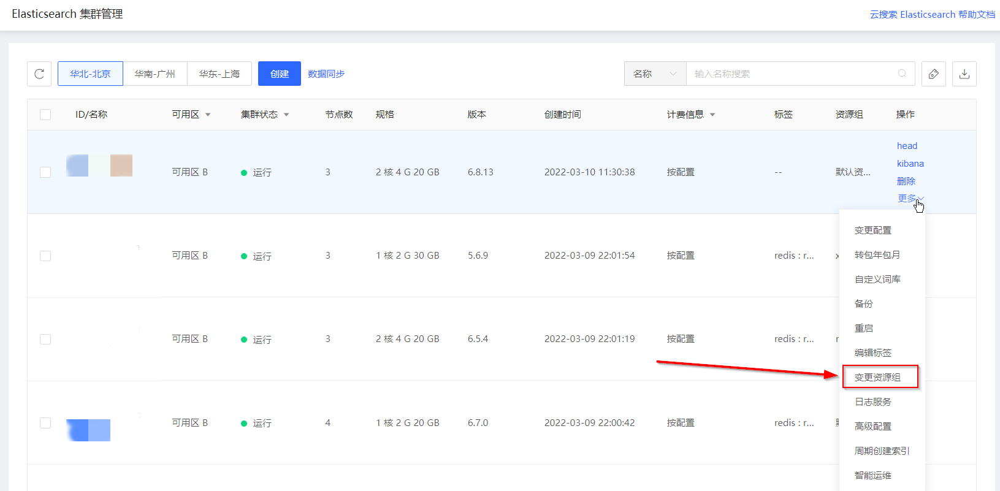
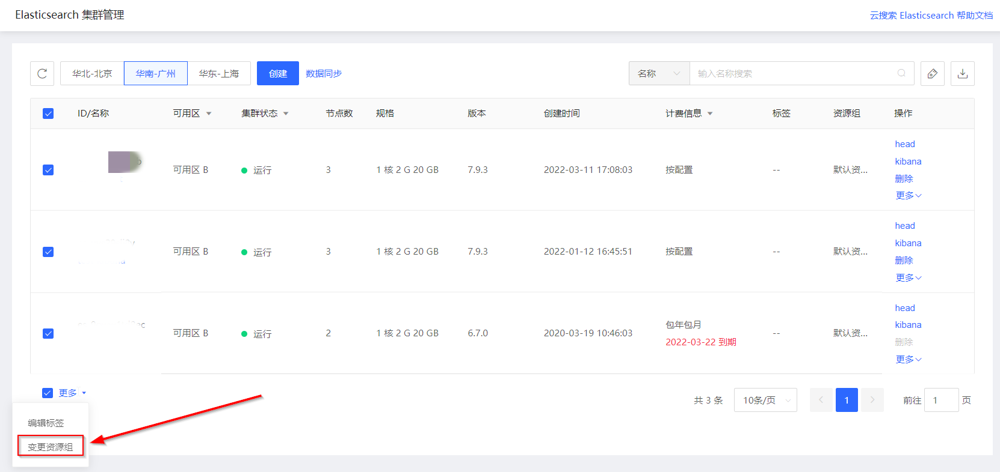

# 变更资源组

实例加入资源组后，您可参考下方操作变更实例所在资源组。

## 操作步骤

- 访问[云搜索Elasticsearch控制台](https://es-console.jdcloud.com/clusters)，进入集群管理页面。或访问 [京东云控制台](https://console.jdcloud.com/overview) ，点击顶部导航栏 **互联网中间件-云搜索Elasticsearch**，进入集群管理页。

- 点击实例列表页【操作-更多-变更资源组】。

- 选择需要转入的资源组即可变更单一实例所在资源组。

- 也可选择多个实例后点击左下角更多-变更资源组。

- 选择需要转入的资源组，即可批量变更实例所在资源组。

