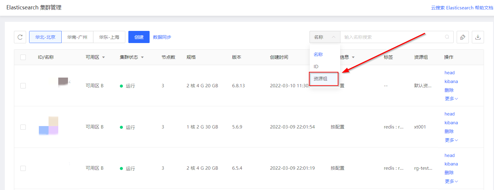

# 资源组筛选

可在云搜索Elasticsearch控制台的集群管理页基于资源组ID对实例进行筛选。

## 操作步骤

- 访问 [云搜索Elasticsearch控制台](https://es-console.jdcloud.com/clusters) ，进入集群管理页。或访问 [京东云控制台](https://console.jdcloud.com/overview) ，点击顶部导航栏 **互联网中间件-云搜索Elasticsearch**，进入集群管理页。

- 在集群管理页右上角联合搜索框中，下拉选择搜索条件-资源组，输入资源组ID后进行筛选。

