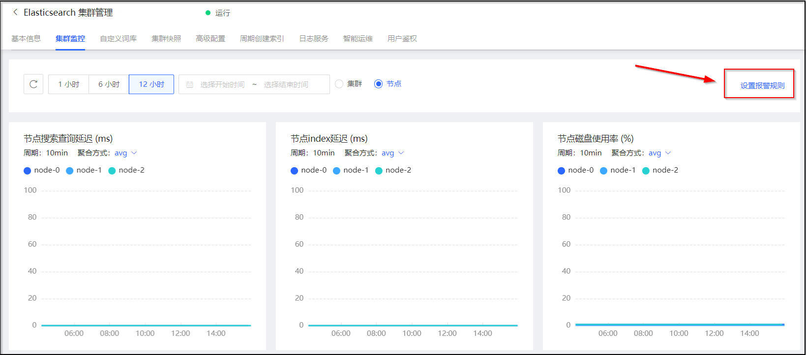

# 创建告警规则
云搜索Elasticsearch可以通过云监控创建集群指标的告警规则、自定义报警阈值，当监控指标达到用户设置告警阈值时，用户可以及时收到通知并采取措施，以免造成业务损失。为避免出现集群状态不正常、节点磁盘使用率过高等问题影响Elasticsearch服务，强烈建议您配置监控报警，实时监控集群状态、节点磁盘使用率等信息，及时查收报警通知，提前做好防御措施。 

## 操作步骤
1.登录[云搜索Elasticsearch控制台](https://es-console.jdcloud.com/clusters)。 

2.在列表页单击【集群名称】，进入集群管理页面。 

3.在集群管理页面，点击【集群监控】，进入监控信息页面。 

4.在集群监控页面点击页面右上角的【设置报警规则】，进入报警规则页面。 

5.在报警规则页面，点击【新增报警规则】，为云搜索Elasticsearch创建对应报警规则。详细操作可参考云监控报警规则管理页面 
- [添加报警规则](../../../../documentation/Management/Monitoring/Operation-Guide/resource-monitoring/AlarmMangent/add-rule-in-batches.md) 
- [修改报警规则](../../../../documentation/Management/Monitoring/Operation-Guide/resource-monitoring/AlarmMangent/update-rule.md) 
- [查看报警规则](../../../../documentation/Management/Monitoring/Operation-Guide/resource-monitoring/AlarmMangent/view-resource-rules.md) 
- [查看规则详情](../../../../documentation/Management/Monitoring/Operation-Guide/resource-monitoring/AlarmMangent/rule-details.md) 
- [启用/禁用报警规则](../../../../documentation/Management/Monitoring/Operation-Guide/resource-monitoring/AlarmMangent/enable-rule.md) 
- [查看报警历史](../../../../documentation/Management/Monitoring/Operation-Guide/resource-monitoring/AlarmMangent/rule-alarms.md) 
- [删除报警规则](../../../../documentation/Management/Monitoring/Operation-Guide/resource-monitoring/AlarmMangent/delete-rule.md) 
