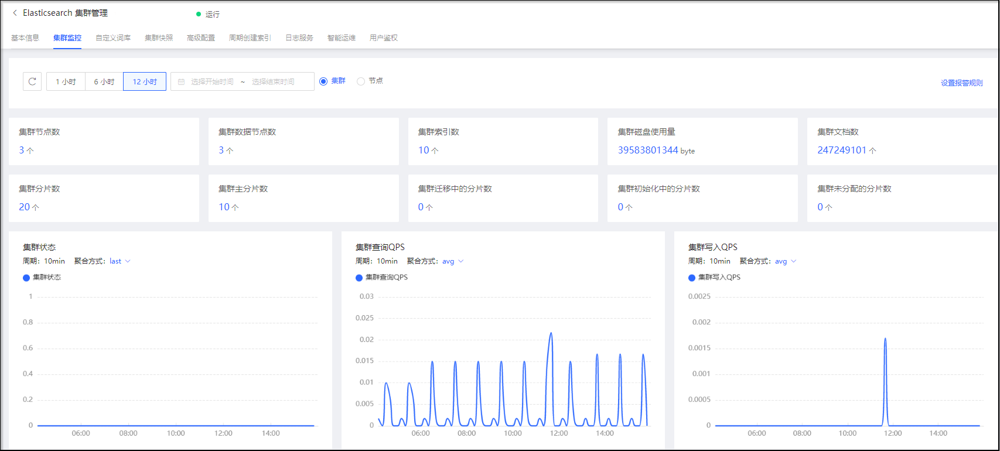
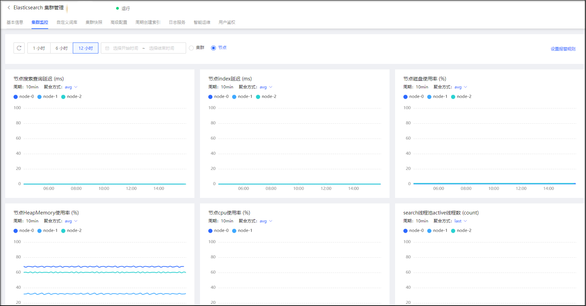

# 查看监控信息
京东云搜索Elasticsearch为运行中的集群提供了多项监控指标（例如集群状态、集群查询QPS、集群写入QPS、节点CPU使用率、节点磁盘使用率、节点搜索查询延迟等），用来监控集群的运行状况。您可以根据这些监控指标，实时了解集群的运行情况，辅助集群运维监管，即时处理潜在风险，保障集群稳定运行。 

## 操作步骤
1.访问[云搜索Elasticsearch控制台](https://es-console.jdcloud.com/clusters)，进入集群列表页面。 

2.在集群列表页面，点击集群名称，进入目标集群详情页面。 

3.在详情页面，点击【集群监控】页签进入监控页面。 

4.选择监控时段和指标维度查看监控详情。 
- 监控时段可选择据当前时间“1小时”、“6小时”、“12小时”进行选择，也可由日历时间段自主选择。 
- 指标维度支持集群维度和节点维度。 
**集群监控** 

**节点监控** 

5.单击右上方“设置报警规则”，单击跳转至云监控页面进行报警规则的设置。 

 

## 监控指标
### 集群维度
| 指标名称	| metric | 单位 | 说明	|
|:--:|:--|:--:|:--| 
| 集群状态 | jmiss.es.instance.status | 无 | ES 集群健康状态： 0 表示绿色，集群正常； 1 表示黄色，告警，部分副本分片不可用； 2 表示红色，异常，部分主分片不可用； |
| 集群查询QPS | jmiss.es.instance.search_qps | Count/Second | 展示了集群每秒执行的查询QPS数量，反应集群查询操作繁忙程度，查询QPS数量与待查询索引的主分片个数有关。 |
| 集群写入QPS | jmiss.es.instance.index_qps | Count/Second | 展示了集群每秒写入文档的数量，反应集群写入操作繁忙程度 |
| 集群数据节点数 | jmiss.es.instance.data_nodes | count | 展示了集群当前集群数据节点的数量 | 
| 集群索引数 | jmiss.es.instance.indices | count | 展示了集群当前集群索引数量 | 
| 集群磁盘使用量 | jmiss.es.instance.fs_used | byte | 展示了集群当前集群磁盘使用量 | 
| 集群节点数 | jmiss.es.instance.nodes | count | 展示了集群当前集群节点总数。在变更配置期间，可能会出现增加一倍的情况。 | 
| 集群文档数 | jmiss.es.instance.docs | count | 展示了集群当前集群文档总数 | 
| 集群分片数 | jmiss.es.instance.active_shards | count | 展示了集群当前集群分片总数 | 
| 集群迁移中的分片数 | jmiss.es.instance.relocating_shards | count | 展示了集群当前集群迁移中的分片总数 | 
| 集群主分片数 | jmiss.es.instance.active_primary_shards | count | 展示了集群当前集群主分片总数 | 
| 集群初始化中的分片数 | jmiss.es.instance.initializing_shards | count | 展示了集群当前集群初始化中的分片数 | 
| 集群未分配的分片数 | jmiss.es.instance.unassigned_shards | count | 展示了集群当前集群未分配的分片数 | 

其中健康状态是云搜索Elasticsearch集群非常重要的监控项，用来表征集群总体上是否工作正常。健康状态种类如下： 
|颜色 | 健康状态	|
|:--:|:--|
| 绿色（green） | 此时集群处于最健康状态，所有的主分片和副本分片都已分配，集群是100%可用的。	|
| 黄色（yellow） | 此时集群的高可用性受到影响，但是搜索结果仍然完整，所有的主分片已经分片了，但至少还有一个副本是缺失的。高可用性在某种程度上被弱化。	|
| 红色（red） | 此时集群异常，搜索只能返回部分数据，至少有一个主分片（以及它的全部副本）都在缺失中。 |

### 节点维度
| 指标名称	| metric | 单位 | 说明	|
|:--:|:--|:--:|:--| 
| 节点CPU利用率 | jmiss.es.container.cpu.util | % | 展示了集群中各节点的CPU使用率百分比，CPU 使用率过高会导致集群节点处理能力下降，甚至宕机。 |
| 节点磁盘使用率	| jmiss.es.node.fs_used_percent_0_100 | % | 展示了集群中各节点的磁盘使用率百分比，磁盘使用率过高会导致数据无法正常写入。建议将磁盘使用率报警阈值控制在75%以下，不要超过85%。 |
| 节点HeapMemory使用率 | jmiss.es.node.jvm_heap_used_percent | % | 展示了集群中各节点的HeapMemory使用率百分比，当HeapMemory使用率较高或存在较大的内存对象时，会影响集群服务，也会自动触发gc操作。 | 
| 节点搜索查询延迟 | jmiss.es.node.query_latency | ms | 展示了集群各节点的搜索查询请求用时的平均值。查询延迟过高时，建议调大节点规格或增加节点个数。 | 
| 节点index延迟 | jmiss.es.node.index_latency | ms | 展示了集群各节点的index请求用时的平均值。index延迟过高时，建议调大节点规格或增加节点个数。 | 
| index线程池active线程数 | jmiss.es.node.index_active | count | 展示了集群各节点单位统计周期（1min）内index线程池active线程数 | 
| index线程池线程队列大小 | jmiss.es.node.index_queue | count | 展示了集群各节点的index线程池线程队列大小，如果队列大小一直很大，请考虑扩展您的集群 | 
| index线程池reject任务数 | jmiss.es.node.index_rejected | count | 展示了集群各节点单位统计周期（1min）内index线程池reject任务数 | 
| search线程池active线程数 | jmiss.es.node.search_active | count | 展示了集群各节点单位统计周期（1min）内search线程池active线程数 | 
| search线程池线程队列大小 | jmiss.es.node.search_queue | count | 展示了集群各节点的search线程池线程队列大小，如果队列大小一直很大，请考虑扩展您的集群 | 
| search线程池reject任务数 | jmiss.es.node.search_rejected | count | 展示了集群各节点单位统计周期（1min）内search线程池reject任务数 | 
| write线程池active线程数 | jmiss.es.node.write_active | count | 展示了集群各节点单位统计周期（1min）内write线程池active线程数 | 
| write线程池线程队列大小 | jmiss.es.node.write_queue | count | 展示了集群各节点的write线程池线程队列大小，如果队列大小一直很大，请考虑扩展您的集群 | 
| write线程池reject任务数 | jmiss.es.node.write_rejected | count | 展示了集群各节点单位统计周期（1min）内write线程池reject任务数 | 
| 节点load_1m | jmiss.es.node.load_average_1m | count| 展示了集群中各节点在1分钟内的负载情况，表示各节点的系统繁忙程度。该指标的正常数值，应该低于对应节点规格的CPU核数。|
| FullGc次数 | jmiss.es.node.jvm_gc_old_count | count | 展示了集群中1分钟内的Gc总次数。|
| FullGc耗时 | jmiss.es.node.jvm_gc_old_time | count | 展示了集群中1分钟内的Gc平均耗时。|
| YoungGc次数 | jmiss.es.node.jvm_gc_young_count | count | 展示了集群中1分钟内的Young Gc总次数。|
| YoungGc耗时 | jmiss.es.node.jvm_gc_young_time | count | 展示了集群中1分钟内的Young Gc平均耗时。|

