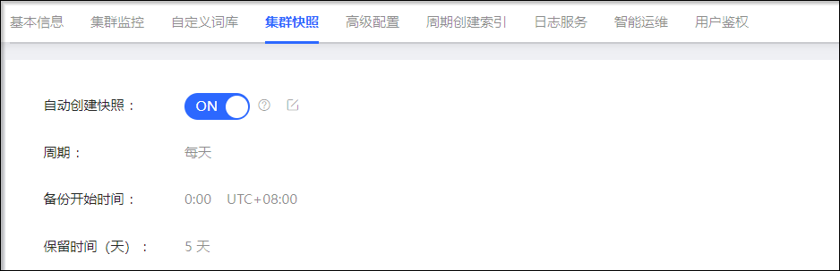
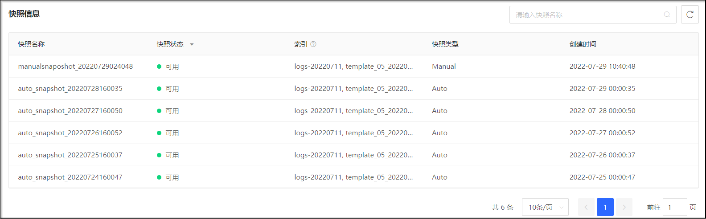

# 集群快照
京东云搜索 Elasticsearch 支持自动快照与恢复、手动快照与恢复，以保证集群数据的可靠性。
| 功能   | 适用场景 | 相关限制 |
| :----- | :----- | :----- |
| 自动快照与恢复 | 需要定时自动备份数据的场景。 | 1. 快照的数据只能恢复到原 Elasticsearch 集群中。  2. 只保留最近5天的快照数据。 |
| 手动快照与恢复 | 1. 需要手工备份数据的场景。  2. 需要在相同地域的不同集群间恢复数据的场景。 | 1. 不支持定时自行备份。  2. 只保留最近5天的快照数据。| 

## 注意事项
- 集群的第一个快照会是集群数据的完整拷贝，后续的快照保留的是已存快照和新数据之间的差异。因此首次快照快照耗时较长（具体时长与数据量相关）。随着您不时的对数据进行快照，备份也在增量的添加和删除。这意味着后续备份会相当快速，因为它们只传输很小的数据量。 
- 快照仅保存索引数据，不保存Elasticsearch实例自身的监控数据（例如以.monitoring和.security_audit为前缀的索引）、元数据、Translog、实例配置数据、Elasticsearch的软件包、自带和自定义的插件、Elasticsearch的日志等。 
- 只保留最近5天的快照数据。 

## 自动快照
1. 访问 [云搜索 Elasticsearch 控制台](https://es-console.jdcloud.com/clusters)，进入集群管理页面。或访问 [京东云控制台](https://console.jdcloud.com/)，点击顶部导航栏 互联网中间件-云搜索Elasticsearch，进入集群管理页。
2. 单击 **目标集群名称** 链接，进入集群详情页
3. 选择 **集群快照** 标签页，单击 **自动创建快照** 右侧的开关按钮。设置自动创建快照后，系统将按照设定的时间（备份开始时间可配置），为你按天自动备份数据，保证数据的安全性。备份完成后，您可以通过备份恢复功能，将数据恢复到原集群中。 

 
 
## 手动快照
1. 访问 [云搜索 Elasticsearch 控制台](https://es-console.jdcloud.com/clusters)，进入集群管理页面。或访问 [京东云控制台](https://console.jdcloud.com/)，点击顶部导航栏 互联网中间件-云搜索Elasticsearch，进入集群管理页。
2. 单击 **目标集群名称** 链接，进入集群详情页
3. 选择 **集群快照** 标签页，单击 **手动创建快照** 右侧的开关按钮。
4. 设置 **快照名称前缀**，快照名称将以快照名称前缀+下划线+快照创建时间组成。
5. 选择您要备份的索引。不设置索引，将创建集群全部索引的快照。如果想要备份指定的索引，请指定具体的索引名称，比如'index1,index2,index3'。逗号隔开，长度不超过64。
6. 点击 **保存**，系统将为您创建手动快照。您可以在 **快照信息** 列表中查看手工快照信息。 

在集群快照页面可开启手动创建快照。手动创建快照将由您定义快照名称前缀和索引，不设置索引，将创建集群全部索引的快照。如果想要备份指定的索引，请指定具体的索引名称，比如'index1,index2,index3'。逗号隔开，长度不超过64。 

 

## 列出快照信息
执行创建快照操作后，您可以在快照列表会中查看自动快照和手动快照的快照信息，包括快照名称、快照状态、索引、快照类型和创建时间等。

 
