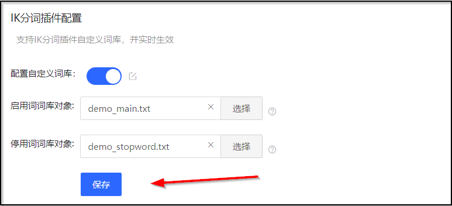
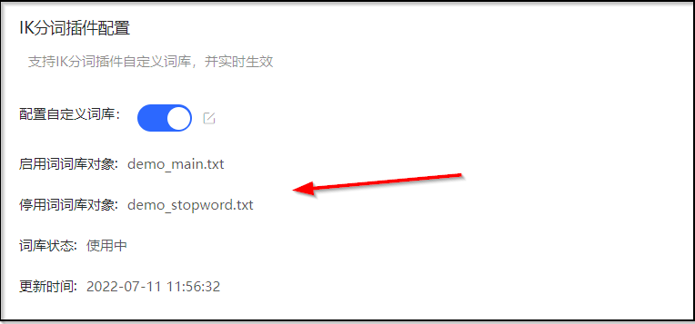
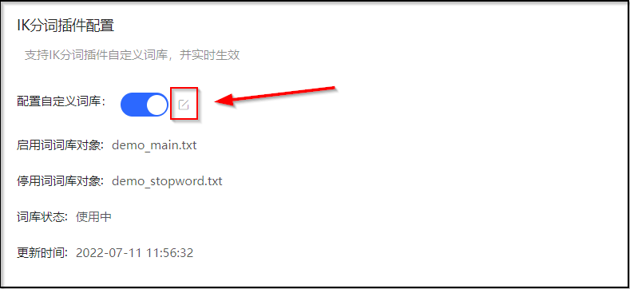
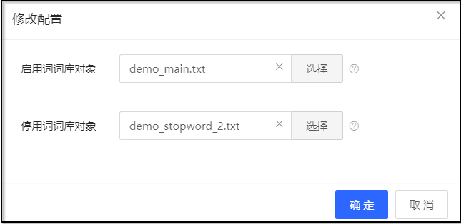
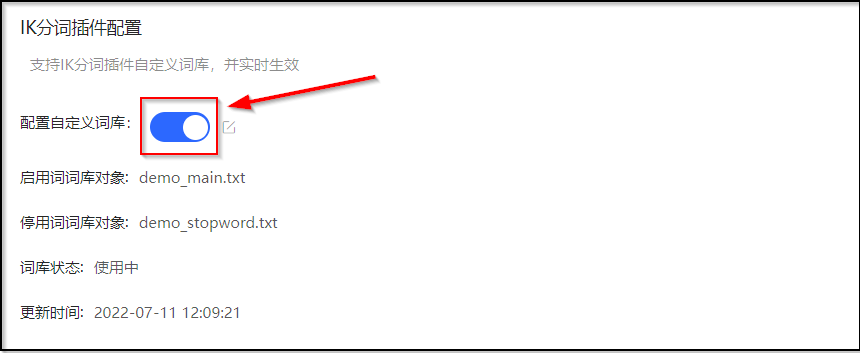

# 自定义词库
用户在使用搜索引擎时，针对中文，一些特殊的词语在分词的时候也希望能够被识别。例如“京东云”、“云搜索服务”等。
针对这种场景，您可以使用云搜索Elasticsearch的自定义词库功能完成分词，云搜索Elasticsearch的自定义词库功能支持热更新，不需要重启集群即可生效。
主要支持主词库和停词库的配置。

```
请注意：
主词库对象、停词库对象不可同时为空，主词库对象、停词库对象不可选择相同文件。
```
## 基本概念
### 主词库
主词为用户希望进行分词的特殊词语，如上文中提到的“**京东云**”和“**云搜索服务**”等。主词库则是这些特殊词语的集合。</br>
- 默认显示当前对象，无对象时显示为空。</br>
- 主词库文件必须是UTF-8无BOM格式编码的文本文件，文件中每一行为一个分词，主词文件最大支持50M。</br>
### 停词库
停词为用户不希望进行分词或者关注的词语，如“为”、“的”、“什么”等。停词库是停词词语的集合。。
- 默认显示当前对象，无对象时显示为空。
- 停词库文件必须是UTF-8无BOM格式编码的文本文件，文件中每一行为一个分词，停词文件最大支持20M。

## 配置自定义词库
1. 登陆 [京东云Elasticsearch控制台](https://es-console.jdcloud.com/clusters)。
2. 在集群管理页，单击 **集群名称** 进入集群详情页。 
3. 选择 **自定义词库** 页签，在 **IK分词插件配置** 区域，单击 **配置自定义词库** 右侧的开关按钮。


4. 单击 **启用词词库** 右侧的 **选择** 按钮，在弹出的文件选择对话框中，选择您要上传的主词库文件。
5. 单击 **停用词词库** 右侧的 **选择** 按钮，在弹出的文件选择对话框中，选择您要上传的停用词文件。
6. 点击 **保存** 按钮，保存自定义词库配置。



7. 请耐心等待1分钟左右，配置的词库将在此集群中生效。词库信息将呈现在 **IK分词插件配置** 区域。



## 修改自定义词库
云搜索Elasticsearch服务支持单独修改其中某个自定义词库文件。
1. 登陆 [京东云Elasticsearch控制台](https://es-console.jdcloud.com/clusters)。
2. 在集群管理页，单击 **集群名称** 进入集群详情页。 
3. 选择 **自定义词库** 页签，在 **IK分词插件配置** 区域，单击 **配置自定义词库** 右侧的修改按钮。



4. 在弹出的 **修改配置** 对话框中，选择您要修改的某个或多个自定义词库文件，点击 **确定** 保存自定义词库配置。请耐心等待1分钟左右，配置的词库将在此集群中生效。词库信息将呈现在 **IK分词插件配置** 区域。



## 删除自定义词库
如果您的词库已不再需要，您可以删除自定义词库。
1. 登陆 [京东云Elasticsearch控制台](https://es-console.jdcloud.com/clusters)。
2. 在集群管理页，单击 **集群名称** 进入集群详情页。 
3. 选择 **自定义词库** 页签，在 **IK分词插件配置** 区域，单击 **配置自定义词库** 右侧的开关按钮。



4. 在弹出的 提示对话框中，点击 **确定** 删除自定义词库配置。请耐心等待1分钟左右，配置的词库将在此集群中生效。


