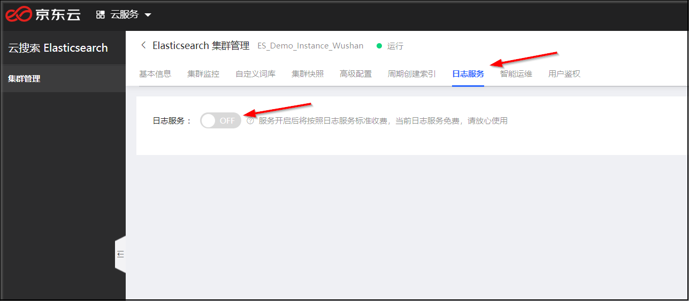
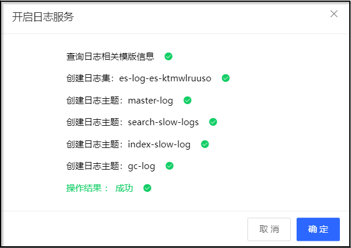
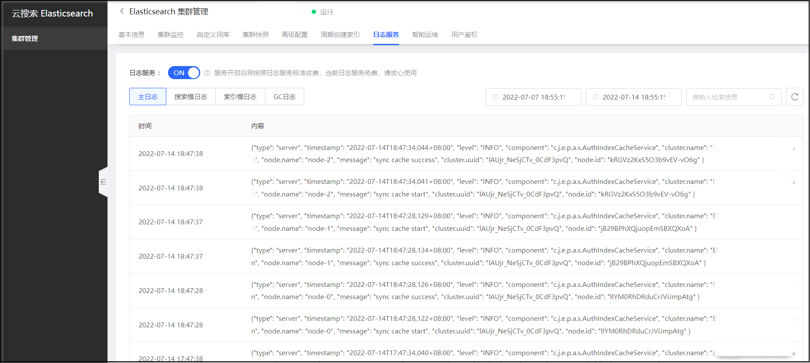

# Elasticsearch日志
云搜索Elasticsearch通过京东云日志服务提供Elasticsearch日志的查询和展示，日志类型包括主日志、搜索慢日志、索引慢日志、GC日志的查询和展示，各类型日志的日志内容主要由time、content 组成。您可以通过输入关键字和设置时间范围，筛选出需要查询的日志内容，快速定位集群问题，辅助集群运维。</br>

- Time：日志的产生时间。</br>
- Content：日志的主要内容。</br>

## 前提条件
- 已开通了京东云的日志服务。</br>
- 已创建了云搜索Elasticsearch集群实例。</br>

## 操作步骤
1. 登陆 [京东云Elasticsearch控制台](https://es-console.jdcloud.com/clusters)。</br>
2. 在集群管理页，单击 **集群名称** 进入集群详情页。 </br>
3. 选择 **日志服务** 页签。日志服务开关，默认关闭，关闭状态下日志服务未生效。您可切换开/关状态以打开或关闭Elasticsearch日志服务功能。</br>
</br>
</br>
4. 日志服务开关打开时，日志服务生效，系统会自动在京东云日志服务创建日志集es-log-{ClusterID}和4种日志主题：主日志（master-log）、索引慢日志（index-slow-log）、搜索慢日志（search-slow-log）、GC日志（gc-log）；日志服务开关关闭后，系统将删除自动创建的日志集和日志主题。</br>

</br>
</br>
5. 主日志、搜索慢日志、索引慢日志、GC日志4种日志内容均最长可支持近7天日志查询，点击日志内容展示日志上下文。</br>
</br>
</br>

## 日志说明

### 主日志
主日志主要展示集群的运行日志，包括日志产生的时间、级别、日志所在的节点和日志内容等，包括INFO、DEBUG、WARN等不同级别。</br>
当您需要查看集群中各节点的运行状况及查询写入情况，例如节点之间的连通性、Full GC情况、创建或删除索引情况、集群级别的查询报错等信息时，可查看主日志进行排查。</br>
</br>

### 慢日志
慢日志的目的是捕获超过指定时间阈值的查询和索引请求，主要展示超过指定时间阈值的索引（Indexing慢日志）和查询（Searching慢日志）日志。在集群负载不均、读写异常、处理数据很慢等情况下，您可以通过查询慢日志来分析具体原因。</br>
</br>
**开启和调整慢日志**</br>
默认情况，慢日志不开启。开启慢日志需要定义具体动作（query、fetch 或 index）、期望的事件记录等级（INFO、WARN、DEBUG 等）、以及时间阈值。您可以根据业务场景，开启和调整相关配置。
如需开启或者调整慢日志，可在集群列表页单击要操作实例的 **Kibana** 按钮 进入Kibana页面，通过 Dev Tools 调用 Elasticsearch 相关 API，或通过客户端调用配置修改 API。</br>
修改完成后，在执行读写任务时，如果执行时间超过了以上配置的时间，您就可以在慢日志页签中查询到对应的日志。</br>
</br>

配置所有索引：
```
PUT */_settings
{
    "index.indexing.slowlog.threshold.index.debug" : "5ms",
    "index.indexing.slowlog.threshold.index.info" : "50ms",
    "index.indexing.slowlog.threshold.index.warn" : "100ms",
    "index.search.slowlog.threshold.fetch.debug" : "10ms",
    "index.search.slowlog.threshold.fetch.info" : "50ms",
    "index.search.slowlog.threshold.fetch.warn" : "100ms",
    "index.search.slowlog.threshold.query.debug" : "100ms",
    "index.search.slowlog.threshold.query.info" : "200ms",
    "index.search.slowlog.threshold.query.warn" : "1s"
}
```
配置单个索引：
```
PUT /my_index/_settings
{
    "index.indexing.slowlog.threshold.index.debug" : "5ms",
    "index.indexing.slowlog.threshold.index.info" : "50ms",
    "index.indexing.slowlog.threshold.index.warn" : "100ms",
    "index.search.slowlog.threshold.fetch.debug" : "10ms",
    "index.search.slowlog.threshold.fetch.info" : "50ms",
    "index.search.slowlog.threshold.fetch.warn" : "100ms",
    "index.search.slowlog.threshold.query.debug" : "100ms",
    "index.search.slowlog.threshold.query.info" : "200ms",
    "index.search.slowlog.threshold.query.warn" : "1s"
}
```
### GC日志
ES 默认开启 GC 日志，日志产生的时间、级别、日志所在的节点和日志内容等。

