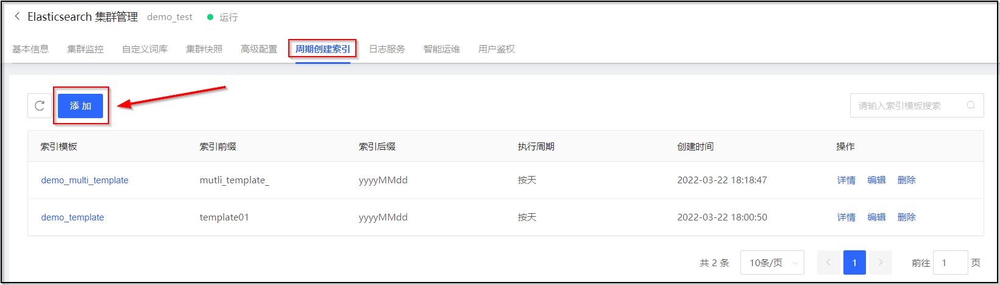
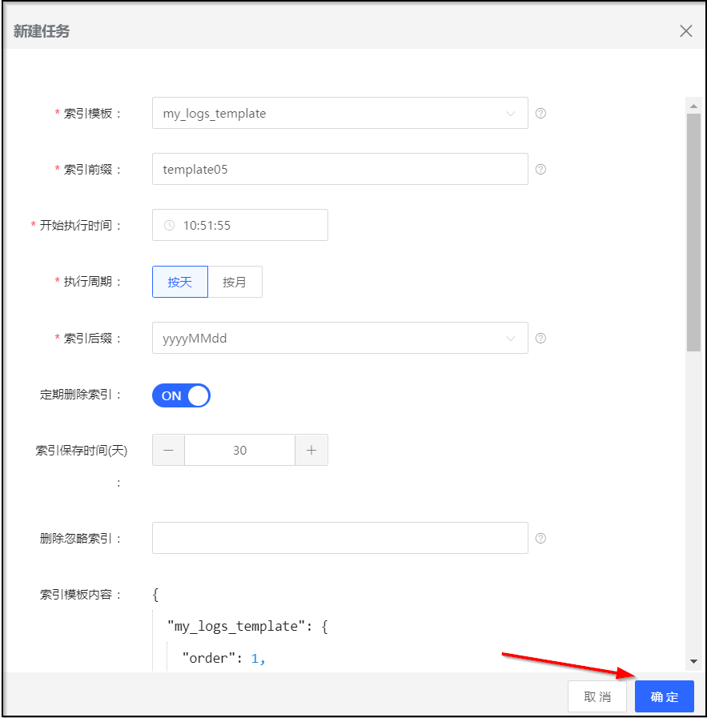
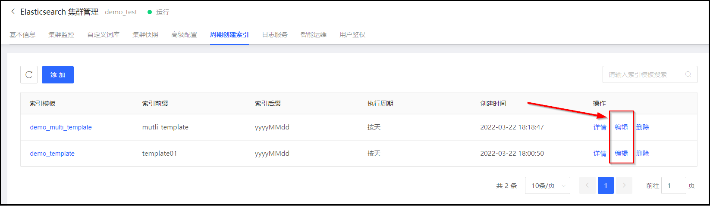
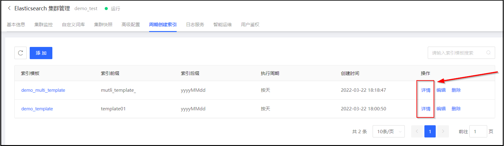
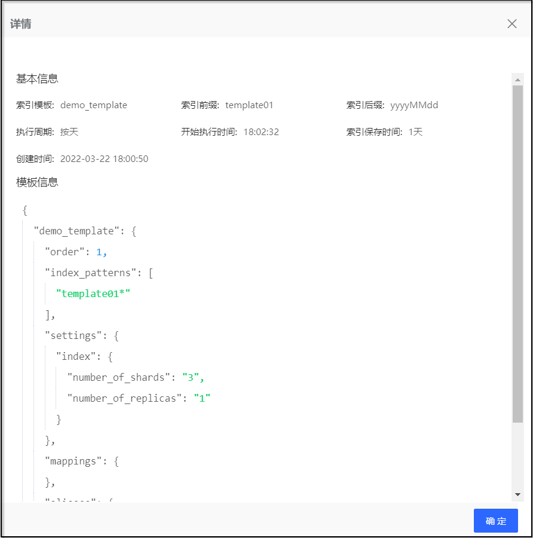
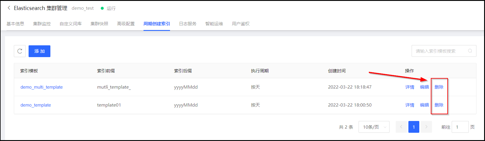

## 周期创建索引
周期创建索引功可以帮助用户实现索引从创建到删除的全生命周期过程的管理。

### 前置条件
在执行周期创建索引任务前，需要先在保证已存在可用的索引模板。
- [创建索引模板](Index/Index-template-create.md)

### 创建索引任务
1. 访问 [云搜索Elasticsearch控制台](https://es-console.jdcloud.com/clusters)，进入集群管理页面。或访问 [京东云控制台](https://console.jdcloud.com/)，点击顶部导航栏 互联网中间件-云搜索Elasticsearch，进入集群管理页。
2. 您可以选择下列任意一种方式进入周期创建索引页面
  - 在集群管理列表页面，单击【**操作-更多-周期创建索引**】进入周期创建索引页面。
  - 单击 **目标集群名称** 链接，进入集群详情页。选择 **周期创建索引** 标签页。
3. 单击 **添加** 按钮，进入索引任务创建页面。

5. 在索引任务创建页面，输入各参数值后，单击 **确认** 按钮，新建索引任务。

| 参数 | 说明 |
| :--- | :--- |
| 索引模板 | 可从预先创建的索引模板下拉列表中选择您要使用的索引模板 |
| 索引前缀 | 对应模版匹配索引的结果，即与index_patterns字段的值保持一致。示例中，对应索引前缀为template05。 |
| 开始执行时间 | 每次执行周期创建索引任务的时间。 |
| 执行周期 | 支持按天、按月2种 |
| 索引后缀 | 时间格式的定义。示例："2018-10-10"对应"yyyy-MM-dd"。|
| 定期删除索引 | 开关打开后可配置索引到期自动删除。|
| 索引保存时间 | 定期删除索引开关打开时，可设置索引保存的时间，超过该保存时间的索引自动删除。|
| 删除忽略索引 | 该项设置后索引不会被定期删除，多个间逗号(,)分隔。例"pop_jd_log_"模板需要长期保留，则填写pop_jd_log_20180618,pop_jd_log_20181111。|
| 索引模板内容 | 对应显示所选择的索引模板的内容 |

### 编辑索引任务
添加周期创建索引的任务后，在周期创建索引页面，可以通过单击【**操作-编辑**】对任务进行修改，编辑索引任务支持以下参数的修改支持的修改。参数说明可参考“创建索引任务”章节的说明 
- 索引前缀
- 执行周期
- 索引后缀
- 定期删除索引
  - 索引保存时间
  - 删除忽略索引

### 查看索引任务
添加或编辑周期创建索引任务后，在周期创建索引页面，可以通过单击【**操作-详情**】查看索引任务的基本信息和模板信息。 

### 删除索引任务
1. 索引任务确认不再使用后，在周期创建索引页面，可以通过单击【**操作-删除**】进入删除确认页面。

2. 在删除确认框中

