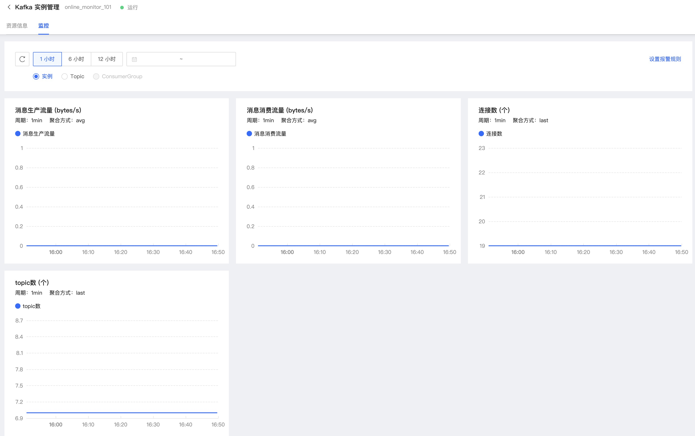

# 监控报警
实例创建成功后，单击实例名称进入集群详情页，可以查看关于集群运行的详细监控信息，辅助集群运维监管。也可由“云监控-资源监控-Kafka监控”进入查看。 

## 操作步骤
1. 访问消息队列Kafka版控制台，即进入集群列表页面。 

2. 在实例列表页面，点击实例名称，进入详情页面。 

3. 在详情页面，点击“监控”进入监控页面。 

4. 监控时段可选择据当前时间“1小时”、“6小时”、“12小时”进行选择，也可由日历时间段自主选择。 

5. 单击右上方“设置报警规则”，可跳转至云监控页面进行报警规则的设置。 

## 监控指标

说明：V2.4、V1.0.1、V0.10.2版实例监控指标参考。

### 实例监控

| 监控指标                 | 单位 | metric                                |说明|
| ---------------------- | ---- | ------------------------------------ |--------------|
| 消息生产流量        | bytes/s   | kafka.instance.messages.produce.rate                 | Message production rate |
| 消息消费流量         | bytes/s   | kafka.instance.messages.consume.rate          |Message consumption rate|
| 连接数        | 个  | kafka.instance.connection.number            |Number of connections|
| topic数       | 个   | kafka.instance.topic.number               |Number of topics |
| 磁盘使用率     | %  | kafka.instance.disk.usage                 |Disk usage|
| cpu使用率      | %  | kafka.instance.container.cpu.util    |Cpu usage|

### Topic监控

| 监控指标                 | 单位 | metric                                |说明|
| ---------------------- | ---- | ------------------------------------ |--------------|
| 消息生产流量       | bytes/s   | kafka.topic.messages.produce.rate                | Message production rate |
| 消息消费流量         | bytes/s   | kafka.topic.messages.consume.rate          |Message consumption rate|
| 生产TPS        | 条/秒  | kafka.topic.produce.tps            |Production TPS|
| 生产消息总数      | 条   | kafka.instance.topic.number               |produced message number|
| 占用磁盘容量    | byte  | kafka.topic.messages.size                 |Data capacity|

### ConsumerGroup监控

| 监控指标                 | 单位 | metric                                |说明|
| ---------------------- | ---- | ------------------------------------ |--------------|
| 未消费消息总数     | 条  | kafka.topic.cgid.messages.number.backlog              | Total number of unconsumed messages |
| 消费TPS        | bytes/s   |  kafka.topic.cgid.messages.tps       |Consumption TPS|
| 消费总数        | 条 | kafka.messages.consume.number         |Total number of consumed messages|
