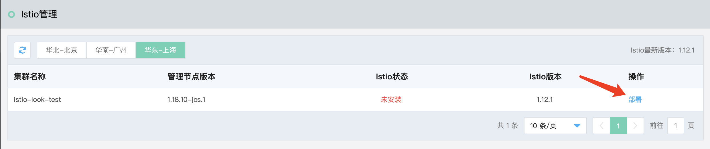
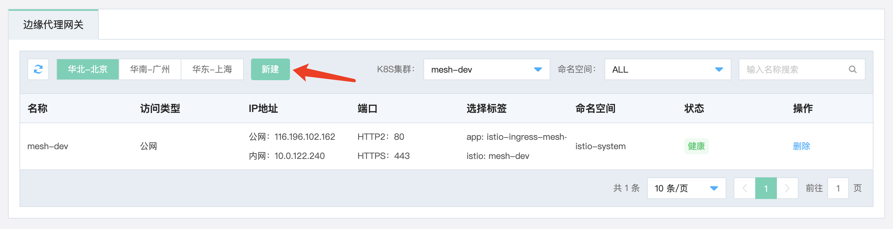

# BookInfo示例程序使用指南

## 简介

BookInfo是istio官方提供用于演示ISTIO服务网格各种特征的示例程序。BookInfo应用程序分为四个独立的微服务：

| 信息项         | 说明                                       |
|:----------- |:---------------------------------------- |
| Productpage | (产品页面)微服务，调用 details 和 reviews 微服务来填充页面。 |
| details     | 微服务包含书籍的详细信息                             |
| reviews     | 微服务包含书籍的点评。它也调用 ratings 微服务              |
| ratings     | 微服务包含随书评一起出现的评分信息。                       |

Reviews部署了三个版本：

| 信息项              | 说明                           |
|:---------------- |:---------------------------- |
| 版本v1（version:v1） | 不调用ratings服务                 |
| 版本v2（version:v2） | 调用ratings服务，将每个评级显示为1到5个黑色星  |
| 版本v3（version:3）  | 调用ratings服务，并将每个评级显示为1到5个红色星 |

应用框架如下图所示：


## 安装方法

#### STEP1: 安装Istio



#### STEP2: 命名空间打标签，执行命令。

```
kubectl label namespace default istio-injection=enabled
```

#### STEP3: 部署bookinfo

```yaml
# Copyright Istio Authors##################################################################################################
# bookinfo.yaml
# Details service
##################################################################################################
apiVersion: v1
kind: Service
metadata:
  name: details
  labels:
    app: details
    service: details
spec:
  ports:
  - port: 9080
    name: http
  selector:
    app: details
---
apiVersion: v1
kind: ServiceAccount
metadata:
  name: bookinfo-details
  labels:
    account: details
---
apiVersion: apps/v1
kind: Deployment
metadata:
  name: details-v1
  labels:
    app: details
    version: v1
spec:
  replicas: 1
  selector:
    matchLabels:
      app: details
      version: v1
  template:
    metadata:
      labels:
        app: details
        version: v1
    spec:
      serviceAccountName: bookinfo-details
      containers:
      - name: details
        image: docker.io/istio/examples-bookinfo-details-v1:1.16.2
        imagePullPolicy: IfNotPresent
        ports:
        - containerPort: 9080
        securityContext:
          runAsUser: 1000
---
##################################################################################################
# Ratings service
##################################################################################################
apiVersion: v1
kind: Service
metadata:
  name: ratings
  labels:
    app: ratings
    service: ratings
spec:
  ports:
  - port: 9080
    name: http
  selector:
    app: ratings
---
apiVersion: v1
kind: ServiceAccount
metadata:
  name: bookinfo-ratings
  labels:
    account: ratings
---
apiVersion: apps/v1
kind: Deployment
metadata:
  name: ratings-v1
  labels:
    app: ratings
    version: v1
spec:
  replicas: 1
  selector:
    matchLabels:
      app: ratings
      version: v1
  template:
    metadata:
      labels:
        app: ratings
        version: v1
    spec:
      serviceAccountName: bookinfo-ratings
      containers:
      - name: ratings
        image: docker.io/istio/examples-bookinfo-ratings-v1:1.16.2
        imagePullPolicy: IfNotPresent
        ports:
        - containerPort: 9080
        securityContext:
          runAsUser: 1000
---
##################################################################################################
# Reviews service
##################################################################################################
apiVersion: v1
kind: Service
metadata:
  name: reviews
  labels:
    app: reviews
    service: reviews
spec:
  ports:
  - port: 9080
    name: http
  selector:
    app: reviews
---
apiVersion: v1
kind: ServiceAccount
metadata:
  name: bookinfo-reviews
  labels:
    account: reviews
---
apiVersion: apps/v1
kind: Deployment
metadata:
  name: reviews-v1
  labels:
    app: reviews
    version: v1
spec:
  replicas: 1
  selector:
    matchLabels:
      app: reviews
      version: v1
  template:
    metadata:
      labels:
        app: reviews
        version: v1
    spec:
      serviceAccountName: bookinfo-reviews
      containers:
      - name: reviews
        image: docker.io/istio/examples-bookinfo-reviews-v1:1.16.2
        imagePullPolicy: IfNotPresent
        env:
        - name: LOG_DIR
          value: "/tmp/logs"
        ports:
        - containerPort: 9080
        volumeMounts:
        - name: tmp
          mountPath: /tmp
        - name: wlp-output
          mountPath: /opt/ibm/wlp/output
        securityContext:
          runAsUser: 1000
      volumes:
      - name: wlp-output
        emptyDir: {}
      - name: tmp
        emptyDir: {}
---
apiVersion: apps/v1
kind: Deployment
metadata:
  name: reviews-v2
  labels:
    app: reviews
    version: v2
spec:
  replicas: 1
  selector:
    matchLabels:
      app: reviews
      version: v2
  template:
    metadata:
      labels:
        app: reviews
        version: v2
    spec:
      serviceAccountName: bookinfo-reviews
      containers:
      - name: reviews
        image: docker.io/istio/examples-bookinfo-reviews-v2:1.16.2
        imagePullPolicy: IfNotPresent
        env:
        - name: LOG_DIR
          value: "/tmp/logs"
        ports:
        - containerPort: 9080
        volumeMounts:
        - name: tmp
          mountPath: /tmp
        - name: wlp-output
          mountPath: /opt/ibm/wlp/output
        securityContext:
          runAsUser: 1000
      volumes:
      - name: wlp-output
        emptyDir: {}
      - name: tmp
        emptyDir: {}
---
apiVersion: apps/v1
kind: Deployment
metadata:
  name: reviews-v3
  labels:
    app: reviews
    version: v3
spec:
  replicas: 1
  selector:
    matchLabels:
      app: reviews
      version: v3
  template:
    metadata:
      labels:
        app: reviews
        version: v3
    spec:
      serviceAccountName: bookinfo-reviews
      containers:
      - name: reviews
        image: docker.io/istio/examples-bookinfo-reviews-v3:1.16.2
        imagePullPolicy: IfNotPresent
        env:
        - name: LOG_DIR
          value: "/tmp/logs"
        ports:
        - containerPort: 9080
        volumeMounts:
        - name: tmp
          mountPath: /tmp
        - name: wlp-output
          mountPath: /opt/ibm/wlp/output
        securityContext:
          runAsUser: 1000
      volumes:
      - name: wlp-output
        emptyDir: {}
      - name: tmp
        emptyDir: {}
---
##################################################################################################
# Productpage services
##################################################################################################
apiVersion: v1
kind: Service
metadata:
  name: productpage
  labels:
    app: productpage
    service: productpage
spec:
  ports:
  - port: 9080
    name: http
  selector:
    app: productpage
---
apiVersion: v1
kind: ServiceAccount
metadata:
  name: bookinfo-productpage
  labels:
    account: productpage
---
apiVersion: apps/v1
kind: Deployment
metadata:
  name: productpage-v1
  labels:
    app: productpage
    version: v1
spec:
  replicas: 1
  selector:
    matchLabels:
      app: productpage
      version: v1
  template:
    metadata:
      labels:
        app: productpage
        version: v1
    spec:
      serviceAccountName: bookinfo-productpage
      containers:
      - name: productpage
        image: docker.io/istio/examples-bookinfo-productpage-v1:1.16.2
        imagePullPolicy: IfNotPresent
        ports:
        - containerPort: 9080
        volumeMounts:
        - name: tmp
          mountPath: /tmp
        securityContext:
          runAsUser: 1000
      volumes:
      - name: tmp
        emptyDir: {}
---
```

```
kubectl apply -f bookinfo.yaml
```

#### STEP4: 创建边缘代理网关。

进入到组件管理界面创建边缘代理网关



#### STEP5: 创建虚拟服务。

```yaml
apiVersion: networking.istio.io/v1alpha3
kind: VirtualService
metadata:
  name: productpage
spec:
  hosts:
  - productpage
  http:
  - route:
    - destination:
        host: productpage
---
apiVersion: networking.istio.io/v1alpha3
kind: VirtualService
metadata:
  name: reviews
spec:
  hosts:
  - reviews
  http:
  - route:
    - destination:
        host: reviews
---
apiVersion: networking.istio.io/v1alpha3
kind: VirtualService
metadata:
  name: ratings
spec:
  hosts:
  - ratings
  http:
  - route:
    - destination:
        host: ratings
---
apiVersion: networking.istio.io/v1alpha3
kind: VirtualService
metadata:
  name: details
spec:
  hosts:
  - details
  http:
  - route:
    - destination:
        host: details
---
```

在虚拟服务界面创建虚拟

#### STEP5: 创建gateway。

使用公网地址+“/productpage”（ 例如本集群的http://114.67.183.240/productpage ）即可访问示例程序，如下图示例程序界面所示。

 

## 查看实例程序服务

安装部署成功后，如下图所示，进入虚拟服务页面，即可看到已经部署成功的bookinfo服务。

## 示例程序分流功能演示

从Bookinfo示例程序服务架构可知，productpage服务调用reviews服务来展示页面，而reviews服务部署了三个不同版本（不同版本返回内容不同），默认情况下，productpage随机访问reviews服务。因此可以配置reviews服务的分流策略，对productpage服务到reviews服务的流量进行治理，以下步骤将演示流量配置过程。

#### STEP1: 创建网关

示例程序在部署过程中，已默认创建了一个名为bookinfo-gateway，host为*，端口为80的网关，可直接使用默认网关。

如果需要配置其他网关，可进行如下操作：

1)进入服务网关界面。

  

2)选择新建进入创建网关界面，如图4-2所示。用户可自由配置端口号和命名空间，host系统目前只支持默认配置（默认所有的请求）。 

  

#### STEP2: 配置入口分流规则

进入虚拟服务页面，选择进入productpage服务中的分流规则配置页面。

  

示例程序在安装过程中：

- 默认为productpage服务创建了一个入口分流规则，该规则默认host为 * （所有的外部请求）

- gateway绑定了默认创建的bookinfo-gateway网关，分流规则是准确匹配url中的“/productpage”，可直接使用默认入口分流规则。

  

如果需要另外创建新的入口分流规则，可进行后续的创建服务入口分流规则，可自由配置入口规则的接入域名、绑定网关和添加分流规则。

分流规则支持Header、URI、权重分流三种方式。通常，Header和URI方式使用较多，其中URI方式又支持精确匹配、前缀匹配两种方式。

  

#### STEP3: 给服务负载打标签

下图为虚拟服务页面

  

选择进入reviews服务中的标签管理功能,进入到标签管理界面。

  

实例程序在安装过程中已经默认给reviews负载实例打了版本的标签（version:v1\version:v2\version:v3）,可使用默认标签，不需要重新配置实例的标签。

如果需要配置其它标签，可以进行如下步骤：

如下图所示，在逻辑全集中操作a步骤，添加需要打给实例的标签，然后操作b步骤，将标签拖拽到指定的逻辑子集中，为该实例打上标签。

  

#### STEP4: 配置逻辑子集（destinationrule）

如下图标签操作页面所示，操作a步骤。在标签全集里面添加需要分流的标签（不同版本实例的标签），然后操作b步骤，将标签拖拽到逻辑子集中，为该服务创建逻辑子集。

  

#### STEP5: 配置内部分流功能（virtualservice）

如下图所示，虚拟服务页面，选择进入reviews服务中的分流规则配置页面。

  

如下图所示，选择进入reviews服务的分流规则中的内部分流规则页面，可选择header或者url配置分流规则。

本文档将演示使用header分流规则：

- 配置匹配header带有end-user:jason流量转发到到步骤三中创建的v1逻辑子集（version:v1）中 

- 配置匹配header带有end-user:alice流量转发到到步骤三中创建的v2逻辑子集（version:v2）中

- 配置匹配header带有end-user:bob流量转发到到步骤三中创建的v3逻辑子集（version:v3）中

- 默认随机全部reviews实例被随机访问（为匹配到以上header）。

  

## 演示分流效果

再次通过公网ip+“/productpage”访问实例程序演示地址，如图5-1所示，通过登录不同的用户，验证分流效果是否有效。
   

#### 演示1：

登录到jason用户，密码为任意值皆可，刷新productpage服务页面，访问页面如图所示，页面没有调用ratings服务，说明分流到reviews的v1版本，证明分流配置达到期望，有效果。

   

#### 演示2：

登录到alice用户，密码为任意值皆可，刷新productpage服务页面，访问页面如图所示，页面调用ratings服务,返回黑色的1-5颗星，说明分流到reviews的v2版本，证明分流配置达到期望，有效果。

    

#### 演示3：

登录到bob用户，密码为任意值皆可，刷新productpage服务页面，访问页面如图所示，页面调用ratings服务,返回红色的1-5颗星，说明分流到reviews的v3版本，证明分流配置达到期望，有效果。

     

#### 演示4：

不登录用户，刷新productpage服务页面，访问页面如下图依次所示，页面随机返回黑色的1-5颗星、红色的1-5颗星和无返回，说明随机分流到reviews的三个不同版本，证明分流默认配置达到期望，有效果。

     

     

     
