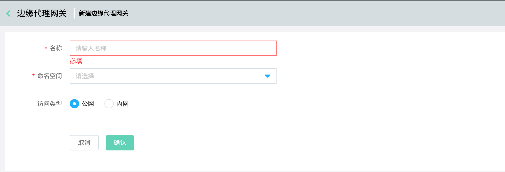
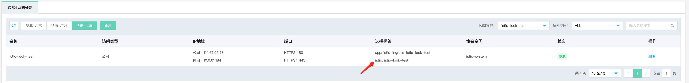

# 边缘代理网关

目前在组件中提供边缘代理网关管理。它是负责网格出口与入口流量负载均衡的特殊数据面，它不以 sidecar 的形式，而是以独立 Pod 的形式部署在您的集群内，分为 Ingress Gateway 和 Egress Gateway 两种类型。其中 Ingress Gateway 实例包含数据面的 Envoy Pod 和它关联的[弹性公网IP](../../../Hyper-Converged-IDC/Cloud-Physical-Server/Operation-Guide/Networking/Elastic-IP-For-Physical-Cloud.md)。

如您需要网格出口流量负载均衡的能力，您需先要创建 Ingress Gateway 实例，再通过 Gateway，VirtualService，DestinationRule 等 Istio CRD 配置边缘代理网关的监听规则和流量管理（路由）规则。监听规则通过 Gateway CRD 配置，流量管理规则通过 VirtualService、Destination Rule 配置。

## 创建边缘代理网关

1. 登录控制台。菜单位置：互联网中间件 > 云服务网格 > 组件管理
   

2. 选择已经安装istio的目前集群，然后点击“新建”
   
   
   
   配置项信息说明：

| 名称   | 信息项                      |
|:---- |:------------------------ |
| 名称   | 边缘代理网格ingress-gateway的名字 |
| 命名空间 | 部署ingress-gateway的命名空间。  |
| 访问类型 | 是否通过负载均衡暴露到公网。           |

3. 安装成功后，详情如下：
   
   

        备注：如上图所示的标签，在创建服务网关是需要填写。
