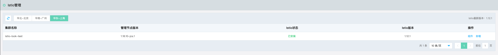
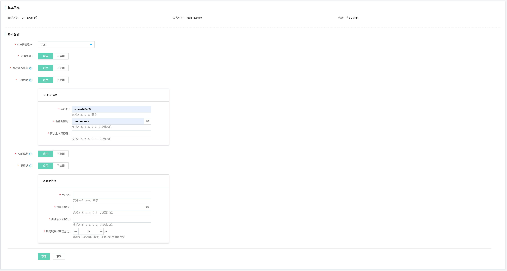

# Istio管理

服务网格是一致、可靠、透明的云原生应用通信网络管控基础平台。提供全托管服务化的支撑能力，轻松保障和管理网格生命周期。 开箱即用，降低运维运营成本；灵活接入管理跨集群、跨环境和异构应用，获取一致的发现、流量、观测和安全管控能力，加速业务云原生化改造和迁移。增强数据面运维、Ingress 网关和配置化遥测等高阶特性，同时深度优化提供更好的数据面转发性能，全面覆盖应用程序的南北与东西向通信连接。

## 环境准备

已经开通所需资源如：云主机、云网格、K8S集群等。网格依赖于K8S存在。

**注意:** 

- 若需要开放外网访问，将产生弹性公网IP费用。在此中场景下，系统会自动创建京东云负载均衡组件并申请公网IP，带宽为1Mbps，收费标准请参考 [弹性公网IP](../../../Hyper-Converged-IDC/Cloud-Physical-Server/Operation-Guide/Networking/Elastic-IP-For-Physical-Cloud.md) 的收费  。

- 京东云保证云服务网格在K8S集群正常的情况下，可安装，可变更。

- 京东云保证在Istio服务正常的情况下，您可通过本产品管理云服务网格的多种服务治理功能。

- 您可通过京东云云监控查看Istio服务的运行状况。

- 如果您对所在VPC的网络配置、Kubernetes集群所用资源、Istio服务所在命名空间、应用pod中的代理服务进行错误的运维行为，将可能导致云服务网格功能失效、应用数据访问失效等问题。

## 操作说明

### 部署网格

1、登录控制台。菜单位置：互联网中间件 > 云服务网格 > Istio管理

2、当用户创建完K8S集群后, 在Istio管理中，会自动检索到用户创建的K8S列表。用户可选择需要部署网格的K8S集群，点击操作中的“部署”，往该集群中部署网格。

配置组件信息说明：

| 信息项      | 说明                                                                                                      |
|:-------- |:------------------------------------------------------------------------------------------------------- |
| 集群名称     | 部署Istio的目标集群。                                                                                           |
| 命名空间     | 部署Istio的命名空间，默认为istio-system。                                                                           |
| 地域       | 当前k8s集群及网格所在地域。                                                                                         |
| 策略检查     | 是否启用Mixer组件实现的访问前Policy Check功能，例如白名单、限流等功能。                                                            |
| 开放外网访问   | 开启外网访问权限后，系统会自动创建京东云负载均衡组件并申请公网IP（带宽为1Mbps），然后将Grafana、Kiali、Jaeger组件通过负载均衡暴露出来，用户可使用组件页面显示的对外地址访问相关服务。 |
| Grafana  | 是否启用Grafana 展示指标的度量数据。如开启，则需要提前设置用户名和密码。                                                                |
| Kiali 观测 | 是否启用 Kiali 可视化服务网格。如果开启，则需要提前设置用户名和密码。                                                                  |
| 调用链      | 是否启用Jaeger调用链。用户可设置调用链采样率百分比 ，范围（1-100%）。                                                               |

3、    在用户配置完基础信息后，点击部署，系统将为当前K8S集群部署Istio。

4、    可通过以下方法查看部署是否成功。

1) 当提交部署后，即可通过执行进度，查看部署过程。若有报错信息，并进行重新部署。

2) 在Istio管理页，查看当前集群的Istio部署状态。

5、    当部署成功后将会有如下变化：

1) 在“服务”中，将自动检索到并展示当前K8S集群中所有的服务列表。

### 组件管理

当网格部署完成后，也可对网格组件进行再次配置。

入口：互联网中间件>云服务网格>Istio管理，在操作栏中有组件管理操作。

### 卸载

1、登录云服务网格控制台。在左侧导航栏点击并进入云网格管理列表页。

2、在列表中，点击操作中的“删除”。

- 删除后，当前为Istio所配置的内容将全部删除。

- 删除后，若再重新为当前集群创建Istio，则视为重新安装
