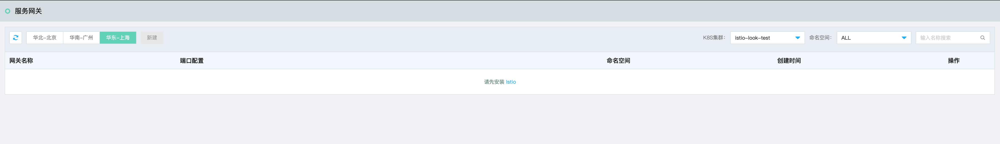
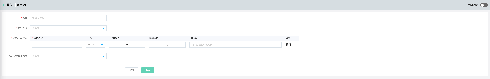

# 网关（Service-Gateway）

通过服务网关，提供服务的外网访问入口。

## 操作说明

### 新建服务网关

1、    登录控制台，互联网中间件>云服务网格>服务网关。

2、    点击新建。

| 信息项      | 说明                                |
|:-------- |:--------------------------------- |
| 名称       | 新创建的服务网关的名称。                      |
| 命名空间     | 代理目标服务的命名空间。                      |
| 端口名称     | 端口的名称。                            |
| 端口协议     | 支持HTTP/TCP等。                      |
| 服务端口     | 边缘代理网关的端口（http端口为80，https端口为443）。 |
| 目标端口     | 目标服务的端口。                          |
| Hosts    | 可以增加多个端口的配置。                      |
| 指定边缘代理网关 | 选择创建的边缘代理网关，没有则需要创建。              |

### 删除网关

- 如果已有绑定的虚拟服务，则不能编辑、删除;解绑后才可以编辑删除。

- 删除后，将不能恢复。
