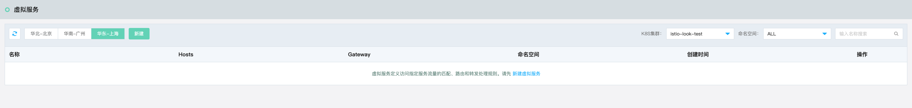
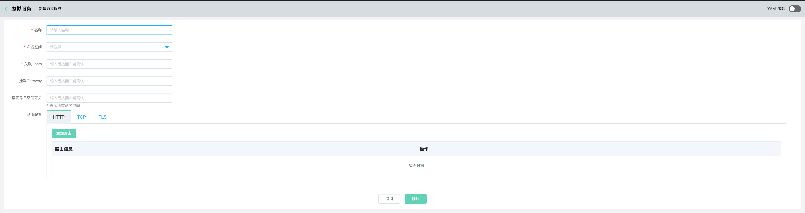

# 虚拟服务（Virtual Service）

在虚拟服务管理页中，平台将自动检索并展示当前K8S集群中所有的服务和Istio中的Serviceentry服务。若内容为空，用户需先至K8S中创建服务或可在页面新建Serviceentry服务。

## 环境准备

1、    用户需要先创建K8S集群，并部署了网格。

2、    K8S中已经运行有服务，或者这服务列表也创建网格外部服务Serviceentry。

3、    如果需要对外提供服务，则需要在组件管理中提前准备好边缘代理网关。

## 操作说明

### 新建虚拟服务（Virtual Service）

1. 登录控制台。菜单位置：互联网中间件>云服务网格>虚拟服务。

2. 点击“新建”，进入创建页面。

| 信息项       | 说明                                        |
| --------- | ----------------------------------------- |
| 名称        | 虚拟服务的名称                                   |
| 命名空间      | 命名空间。                                     |
| 关联Hosts   | 定义路由规则关联的 hosts，可以是带有通配符的 DNS 名称或者 IP 地址。 |
| 挂载Gateway | 在相同命令空间中关联的Gateway的名称                     |
| 指定命令空间可见  | 边缘代理网关的端口（http端口为80，https端口为443）。         |
| 路由配置      | 路由规则，详见VirtualService重要字段说明。              |

### VirtualService 重要字段说明

以下是 VirtualService 的重要字段说明：

| 字段名称                      | 字段类型                                                                                               | 字段说明                                                                                                                                                                                                                                                                                              |
| ------------------------- | -------------------------------------------------------------------------------------------------- | ------------------------------------------------------------------------------------------------------------------------------------------------------------------------------------------------------------------------------------------------------------------------------------------------- |
| `spec.hosts`              | `string[]`                                                                                         | 定义路由规则关联一组的 hosts，可以是带有通配符的 DNS 名称或者 IP 地址（IP 地址仅能应用于来源流量为边缘代理网关）。该字段能应用于 HTTP 和 TCP 流量。在 Kubernetes 环境中，可以使用 service 的名称作为缩写，Istio 会按照 VirtualService所在 namespace 补齐缩写，例如在 default namespace 的 VirtualService 包含 host 缩写 `reviews` 会被补齐为 `reviews.default.svc.cluster.local`。为避免误配置，推荐填写 host 全称 |
| `spec.gateways `          | `string[]`                                                                                         | 定义应用路由规则的来源流量，可以是一个或多个网关，或网格内部的 sidecar，指定方式为 `<gateway namespace>/<gateway name>`，保留字段 `mesh` 表示网格内部所有的 sidecar，当该参数缺省时，会默认填写 `mesh`，即该路由规则的来源流量为网格内部所有 sidecar                                                                                                                                  |
| `spec.http`               | `HTTPRoute[]`                                                                                      | 定义一组有序的（优先匹配靠前的路由规则）应用于 HTTP 流量的路由规则，HTTP 路由规则会应用于网格内部的 service 端口命名为 `http-`, `http2-`, `grpc-` 开头的流量以及来自 gateway 的协议为 `HTTP, HTTP2, GRPC, TLS-Terminated-HTTPS` 的流量                                                                                                                             |
| `spec.http.match`         | `HTTPMatchRequest[]`                                                                               | 定义路由的匹配规则列表，单个匹配规则项内所有条件是且关系，列表中多个匹配规则之间为或关系                                                                                                                                                                                                                                                      |
| `spec.http.route`         | `HTTPRouteDestination[]`                                                                           | 定义路由转发目的地列表，一条 HTTP 路由可以是重定向或转发（默认），转发的目的地可以是一个或多个服务（服务版本）。同时也可以配置权重、header 操作等行为                                                                                                                                                                                                                 |
| `spec.http.redirect`      | `HTTPRedirect`                                                                                     | 定义路由重定向，一条 HTTP 路由可以是重定向或转发（默认），如规则中指定了 `passthrough ` 选项，route、redirect 均会被忽略。可将 HTTP 301 重定向到另外的 URL 或 Authority                                                                                                                                                                                |
| `spec.http.rewrite`       | `HTTPRewrite`                                                                                      | 定义重写 HTTP URL 或 Authority headers，不能与重定向同时配置，重写操作会在转发前执行                                                                                                                                                                                                                                          |
| `spec.http.timeout`       | `Duration` | 定义 HTTP 请求的超时时间                                                                                                                                                                                                                                                                                   |
| `spec.http.retries`       | `HTTPRetry`                                                                                        | 定义 HTTP 请求的重试策略                                                                                                                                                                                                                                                                                   |
| `spec.http.fault`         | `HTTPFaultInjection`                                                                               | 定义 HTTP 流量的故障注入策略，开启时超时和重试策略不会开启                                                                                                                                                                                                                                                                  |
| `spec.http.mirror`        | `Destination`                                                                                      | 定义将 HTTP 流量复制到另一个指定的目的端，被复制的流量按照“best effort”原则，sidecar/网关不会等待复制流量的响应结果就会从源目的端返回响应。镜像流量的目的服务端会产生监控指标。                                                                                                                                                                                             |
| `spec.http.mirrorPercent` | `uint32 `                                                                                          | 定义流量镜像的复制百分比，缺省时复制100%的流量。最大值为100                                                                                                                                                                                                                                                                 |
| `spec.http.corsPolicy`    | `CorsPolicy`                                                                                       | 定义 CORS 策略（跨域资源共享，Cross-Origin Resource Sharing，CORS），更多关于 CORS 的介绍请参见 [CORS](https://developer.mozilla.org/en-US/docs/Web/HTTP/CORS)，关于 Istio CORS 策略配置语法请参见 [CorsPolicy](https://istio.io/latest/docs/reference/config/networking/virtual-service/#CorsPolicy)                                  |
| `spec.http.headers`       | `Headers`                                                                                          | 定义 header 操作规则，包括 request 和 response header 的更新，增加，移除操作                                                                                                                                                                                                                                           |
| `spec.tcp`                | `TCPRoute[]`                                                                                       | 定义一组有序的（优先匹配靠前的路由规则）应用于 TCP 流量的路由规则，该路由规则会应用于任何非 HTTP 和 TLS 的端口                                                                                                                                                                                                                                   |
| `spec.tcp.match`          | `L4MatchAttributes[]`                                                                              | 定义 TCP 流量路由的匹配规则列表，单个匹配规则项内所有条件是且关系，列表中多个匹配规则之间为或关系                                                                                                                                                                                                                                               |
| `spec.tcp.route`          | `RouteDestination[]`                                                                               | 定义 TCP 连接转发的目的端                                                                                                                                                                                                                                                                                   |
| `spec.tls`                | `TLSRoute[]`                                                                                       | 定义一组有序的（优先匹配靠前的路由规则）应用于未终止的 TLS 或 HTTPS 流量的路由规则，该路由规则会应用于网格内部的 service 端口命名为 `https-`，`tls-` 开头的流量，来自 gateway 的端口协议为 `HTTPS, TLS` 的未终止加密流量，Service Entry 使用 `HTTPS, TLS` 协议的端口。当 `https-`, `tls-` 端口未关联 VirtualService 规则时将会被视为 TCP 流量                                                            |
| `spec.tls.match`          | `TLSMatchAttributes[]`                                                                             | 定义 TLS 流量路由的匹配规则列表，单个匹配规则项内所有条件是且关系，列表中多个匹配规则之间为或关系                                                                                                                                                                                                                                               |
| `spec.tls.route`          | `RouteDestination[]`                                                                               | 定义连接转发的目的端                                                                                                                                                                                                                                                                                        |
