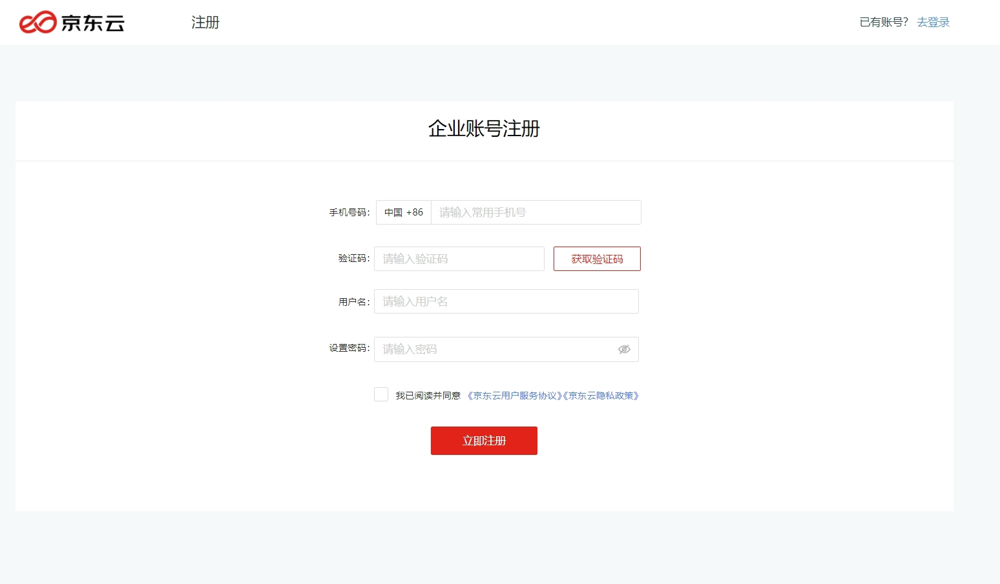
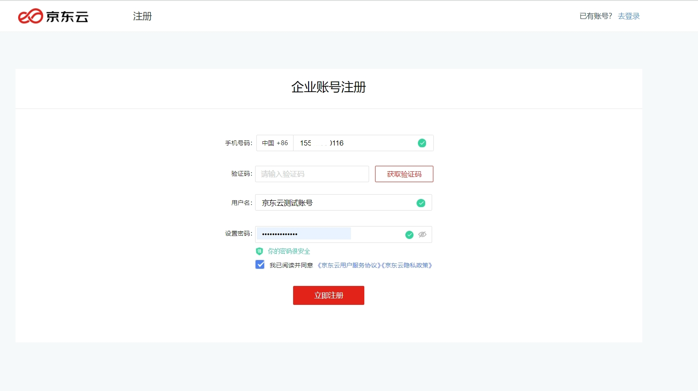
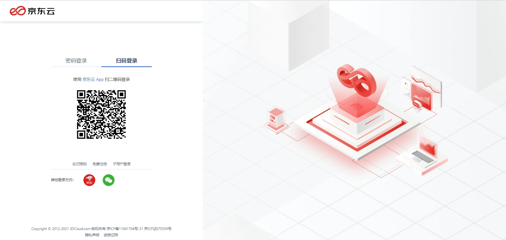
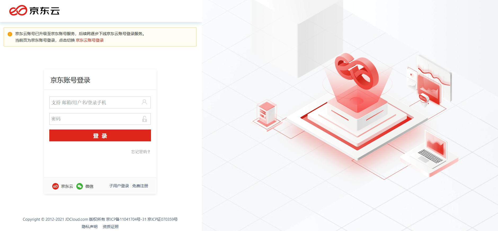
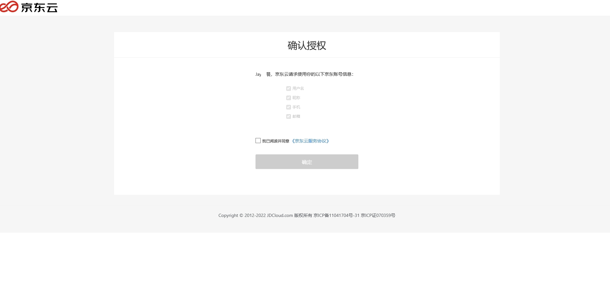
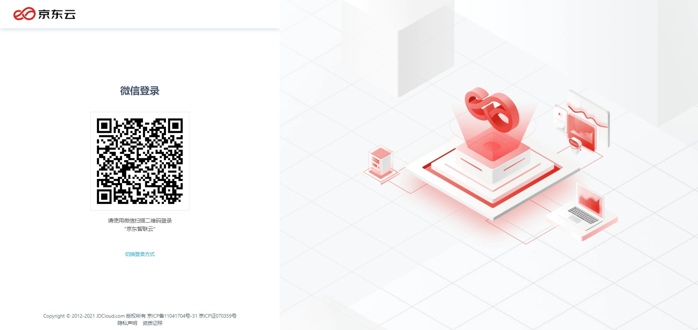
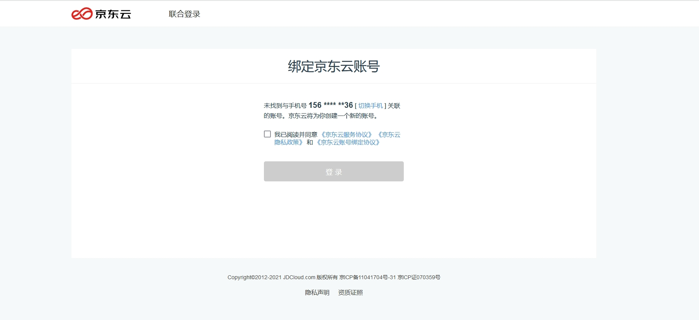
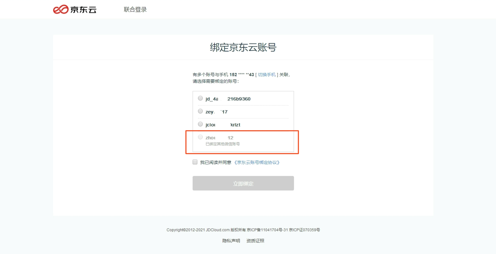

# 登录与注册
## 注册账号
目前京东云仅支持大陆手机注册，步骤如下：

### 1. 输入账号名和密码
账号名是京东云账号的标识，用于登录。输入时，页面会提示输入规则：
账号名长度为4-20位，支持输入汉字、英文字母、数字或“-”、“_”符号，不支持纯数字格式的账号名；
登录密码长度为7-20位，建议使用字母、数字和符号两种及以上组合，密码不能与账号名相同。

### 2. 输入一个常用手机号，作为账号的安全手机
请使用你的常用手机进行验证。验证码可能会通过短信或来电的方式发送。如果使用手机小号进行注册，由于小号本身的网络不稳，可能会出现偶尔收不到短信或来电的问题，请等待一段时间后进行重试。

注册成功后，该手机会成为账号绑定的安全手机，用于接收京东云的重要通知，并作为你账户的安全验证方式。
如果你的手机号是首次用于开通京东云业务，则该手机可以用于账号登录；如果手机号已关联其他京东云账号，则你当前注册的账号不能使用手机号进行登录。

## 登录账号

### 1. 扫码登录
推荐你使用 [京东云App](https://console.jdcloud.com/download) 扫码登录。在各大应用商店搜索 “京东云” 即可下载使用。扫码后，在手机端确认登录，电脑端即可同步登录。

### 2. 京东登录
京东云支持 “京东登录” 。如果您有京东的账号，可以使用京东账号登录。

首次使用京东登录时，系统将引导您授权给京东云您京东账号的相关信息，完成授权后登入成功。

### 3. 京东云登录
你可以点击下方的京东云图标，输入您的京东云账号名和密码进行登录。

当您京东云账号绑定了手机号或邮箱，您可以使用手机号或者邮箱登入。
如果收到提示 “当前手机/邮箱不可用于登录”，说明你的账号不支持通过手机或邮箱登录，请尝试输入账号名；

### 4. 微信登录
京东云支持 “微信登录”。用手机微信扫描页面上的微信登录二维码，然后在手机微信中同意京东云使用微信登录。京东云将获取你的微信昵称，用于在页面进行展示。

首次使用微信登录时，请先为微信账号绑定一个京东云账号。输入你的手机号，系统会查询你已注册的京东云账号，或为你自动创建一个京东云账号。

如果你已注册过账号，可以选择绑定并登录到该账号。

如果你是一个新用户，系统会为你自动创建一个账号。稍后你可以在 “账户管理” 中心查看和管理账号。

在特殊情况下，你会无法使用微信登录，因为你的京东云账号已经绑定了另一个微信账号；或者你的账号是京东账号，只能通过京东登录，请返回登录页选择 “京东登录” —— 当账号完成升级（查看 [《京东账号管理》](https://docs.jdcloud.com/cn/account-management/manage-jd-account) - 京东账号升级为京东云账号）后，才支持绑定微信账号、使用微信登录。

#### 解绑微信账号
不再需要使用微信登录时，可以在 “账户管理 - 基本资料” 页面将微信账号解除绑定。能够解绑的前提是，当前账号已经设置登录密码，可以使用除了微信登录以外的方式进行登录。

如果尚未设置登录密码，先进行设置，保证账号在解除微信账号绑定后仍然能使用其他方式进行登录。

点击 “解除绑定”，并确认解除绑定后可用的登录方式。

