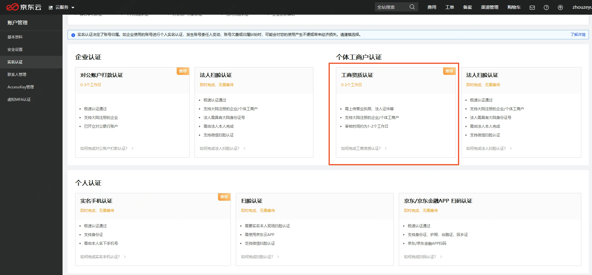
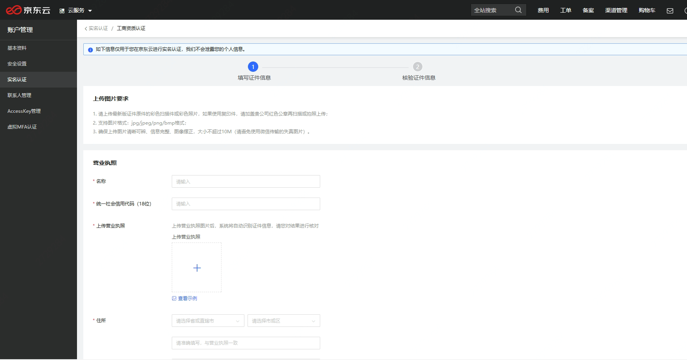
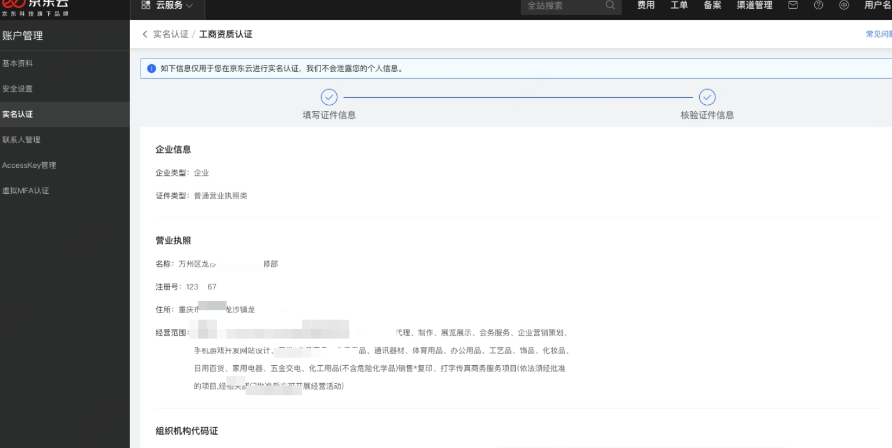
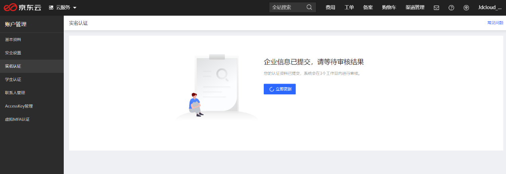
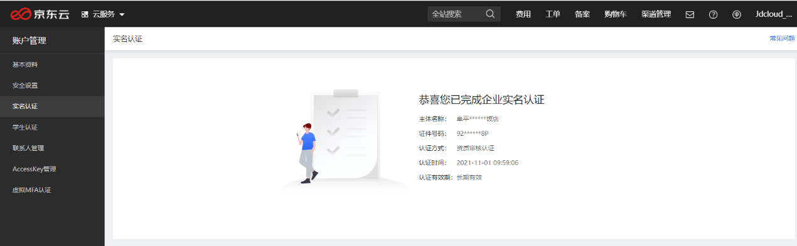
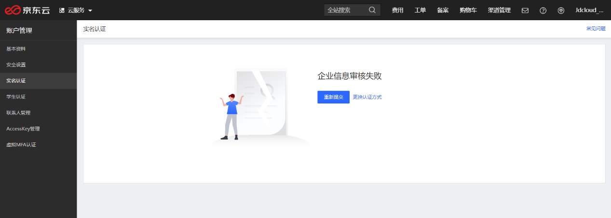

## **个体工商户-工商资质认证**

[京东云企业认证](https://realname.jdcloud.com/account/verify)支持个体工商户进行工商资质认证。
如果您的账号已经在[京东金融企业站](https://biz.jd.com/)完成了企业实名认证，您也可以在京东云页面完成认证状态的一键同步。

### 认证步骤

对公账户打款认证主要分为以下四个步骤：

1.	选择认证方式 - 对公账户打款认证
2.	填写企业名称、对公账户信息，核对无误后提交
3.	企业信息审核通过后，完成对公账户转账金额验证
4.	企业实名认证通过

注：按照国务院登记制度改革意见及各省市加快推进 “五证合一、一照一码” 登记制度改革的相关要求，各类市场主体需在2017年12月31日之前，完成 “统一社会信用代码” 营业执照换发工作。2018年1月1日起，未换发的证照将失去效用，市场主体将变成无证经营。因此，京东云当前仅支持用户使用加载了统一社会信用代码的营业执照完成企业实名认证。

**1. 选择主体类型**

进入[实名认证](https://realname.jdcloud.com/account/verify)页面，选择个体工商户-工商资质认证

**2. 填写证件信息**

在此处，您需要补充营业执照、法人证件、被授权人证件（如有）、授权委托书（如有）的信息，并上传相应的证件照片。

注：上传证件图片要求如下

1. 请上传最新版证件原件的彩色扫描件或彩色照片，如果使用复印件，请加盖贵公司红色公章再扫描或拍照上传；
2. 支持图片格式：jpg/jpeg/png/bmp格式；
3. 确保上传图片清晰可辨、信息完整、图像摆正，大小不超过10M（请避免使用微信传输的失真图片）。

**3. 核对企业信息并提交**

点击“下一步”，再次确认确认企业信息无误后点击“提交”。

 
**4. 资料提交审核**

企业信息提交审核后，系统将在 1 ~ 10 分钟内完成企业信息审核。

 
**5.	审核通过**

证件信息系统核对无误后，认证通过。

 
**6.	审核不通过**

证件信息不正确时会导致审核不通过，请您核对信息及证件照片后重新提交，或者更换认证方式。

 

