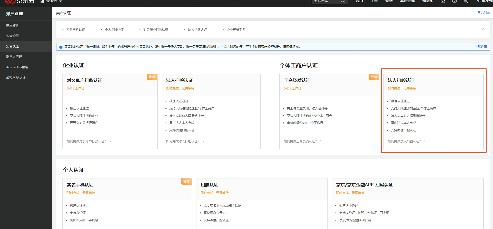
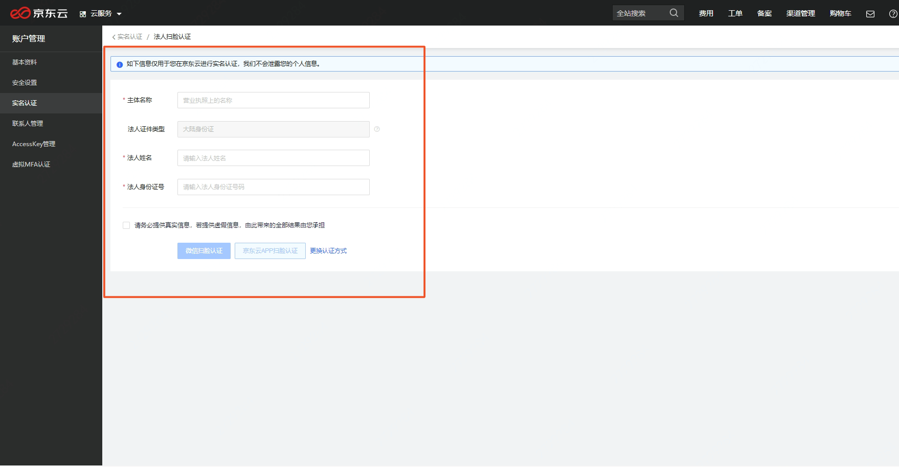
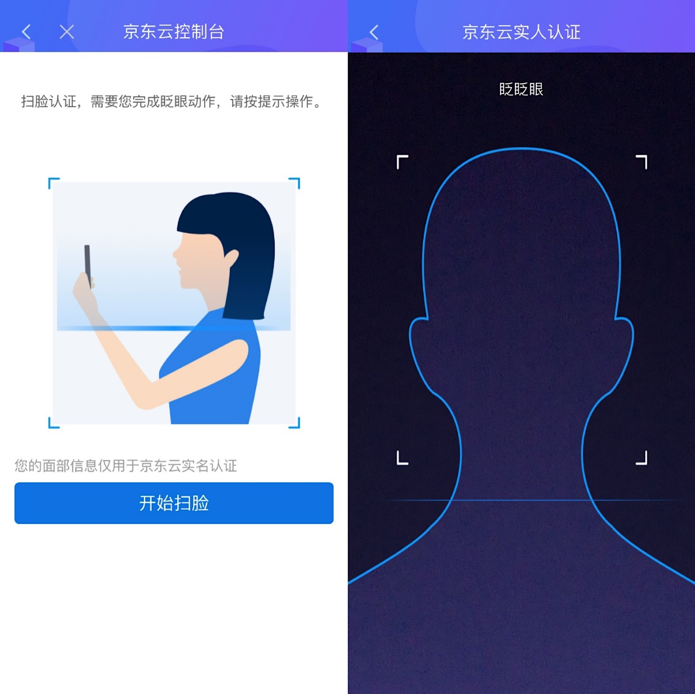

## **个体工商户-法人扫脸认证**

[京东云企业认证](https://realname.jdcloud.com/account/verify)支持个体工商户法人扫脸认证。同时，如果您的账号已经在[京东金融企业站](https://biz.jd.com/)完成了企业实名认证，您也可以在京东云页面完成认证状态的一键同步。

### 认证步骤

个体工商户-法人扫脸认证流程主要分为以下四个步骤：

1.	选择个体工商户 - 法人扫脸实名
2.	填写企业名称、法人姓名和法人身份证号，核对无误后点击扫脸认证。
3.	上述三样信息校验无误后，会实时生成二维码
4.	法人本人使用京东云APP或微信扫一扫完成实名认证操作

注：按照国务院登记制度改革意见及各省市加快推进“五证合一、一照一码”登记制度改革的相关要求，各类市场主体需在2017年12月31日之前，完成“统一社会信用代码”营业执照换发工作。2018年1月1日起，未换发的证照将失去效用，市场主体将变成无证经营。因此，京东云当前仅支持用户使用加载了统一社会信用代码的营业执照完成企业实名认证。

**1. 选择主体类型**

进入[实名认证](https://realname.jdcloud.com/account/verify)页面，选择个体工商户认证-法人扫脸认证。

 
**2. 填写企业名称和法人信息**

请输入您营业执照上的主体名称、法人姓名、法人身份证号。

 
**3. 进行扫脸认证**

a. 使用京东云 App 扫脸认证
点击京东云APP扫脸认证。下载京东云 App，使用 App 的控制台左上角的“扫一扫”功能扫描生成的二维码，完成您人脸信息的核验。

 
b. 使用微信扫脸认证
点击微信扫脸认证。打开微信右上角的扫一扫功能，扫描生成的二维码，完成您人脸信息的核验。

**4. 扫脸校验通过，即完成了企业实名认证**

扫脸认证通过，即完成了企业实名认证，可在 PC 页面查询您的实名详情。

