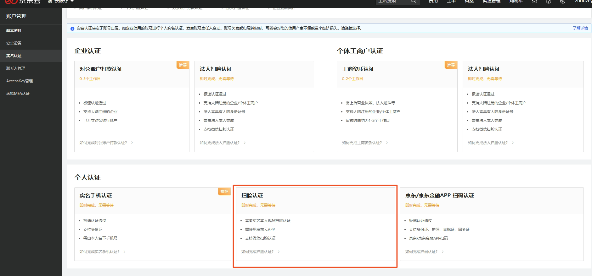
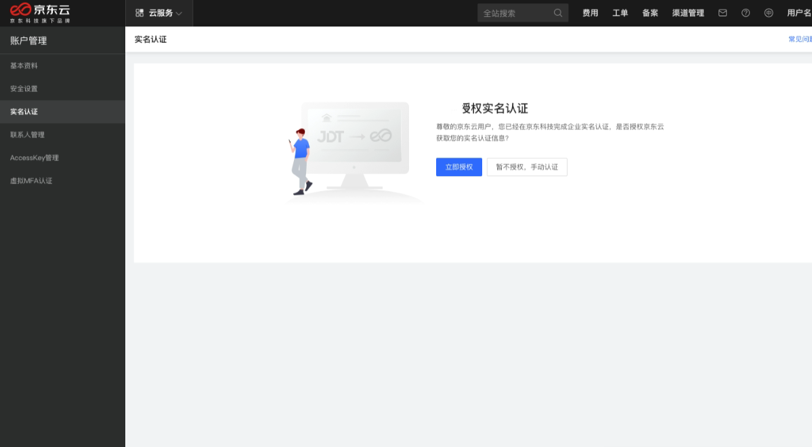
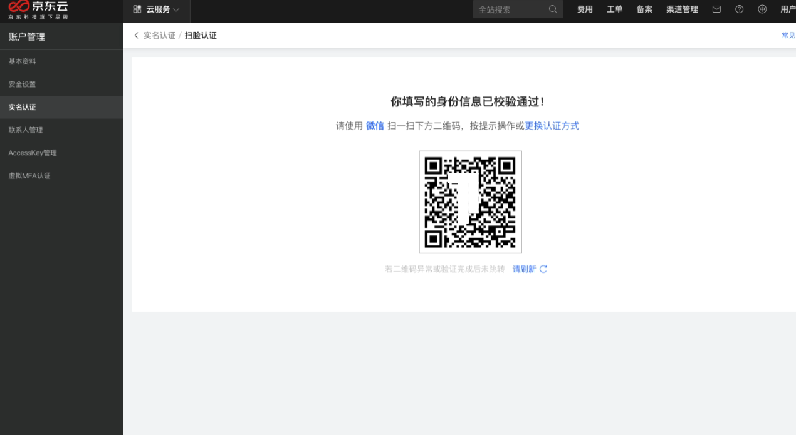
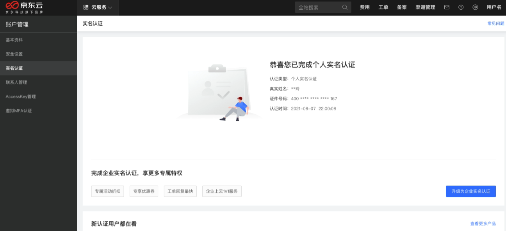

# 个人扫脸认证

[京东云个人认证](https://realname.jdcloud.com/account/verify)支持用户使用京东云 APP 扫脸完成实名认证。 同时，如果您的账号是京东商城/京东金融账号，并且在京东商城/京东金融完成了个人实名认证，您也可以在京东云页面完成认证状态和认证信息的一键同步。

## 名词解释

扫脸认证指的是您在京东云页面填写姓名和身份证号，并使用京东云 APP 完成人脸识别的过程。人脸识别通过，则完成了个人实名认证。目前仅允许持身份证的用户进行扫脸认证，其他证件类型正在陆续拓展支持。

## 认证流程

1. 进入[实名认证](https://realname.jdcloud.com/account/verify)页面，在“个人认证”选项卡里点击“立即认证”。

 
2. 如果系统检测到您的账号已经在京东商城/京东金融完成了个人实名认证，会自动弹出如下弹窗，您可以点击“立即授权”授权京东云获取您在京东商城/京东金融的实名信息。

 
如果您的账号未在京东商城/京东金融完成个人实名认证或者您选择“暂不授权，手动认证”，则进入选择个人实名认证方式的页面，您可以选择“实名手机认证”或“扫脸认证”。

3. 选择“扫脸认证”后，点击下一步，需要在如下页面填写您的姓名和身份证号。

4. 姓名和身份证号验证无误，页面会展示如下二维码。

 
5. 进行扫脸认证

a. 使用京东云 App 扫脸认证

点击京东云APP扫脸认证。下载京东云 App，使用 App 的控制台左上角的“扫一扫”功能扫描生成的二维码，完成您人脸信息的核验。

 
b. 使用微信扫脸认证

点击微信扫脸认证。打开微信右上角的扫一扫功能，扫描生成的二维码，完成您人脸信息的核验。

6. 扫脸校验通过后，个人实名认证完成，您可以在 PC 端查看实名认证详情。
	

 
## 常见问题
**问题：一个身份信息最多可认证几个京东云账号？**

答：一个身份信息最多可认证一个京东云账号。

**问题：使用京东云 APP 扫脸提示 “扫脸校验失败”。**

答：您在页面填写的身份证号和扫脸人需为同一人。

